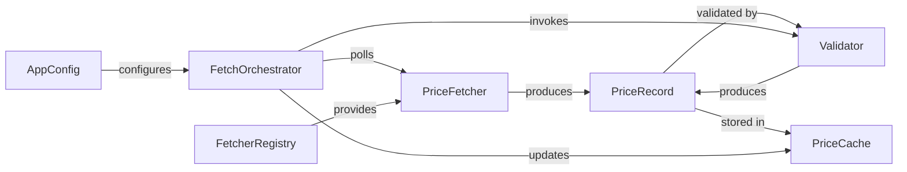
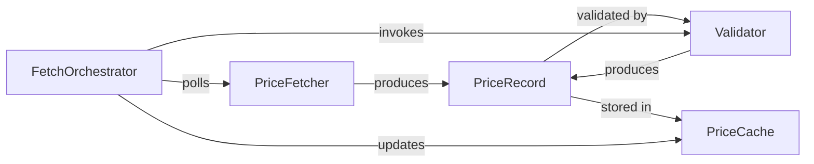

# Golden Example: architect — pricefeed

Demonstrates a complete architect output for the pricefeed project (W1 Build).
Exercises all MUST fields in the BCS-1.0 contract.

---

## Scenario

**Upstream:** ideate Handoff specifying plugin-based fetcher architecture.

**Entry point:** ideate

---

## Example Output

### Phase 1: Domain Mapping

#### 1.1 Domain Concepts

| Domain Concept | Type | Description | Changes When... |
|---|---|---|---|
| PriceRecord | Entity | A single price observation (ticker, price, timestamp, source) | Schema evolves |
| PriceFetcher | Computation | Retrieves prices from a specific source | New source added / API changes |
| Validator | Computation | Checks price records against quality rules | Validation rules change |
| PriceCache | Collection | Holds latest validated prices per ticker | Every fetch cycle |
| FetcherRegistry | Collection | Tracks available fetcher implementations | New fetcher added |
| FetchOrchestrator | Orchestration | Polls fetchers, validates, updates cache | Orchestration logic changes |
| AppConfig | Configuration | Runtime settings (sources, intervals, thresholds) | Deployment/reconfiguration |

#### 1.2 Domain Relationships



#### 1.3 Rate of Change

| Concept | Rate | Rationale |
|---|---|---|
| PriceRecord schema | Static | Reference data, changes on deployment |
| Validation rules | Slow | Policy changes, not per-tick |
| PriceFetcher implementations | Structural | New source = new code |
| PriceCache contents | Fast | Updated every fetch cycle |
| AppConfig | Slow | Changes on reconfiguration |
| Orchestration logic | Moderate | Polling strategy may evolve |

### Phase 2: Boundary Drawing

Heuristics applied:

1. **Rate-of-change:** Fetchers (structural) separated from validators (slow)
   separated from cache (fast). Config (slow) separated from all.
2. **Knowledge:** Each fetcher knows only its source API. Validators know only
   quality rules. Cache knows only storage. Orchestrator wires them.
3. **Testability:** Fetchers testable with mock HTTP/files. Validators testable
   with synthetic records. Cache testable in isolation.

#### Candidate Boundaries

| Module | Responsibility | Knows About | Doesn't Know About | Changes When |
|---|---|---|---|---|
| `core/types` | Domain types (PriceRecord) and protocols (PriceFetcher, Validator) | Domain vocabulary | Implementation details | Domain model evolves |
| `fetchers/` | Price fetching implementations | How to call specific APIs/read files | What happens to prices after fetch | Data source API changes |
| `validators/` | Price quality validation | Quality rules and thresholds | Where prices came from | Validation policy changes |
| `cache/` | In-memory price storage | How to store/retrieve by ticker | Who reads the cache or why | Storage strategy changes |
| `cli/` | CLI entry point and orchestration | How to wire fetchers → validators → cache | Internal implementation of any component | User-facing commands change |

### Phase 3: Abstraction Decisions

| Piece | Abstraction | Rationale |
|---|---|---|
| PriceRecord | Dataclass | Pure data, no behaviour, internal |
| PriceFetcher | Protocol | Multiple implementations (CSV, API, REST) |
| Validator | Protocol | May have multiple validation strategies |
| PriceCache | Class | Has state (the cache dict) + behaviour (get/put) |
| CsvFetcher | Class | Implements PriceFetcher, has config state |
| RangeValidator | Class | Implements Validator, has threshold config |
| FetchOrchestrator | Function | Stateless wiring: poll → validate → cache |
| AppConfig | Config | Crosses serialisation boundary (YAML → runtime) |

### Dependency Direction

```
CORRECT:
  fetchers/csv.py implements core/types.PriceFetcher
  validators/range.py implements core/types.Validator
  cli/main.py wires fetchers → validators → cache (depends on all, depended on by none)
  core/types.py depends on nothing project-internal

WRONG (would be):
  core/types.py importing from fetchers/ (domain depending on infrastructure)
```

DAG check: PASS — no circular dependencies. core/ is the root, cli/ is the leaf.

### Cross-Cutting Concerns

- **Errors:** Fetchers raise FetchError; orchestrator catches, logs, skips
  source, continues. Validators raise ValidationError; orchestrator logs,
  discards record.
- **Logging:** `logging.getLogger(__name__)` in each module. Configured at CLI
  entry point.
- **Config:** Loaded from YAML at CLI entry point. Passed as typed AppConfig to
  constructors.

### Phase 4: Architecture Review Checkpoint

**STOP.** Presenting for review.

Does this decomposition feel right for the domain? Are the boundaries where
you'd expect them? Anything I'm splitting that should stay together, or
bundling that should split?

## Handoff



| Module | Responsibility | Knows About | Doesn't Know About | Changes When |
|---|---|---|---|---|
| `core/types` | Domain types and protocols | Domain vocabulary | Implementation details | Domain model evolves |
| `fetchers/` | Price fetching from specific sources | Source-specific APIs and file formats | What happens to prices downstream | Data source API changes |
| `validators/` | Price quality validation | Quality rules and thresholds | Where prices originated | Validation policy changes |
| `cache/` | In-memory price storage and retrieval | Storage mechanics (dict by ticker) | Who reads cache or why prices exist | Storage strategy changes |
| `cli/` | CLI entry points and orchestration | How to wire components together | Internal implementation of any component | User-facing commands change |

**Abstraction decisions:**

| Piece | Abstraction |
|---|---|
| PriceRecord | Dataclass |
| AppConfig | Config |
| PriceFetcher | Protocol |
| Validator | Protocol |
| PriceCache | Class |
| CsvFetcher | Class |
| ApiFetcher | Class |
| RangeValidator | Class |
| FetchOrchestrator | Function |
| `fetchers/` | Package |
| `validators/` | Package |
| `cache/` | Module |
| `cli/` | Module |
| `core/` | Package |

**Rate-of-change map:**

| Concept | Category |
|---|---|
| PriceRecord schema, protocols | Stable |
| Validation rules, AppConfig, orchestration logic | Moderate |
| PriceCache contents, fetcher implementations (structural) | Volatile |

DAG check: PASS

Entry point: ideate

**Cross-cutting concerns:**
- Errors: FetchError and ValidationError; orchestrator catches, logs, continues
- Logging: `logging.getLogger(__name__)` everywhere, configured at CLI
- Config: YAML → AppConfig (Pydantic), passed as typed objects
