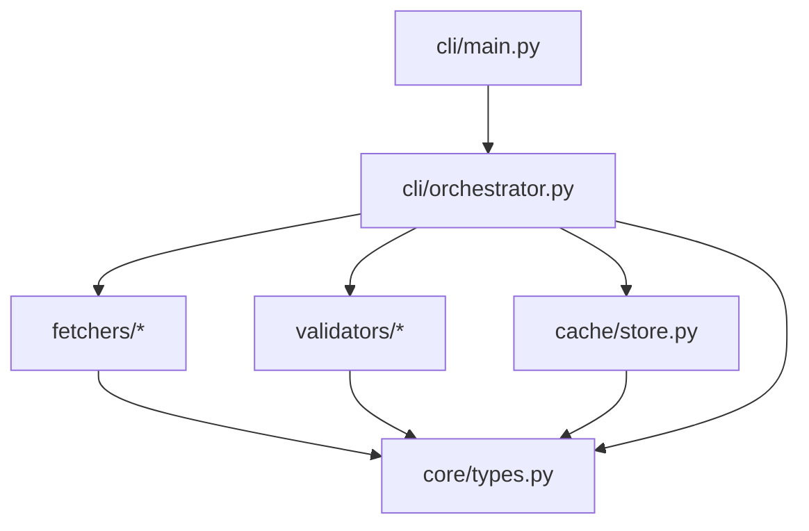

# Golden Example: design — pricefeed

Demonstrates a complete design output for the pricefeed project (W1 Build).
Exercises all MUST fields in the BCS-1.0 contract.

---

## Scenario

**Upstream:** architect Handoff specifying domain model, module table, abstraction
decisions, rate-of-change map, DAG check PASS.

---

## Example Output

### Phase 1: Problem Framing

**Objective:** Build a pricefeed system that fetches bond prices from multiple
sources, validates quality, caches latest values, and serves them via CLI.

**Inputs:** CSV files, Bloomberg API responses, internal REST API responses
**Outputs:** Validated, cached prices served via CLI queries
**Constraints:** Must handle source failures gracefully (skip, don't crash);
in-memory cache for current scale (~10K instruments)
**Success criteria:** CLI can query latest price for any ticker; adding a new
source requires only one new file.

**Core abstraction:** PriceFetcher protocol — everything revolves around the
contract "give me prices for these tickers."

### Phase 2: Architecture

#### 2.1 Dependency Graph



DAG verified. Dependencies point inward toward core/.

#### 2.2 Data Flow

```
CSV/API/REST → PriceFetcher.fetch() → list[PriceRecord]
  → Validator.validate() → list[PriceRecord] (filtered)
    → PriceCache.update() → None (side effect: cache updated)
      → PriceCache.get(ticker) → PriceRecord | None
```

| Boundary | Schema | Format | Failure Mode |
|---|---|---|---|
| Source → Fetcher | Raw API/file data | Source-specific | FetchError → log, skip source |
| Fetcher → Validator | `list[PriceRecord]` | In-memory dataclass | Never fails (type-safe) |
| Validator → Cache | `list[PriceRecord]` | In-memory dataclass | ValidationError → log, discard record |
| Cache → CLI | `PriceRecord \| None` | In-memory dataclass | None → "not found" message |

### Phase 3: Interface Design

#### 3.1 Key Interfaces

```python
from typing import Protocol
from datetime import datetime
from dataclasses import dataclass


@dataclass(frozen=True)
class PriceRecord:
    """A single validated price observation."""
    ticker: str
    price: float
    timestamp: datetime
    source: str


class PriceFetcher(Protocol):
    """Contract for any price data source."""
    def fetch(self, tickers: list[str]) -> list[PriceRecord]: ...


class Validator(Protocol):
    """Contract for price quality validation."""
    def validate(self, records: list[PriceRecord]) -> list[PriceRecord]: ...
```

#### 3.2 Configuration Design

```python
from pathlib import Path
from pydantic import BaseModel


class SourceConfig(BaseModel):
    """Configuration for a single data source."""
    name: str
    type: str  # "csv", "api", "rest"
    path_or_url: str
    enabled: bool = True


class ValidationConfig(BaseModel):
    """Validation thresholds."""
    min_price: float = 0.0
    max_price: float = 1_000_000.0
    max_age_seconds: int = 3600


class AppConfig(BaseModel):
    """Top-level application configuration."""
    sources: list[SourceConfig]
    validation: ValidationConfig = ValidationConfig()
    cache_size: int = 50_000
    log_level: str = "INFO"
```

Approach: Pydantic

#### 3.3 Error Handling

- **Fetchers:** Raise `FetchError(source, reason)`. Orchestrator catches, logs
  warning, skips source, continues with remaining sources.
- **Validators:** Return filtered list (invalid records dropped). Log each
  discard at DEBUG level.
- **Cache:** No failure mode — in-memory dict operations.
- **CLI:** Catches all exceptions at top level, logs structured error, exits
  with code 1.

#### 3.4 Testing Strategy

- **Unit:** PriceRecord construction, RangeValidator logic, PriceCache get/put
- **Integration:** Orchestrator with mock fetcher → real validator → real cache
- **Property (hypothesis):** RangeValidator with random floats, boundary values

### Phase 4: File Structure

```
pricefeed/
├── src/
│   └── pricefeed/
│       ├── __init__.py
│       ├── core/
│       │   ├── __init__.py
│       │   └── types.py          # PriceRecord, PriceFetcher, Validator protocols
│       ├── fetchers/
│       │   ├── __init__.py
│       │   ├── csv_fetcher.py    # CsvFetcher implements PriceFetcher
│       │   └── api_fetcher.py    # ApiFetcher implements PriceFetcher
│       ├── validators/
│       │   ├── __init__.py
│       │   └── range.py          # RangeValidator implements Validator
│       ├── cache/
│       │   ├── __init__.py
│       │   └── store.py          # PriceCache class
│       └── cli/
│           ├── __init__.py
│           └── main.py           # Click CLI entry point + orchestration
├── tests/
│   ├── conftest.py
│   ├── unit/
│   │   ├── test_types.py
│   │   ├── test_range_validator.py
│   │   └── test_cache.py
│   └── integration/
│       └── test_orchestrator.py
├── config/
│   └── default.yaml
└── pyproject.toml
```

### Phase 5: Design Review Checkpoint

**STOP.** Does this design look right? Anything to adjust before I start
building?

## Handoff

### File Structure

```
pricefeed/
├── src/
│   └── pricefeed/
│       ├── __init__.py
│       ├── core/
│       │   ├── __init__.py
│       │   └── types.py
│       ├── fetchers/
│       │   ├── __init__.py
│       │   ├── csv_fetcher.py
│       │   └── api_fetcher.py
│       ├── validators/
│       │   ├── __init__.py
│       │   └── range.py
│       ├── cache/
│       │   ├── __init__.py
│       │   └── store.py
│       └── cli/
│           ├── __init__.py
│           └── main.py
├── tests/
│   ├── conftest.py
│   ├── unit/
│   │   ├── test_types.py
│   │   ├── test_range_validator.py
│   │   └── test_cache.py
│   └── integration/
│       └── test_orchestrator.py
├── config/
│   └── default.yaml
└── pyproject.toml
```

### Protocols

```python
from typing import Protocol
from datetime import datetime
from dataclasses import dataclass


@dataclass(frozen=True)
class PriceRecord:
    """A single validated price observation."""
    ticker: str
    price: float
    timestamp: datetime
    source: str


class PriceFetcher(Protocol):
    """Contract for any price data source."""
    def fetch(self, tickers: list[str]) -> list[PriceRecord]: ...


class Validator(Protocol):
    """Contract for price quality validation."""
    def validate(self, records: list[PriceRecord]) -> list[PriceRecord]: ...
```

### Config Design

```python
from pathlib import Path
from pydantic import BaseModel


class SourceConfig(BaseModel):
    name: str
    type: str
    path_or_url: str
    enabled: bool = True


class ValidationConfig(BaseModel):
    min_price: float = 0.0
    max_price: float = 1_000_000.0
    max_age_seconds: int = 3600


class AppConfig(BaseModel):
    sources: list[SourceConfig]
    validation: ValidationConfig = ValidationConfig()
    cache_size: int = 50_000
    log_level: str = "INFO"
```

Approach: Pydantic

### Dependency Graph


### Testing Strategy

- Unit: PriceRecord construction, RangeValidator, PriceCache
- Integration: Orchestrator with mock fetcher → validator → cache
- Property: RangeValidator boundary values with hypothesis
