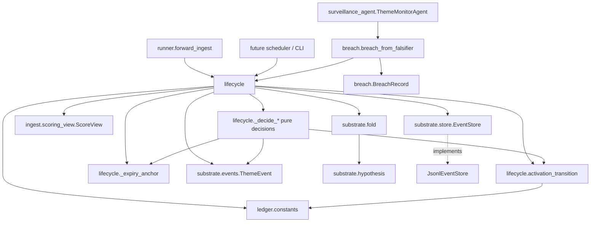
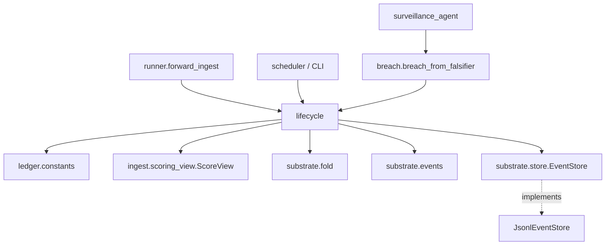
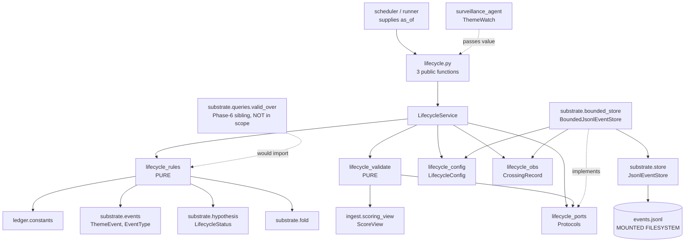

# PASTE-TEST — release-it — result

**Run:** 2026-08-09. Protocol: `PASTE-TEST.md`, second application.
**Gate under test:** `design` (the first test exercised `refactor`).
**Pack:** `principles/release-it.md`, `## Final checklist`, 7 items.

## Verdict

**PASS — § 4 branch one. Material difference. Ship the pack.**

Four of five criteria flipped. The rule required three.

## Target and why it qualifies

`/media/ak/10E1026C4FA6006E/GitRepos/creditmacro` — `engine/ledger/lifecycle.py`, the three
Phase-6 transition functions, all currently `raise NotImplementedError`. Genuinely unbuilt.

`release-it`'s `when:` fires honestly on three independent counts, checked before the run
rather than assumed: the SQLite ledger is a database driver crossing the process boundary;
the surveillance Breach Buffer is an unbounded buffer; `expiry_sweep` returns an uncapped
list. Running the test where the pack would not legitimately load would have rigged it.

## E1–E6

| # | Question | Control | Treatment | Flip |
|---|---|---|---|---|
| E1 | Size | 1246 lines | 1556 lines | control — +25%, and the additions are specific, not recitation |
| E2 | Crossing call names a real timeout number, not "the library default" | absent | **present** | **YES** |
| E3 | Retry classified, bounded, single-layered | absent | **present** | **YES** |
| E4 | Every queue/pool/buffer has a stated bound AND overflow behaviour | absent | **present** | **YES** |
| E5 | Dependency *slow* distinguished from dependency *down* | absent | **present** | **YES** |
| E6 | Dependency responses validated, not just user input | **present** | present | no — control already did this |

Criteria were fixed and recorded before either design was read. The control was scored and
its result stated before the treatment file was opened.

Control contained zero occurrences of: timeout, retry, backoff, max-attempts, overflow,
slow, latency, circuit. Not weak instances — none.

Control earned E6 honestly: it raises `ValueError` on a breach confirmation that is not
actually confirmed, and says why — swallowing it would hide an A3 violation at the one place
a theme can die.

## Not padding

Treatment additions are concrete and justified, not the checklist recited back:

- `scan_max_attempts: 3`, `scan_max_elapsed_s: 12.0`, `append_max_attempts: 2`,
  `append_max_elapsed_s: 6.0`, full-jitter backoff — and "ONE layer only … worst-case
  multiplier is therefore 1x".
- `max_event_bytes: 256 MiB`, `max_events_scanned: 500_000`, `max_themes_per_sweep: 2_000`,
  `max_transitions_per_sweep: 500`. Overflow **rejects**; the reason is stated — truncating a
  scan would change the fold, which would change the status.
- `io_workers: 2`, `io_queue_max: 4`; on saturation the next caller is REJECTED immediately
  rather than queued behind a hang.
- Distinct exception classes for SLOW (`LedgerReadTimeout`, deadline elapsed) versus DOWN.

## Two findings beyond the score

**The treatment checked the codebase; the control did not.** It recorded finding F-7 — a
repo-wide grep showing `engine/` contains no timeout, retry, or backoff anywhere — and that
Python file I/O accepts no timeout at all, so a deadline must be enforced caller-side. It
stated the limitation rather than hiding it: a blocked read thread is not cancellable, so the
deadline bounds the caller's wait, not the OS call.

**The conflict protocol worked on its first real exercise.** Item 7 declares a conflict with
`shared-principles.md` Interface Segregation. The treatment named the conflict, quoted the
principle, resolved it **in the principle's favour** (one round trip, still a single-method
Protocol), and stated the residual cost — one backing file now described by two Protocols.
Surfaced at the gate, not silently decided. That is the behaviour the pack layer specifies.

## Comparison with the first test

| | WELC on `refactor` | release-it on `design` |
|---|---|---|
| Criteria absent in control | 2 of 4 | 4 of 5 |
| Ceiling before treatment read | 2 — PASS impossible | 4 |
| Flips | 2 | 4 |
| Outcome | PARTIAL — ship alone, re-test before adding | PASS — ship |

Same method, opposite results. `refactor` already located seams and diagnosed barriers;
`design` never asks what happens when a dependency is slow. The test measures the gap rather
than flattering the pack. Three of five candidates have now failed or been cut.

## Deviation from protocol

Checklist delivered inline in the treatment prompt, marked as a requirement at the Review
Checkpoint, rather than pasted into `design/SKILL.md` and reverted. Same reason as the first
run: both agents executed concurrently, and editing the skill mid-run risks the control
reading the treatment.

Both runs received a byte-identical architect Handoff, hand-written from the real code, so
the only difference between arms was the checklist. Neither agent knew the other existed or
that a comparison was running. Both repos verified clean before and after.

---

## Control — verbatim

# Design — creditmacro ledger lifecycle transitions (`engine/ledger/lifecycle.py`)

Skill: `design` (blueprint). Upstream: architect Handoff at
`/tmp/claude-1000/-home-ak-blueprint/f140d00e-6106-4fb5-b379-9d14ba724e01/scratchpad/architect-handoff.md`.
Target repo: `/media/ak/10E1026C4FA6006E/GitRepos/creditmacro` (read only; nothing written there).

Contract check on the Consumes side: the architect Handoff supplies a domain model, a module
table, abstraction decisions, a rate-of-change map, and `DAG check = PASS`. Contract satisfied,
design proceeds.

---

## 0. Correction to the upstream Handoff — read this before anything else

The architect's module table says:

> Ledger persistence | Append `STATUS_CHANGED`; SQLite via `sqlite3`, migrations in `db/migrations/`

**This is wrong against the code.** The Theme Hypothesis Ledger does not use SQLite anywhere.
Its persistence is append-only JSONL:

- `engine/ledger/substrate/store.py:21` — `EventStore` Protocol (`append`, `events_as_of`, `events_for`)
- `engine/ledger/substrate/store.py:28` — `JsonlEventStore`, writing one `model_dump_json()` line per event
- `engine/ledger/ingest/link.py:32` — `JsonlEvidenceLinkStore`, the same shape for evidence links
- `engine/ledger/runner.py:28-30` — `LedgerRunConfig.events_store = Path("data/ledger/events.jsonl")`

SQLite in this repo is a *different subsystem*: `engine/thesis_tracker.py` is a standalone
sidecar over `db/migrations/0001_thesis_tracker.sql` and `0002_thesis_audit_log.sql`, and its own
docstring says it "does NOT touch the discovery pipeline" (`engine/thesis_tracker.py:1-19`).
`db/migrations/` contains only those two files, both `thesis_*` tables.

Implementing the Handoff literally would create a second, divergent ledger and break invariant I4
(append-only, no update/delete path) which is CI-enforced by `tools/ledger_invariants.py`
(`check_store_append_only`). **This design targets the existing `EventStore` and ignores the SQLite
line in the Handoff.** Everything else in the Handoff is accurate and is followed.

Two smaller corrections:

- The Handoff says "Signatures are fixed by the existing stubs *and by callers*." There are no
  callers. A repo-wide grep for `activation_transition`, `falsified_from_breach`, `expiry_sweep`
  finds only the stub definitions themselves. The signatures are fixed by the stubs alone, which
  matters because two of them cannot work as written (§3.4).
- The Handoff says "722 tests currently pass"; `docs/ledger/PLAN_TRACKER.md` says 849 passed
  (73 of them ledger tests). This design is read-only and did not run the suite, so neither
  number is verified here.

Naming note: the repo's own `docs/ledger/PLAN_TRACKER.md` numbers "Phase 6" as *orphan clustering
+ admission*, which is already complete. The work in front of us is the line it records as
`[~] lifecycle.py still stub — surveillance→FALSIFIED wiring is Phase-6/7 follow-on`. Same work,
different numbering; this document uses "the lifecycle work" to avoid the collision.

---

## Phase 1: Problem Framing

### 1.1 Objective

Implement the three ONTOLOGY §Lifecycle market-truth transitions as pure decisions over the folded
event ledger, emitting `STATUS_CHANGED` events through the existing append-only `EventStore`.

**Inputs**

| Input | Type | Source |
|---|---|---|
| Scoring view | `ScoreView` (frozen dataclass) | `engine/ledger/ingest/scoring_view.py:36` |
| Activation thresholds | `int` | `engine/ledger/constants.py:30-31` (`ACTIVATION_BREADTH_MIN`, `ACTIVATION_ABS_SCORE_MIN`) |
| Breach confirmation | structural object | originates in `engine/surveillance.py:72` `FalsifierState`, driven by `engine/surveillance.py:243` `transition` |
| Event stream | `Sequence[ThemeEvent]` | `EventStore.events_as_of` / `events_for` |
| Clock | ISO string / `date` | caller-supplied; this repo has no wall-clock in the ledger or surveillance core |

**Outputs**

| Output | Shape |
|---|---|
| Activation gate verdict | `bool` |
| Lifecycle events | zero or more `ThemeEvent(event_type=STATUS_CHANGED, payload={"status": ...})`, appended |

Nothing else. Lifecycle never writes a score (I1), never constructs a `ThemeHypothesis` (I5),
never mutates an existing event (I4), never stamps `recorded_at` (I7 — the store does that).

**Constraints**

- Python 3.12; Pydantic v2 (`ConfigDict(frozen=True)` is the house style for event models).
- Append-only JSONL. There is no update, no delete, no unique index on `event_id`. Idempotency
  must therefore be enforced by *reading current state before appending*, not by the store.
- Determinism, no wall-clock: `engine/surveillance.py:12` and `engine/ledger/ingest/scoring_view.py`
  both take time as a parameter. Lifecycle must too.
- ONTOLOGY constants are read by name from `constants.py` and never re-declared or overridden
  locally (`engine/ledger/constants.py:1-6`, Tier-1 discipline).
- AMEND A3 (`docs/ledger/ONTOLOGY.md`, §Lifecycle): three orthogonal status axes. `STATUS_CHANGED`
  governs the **market-truth** axis only. `surveillance.WatchStatus` is an *input* to
  ACTIVE→FALSIFIED, never a copy of it, and `projection.py` is the only site permitted to map
  between axes. So the surveillance status string must not cross into `lifecycle.py`.
- The Tier-1 CI harness (`tools/ledger_invariants.py`, 7 checks) must stay green.
- The existing test suite must stay green. In particular `test_end_to_end_golden`
  (`tests/integration/test_ledger_admission.py`) depends on the activation predicate currently
  inlined at `engine/ledger/runner.py:84`.

**Success criteria**

1. `activation_transition` is the single definition of the CANDIDATE→ACTIVE gate; `runner.py:84`
   delegates to it and `test_end_to_end_golden` still passes unchanged.
2. A `ThemeWatch` driven to terminal `"falsified"` by the real surveillance core can be carried
   across the boundary and produce exactly one `STATUS_CHANGED(FALSIFIED)`; the folded theme
   reads `LifecycleStatus.FALSIFIED`.
3. Document contra-evidence that drives `S_θ` negative with **no** breach produces **no** event,
   and the theme is still `ACTIVE`.
4. `expiry_sweep` run twice at the same `as_of` emits the same events once.
5. An earlier as-of query returns byte-identical output after a sweep at a later `as_of`
   (no retroactive mutation — the property `test_no_retroactive_mutation` already asserts).
6. Tier-1 harness green; full suite green.

### 1.2 Core Abstraction

**A lifecycle transition is a pure function `(current folded state, trigger, clock) → Optional[ThemeEvent]`.**

Deciding and persisting are separate. The decision reads a folded `ThemeHypothesis` plus a
trigger (a `ScoreView`, a breach confirmation, or a date) and returns at most one
`STATUS_CHANGED` event — or `None`, meaning "no transition". Appending is a caller concern,
handled by the existing `EventStore`.

Why this abstraction survives the next requirement change: the remaining §Lifecycle arrows
(`any → RETIRED`, `any → MERGED`) and any future sub-state reporting are new functions of the
same shape. Nothing about them forces a change to the existing three. It also makes the hard part
— the decision logic — testable with no filesystem at all, which matters because the store is the
only impure component in the whole ledger.

Rejected alternative: a stateful `LifecycleService` class holding the store. Rejected because the
stubs are free functions, and because it welds the decision to I/O, which is exactly what makes
the existing ledger modules (`fold`, `scoring_view`, `identity`) easy to test.

Rejected alternative: one `transition(theme, trigger)` dispatching on trigger type. Rejected for
the reason the architect gives — a tagged union at every call site — and because the three
triggers have genuinely different arities and failure modes.

### 1.3 Component Enumeration

Five components. Two are new files, three are functions inside `lifecycle.py`.

| # | Component | Single responsibility | Depends on | Depended on by |
|---|---|---|---|---|
| C1 | `activation_transition(score)` | Evaluate the CANDIDATE→ACTIVE gate predicate | `constants`, `ScoreView` | `runner.forward_ingest`, C2 |
| C2 | `decide_*` (three pure decisions) | Turn (state, trigger) into `Optional[ThemeEvent]` | `substrate.events`, `substrate.hypothesis`, C1, C4 | C5 |
| C3 | `breach.py` — `BreachConfirmation` / `FalsifierShape` / `BreachRecord` | Carry a confirmed falsifier breach across the surveillance→ledger boundary without importing surveillance | stdlib only | C2, C5, callers |
| C4 | `_expiry_anchor(events)` | Resolve the valid-time anchor and horizon for the expiry clock | `substrate.events` | C2 |
| C5 | the three public functions + `LifecycleContext` | Bind a store and a clock to the decisions; append what they return | C1–C4, `substrate.store`, `substrate.fold` | future scheduler / CLI |

Five, so no subsystem grouping needed.

### 1.5 Mathematical Specification

This is a state machine, not a strategy, but two of the three transitions are predicates worth
stating exactly. They become the module docstring in `lifecycle.py`.

**Activation gate** (ONTOLOGY §Lifecycle, §Scoring):

    activate(θ, t) ⟺ B_θ(t) ≥ ACTIVATION_BREADTH_MIN ∧ |S_θ(t)| ≥ ACTIVATION_ABS_SCORE_MIN

with `S_θ`, `B_θ` the pure scoring view (`ingest/scoring_view.py:59`), currently 2 and 2. The
absolute value is load-bearing: a theme with `S_θ = −3, B_θ = 2` **activates**. Breadth counts
institutions with *positive* net contribution (`scoring_view.py:110`), so `B_θ ≥ 2` with a
negative total means two institutions support and others contradict harder. That is a live,
contested-but-real theme, and the ONTOLOGY spells `|S_θ|` deliberately. A test must pin this.

**Expiry predicate** (ONTOLOGY §Lifecycle: "at effective_at + H without renewal"):

    expire(θ, t) ⟺ status(θ) = ACTIVE ∧ date(anchor(θ)) + H(θ) ≤ date(t)

where `H(θ) = θ.horizon_days` after folding (fold already applies `HORIZON_EXTENDED` at
`substrate/fold.py:52`), and `anchor(θ)` is defined in §2.2 Path C — the one genuinely
under-specified quantity in the ONTOLOGY, flagged in §5.

**Falsification** is not a predicate over ledger state at all. It is the arrival of an external
confirmation:

    falsify(θ, b) ⟺ status(θ) = ACTIVE ∧ b.breached ∧ b.consecutive_breach_count ≥ b.breach_buffer

The second and third conjuncts are re-checked at the boundary rather than trusted, because
`FalsifierState.breached` is a field a caller can set by hand. Guardrail 1 in the surveillance
core sets it only through `transition()` at `engine/surveillance.py:296`.

**Distributional assumptions**: none. Every quantity is a deterministic function of the event log
and the caller-supplied clock.

**Degeneracy conditions**

| Condition | Behaviour |
|---|---|
| No `CREATED` event for a theme | `fold` returns `None` → skip, no event, log |
| Empty evidence ledger | `S_θ = 0`, `B_θ = 0` → gate false, correct by construction |
| `horizon_days = 0` | expires the day it activates; permitted (WF only caps the upper bound at `H_MAX`) |
| Theme already in the target status | decision returns `None` (idempotency) |
| Theme in a terminal status (`FALSIFIED`, `EXPIRED`, `RETIRED`, `MERGED`) | no transition out; decisions return `None` |
| `as_of` earlier than the anchor | `date` arithmetic goes negative, predicate false — correct, no special case |
| Malformed ISO date | `date.fromisoformat` raises; propagate, this is a caller bug |

**In-sample / out-of-sample boundary**: not applicable. The relevant analogue is the
no-lookahead discipline the ledger already enforces bitemporally — see §2.2 Path C and §5 R4,
which is where it can silently go wrong.

---

## Phase 2: Architecture

### 2.1 Dependency Graph



**Is it a DAG?** Yes. Every arrow runs from orchestration toward leaves. The one edge that could
close a cycle is `runner → lifecycle` (added by this design so the activation predicate has a
single home). That makes `lifecycle → runner` permanently forbidden, which has a concrete
consequence in §3.2: `LifecycleConfig` may not import the default store path from
`LedgerRunConfig`.

**Is it shallow?** Yes — three levels: orchestration → decision → leaf types. The deepest chain is
`runner → lifecycle → fold → hypothesis`, which already exists.

**Do the arrows point inward?** Yes, and one of them is the point of the whole design.
`breach.py` depends on nothing but the stdlib. It is a structural boundary: `lifecycle` never
imports `engine.surveillance`, and `engine.surveillance` never learns the ledger exists. Both
depend on the shape of a breach confirmation. This is what makes AMEND A3 mechanical rather than
a rule someone has to remember — `WatchStatus` has no route into `lifecycle.py`.

### 2.2 Data Flow

#### Path A — CANDIDATE → ACTIVE

```
corpus → Pass A → Pass B → cluster → admit → score(...) → ScoreView
      → activation_transition(score) : bool
      → _decide_activation(theme, score) : Optional[ThemeEvent]
      → EventStore.append(event)       → one JSONL line, recorded_at stamped
      → fold(events)                   → ThemeHypothesis(status=ACTIVE)
```

| Boundary | Schema | Format | Failure mode | Sync |
|---|---|---|---|---|
| `score(...) → ScoreView` | `theme_id: str`, `as_of: str` (ISO), `S: float`, `B: int`, `by_institution: tuple[InstitutionContribution, ...]` | frozen dataclass, in-memory | pure; cannot fail on well-formed input | sync |
| `ScoreView → bool` | — | — | none; total function | sync |
| `→ ThemeEvent` | `event_id`, `theme_id`, `event_type=STATUS_CHANGED`, `payload={"status": "ACTIVE", "reason": "activation_gate", "B": int, "S": float}`, `effective_at`, `provenance` | frozen Pydantic model | wrong source status → returns `None`, logs, no event | sync |
| `→ JSONL` | one `model_dump_json()` line | append-only file | filesystem error propagates | sync, blocking |

The payload shape matters: `fold` reads exactly `p["status"]` for `STATUS_CHANGED`
(`substrate/fold.py:54-55`) and must be able to construct `LifecycleStatus(p["status"])`. Every
other key is additive metadata that `fold` ignores — which is how `B` and `S` can be recorded for
audit without becoming stored score fields on the hypothesis (I1 is a check on
`substrate/hypothesis.py` only; the event payload is evidence of a decision, not a stored score).

`effective_at` for activation is `score.as_of` — the valid time at which the gate was met.
`provenance` is `Provenance.ORPHAN_PROMOTION` when the caller is `runner.forward_ingest` (matching
`admission.py:146`, which stamps the founding `CREATED` the same way) and `ANALYST` otherwise.
This is a `LifecycleContext` field, not a hardcode.

#### Path B — ACTIVE → FALSIFIED

```
ThemeWatch + Tick(is_falsifier_read, metric_value)
      → surveillance.transition(...)          [Guardrail 1: consecutive_breach_count ≥ breach_buffer]
      → w.status = "falsified"; w.falsifier.breached = True
      → breach.breach_from_falsifier(w.falsifier, confirmed_at=<date>) : BreachRecord
      → lifecycle.falsified_from_breach(theme_id, breach)
      → _decide_falsification(theme, breach) : Optional[ThemeEvent]
      → EventStore.append                     → fold → status = FALSIFIED
```

| Boundary | Schema | Format | Failure mode | Sync |
|---|---|---|---|---|
| surveillance → adapter | `FalsifierState`: `observable: str`, `threshold: float`, `direction: "below"\|"above"`, `breach_buffer: int`, `current_value`, `distance_to_threshold`, `consecutive_breach_count: int`, `breached: bool` | Pydantic model, in-memory | none | sync |
| adapter → `BreachRecord` | the six fields above that matter, plus `confirmed_at: date` | frozen dataclass | `breached is False` → `ValueError`; buffer not elapsed → `ValueError` | sync |
| `BreachRecord` → decision | — | — | source status ≠ ACTIVE → `None` + WARNING | sync |
| → `ThemeEvent` | `payload={"status": "FALSIFIED", "reason": "falsifier_breach_confirmed", "observable": str, "threshold": float, "consecutive_breach_count": int}` | frozen Pydantic | — | sync |

`confirmed_at` is supplied by the caller, not read from the falsifier. `FalsifierState` carries no
date, and `ThemeWatch.breach_started_at` is the *start* of the breach run, not its confirmation.
The confirmation date is the `Tick.now` of the read that tipped the buffer, which only the caller
holds. `effective_at = breach.confirmed_at`; `provenance = Provenance.SURVEILLANCE`.

**Why the boundary re-checks the buffer.** `breached` is an ordinary Pydantic field. The
surveillance core sets it only inside `transition()` at `engine/surveillance.py:283-284`, after
`consecutive_breach_count >= falsifier.breach_buffer` at line 295. Nothing stops a caller
constructing `FalsifierState(breached=True)` by hand. Since this single event is the *only* route
by which a theme can die of market truth, the adapter re-asserts the Guardrail-1 condition rather
than trusting the flag. Cheap, and it is the ONTOLOGY's stated rationale ("market breach is
realized state") turned into a check.

**The asymmetry, negatively.** There is no path from `ScoreView` to `FALSIFIED` anywhere in this
design. Document contra-evidence enters only through Path A's inputs and can only fail the
activation gate or lower `S_θ`. `is_contested(theme, score)` is a pure predicate
(`status is ACTIVE and score.S < 0`) that emits nothing — CONTESTED is a *reportable sub-state of
ACTIVE*, and adding it to `LifecycleStatus` would break `fold` and the A3 axis table. Explicit
non-goal, tested negatively (success criterion 3).

#### Path C — ACTIVE → EXPIRED

```
as_of (ISO)
      → _tx_upper_bound(as_of)                  [transaction-time cut]
      → EventStore.events_as_of(tx)             → Sequence[ThemeEvent]
      → group by theme_id, sorted                → dict[str, list[ThemeEvent]]
      → fold(events) per theme                   → ThemeHypothesis | None
      → filter status == ACTIVE
      → _expiry_anchor(events)                   → (anchor: str, horizon_days: int)
      → predicate: date(anchor) + H ≤ date(as_of)
      → _decide_expiry(...)                      → Optional[ThemeEvent]
      → EventStore.append per expiring theme
```

**The anchor rule.** ONTOLOGY §Lifecycle says "ACTIVE → EXPIRED at effective_at + H without
renewal (HORIZON_EXTENDED resets the clock)" and does not say *which* event's `effective_at`.
Three readings are defensible. This design proposes:

```
anchor(θ) = effective_at of the latest HORIZON_EXTENDED, if any
          else effective_at of the STATUS_CHANGED event that set ACTIVE, if any
          else effective_at of CREATED
```

with ties broken by `(effective_at, event_id)` for determinism, mirroring `fold._canonical`.
Rationale: expiry measures how long the hypothesis has been *live in the market*. A theme that sat
as CANDIDATE for four months while evidence accumulated and only just activated should get its
full horizon, not be born expired. The `CREATED` fall-back covers themes that were never observed
to activate through the ledger.

This is a decision, not a reading of the spec, and it is configurable
(`LifecycleConfig.expiry_anchor: "activation" | "created"`) precisely because it is. It goes to
the gate as an open question (§5, R2) and needs an `ONTOLOGY_DELTA` entry either way.

**The `_tx_upper_bound` trap.** `events_as_of` compares `recorded_at` strings with `<=`
(`substrate/store.py:57`). `recorded_at` is a full UTC ISO timestamp from
`datetime.now(timezone.utc).isoformat()` — e.g. `"2026-08-09T12:00:00.123456+00:00"`. If a caller
passes `as_of = "2026-08-09"`, then `"2026-08-09T12:00:00.123456+00:00" <= "2026-08-09"` is
`False`, and **every event recorded that day is silently invisible to the sweep**. A date-only
`as_of` therefore makes `expiry_sweep` a partial no-op with no error. `_tx_upper_bound` normalises
a bare date to `f"{as_of}T23:59:59.999999+00:00"` and passes full timestamps through unchanged.
This gets a named test (§3.4).

Valid-time comparisons use the date part only, matching `scoring_view._days`
(`scoring_view.py:45-47`).

| Boundary | Schema | Format | Failure mode | Sync |
|---|---|---|---|---|
| `as_of → tx bound` | ISO date or timestamp string | str | malformed → `ValueError` from `date.fromisoformat` | sync |
| `events_as_of` | `Sequence[ThemeEvent]` | reads whole JSONL, parses every line | file missing → returns `[]` (`store.py:47-48`) | sync, blocking, O(all events) |
| fold per theme | `ThemeHypothesis \| None` | frozen Pydantic | `None` → skip + log | sync |
| anchor | `(str, int)` | tuple | no anchor found → skip + WARNING | sync |
| → events | one per expiring theme | appended in sorted `theme_id` order | per-theme exception caught, logged, batch continues | sync |

**Reuse note, out of scope.** `substrate/queries.py:37` `valid_over` is also stubbed "Phase 6 —
outcome-attribution query (valid-time window)", and its window `[effective_at, effective_at + H]`
is the exact complement of the expiry predicate. Implementing both from one shared helper would be
right. `valid_over` is not in the declared scope (the architect names three functions), so this
design does not touch it — but `_expiry_anchor` is written as a module-private that could be
promoted to `queries` unchanged when `valid_over` is picked up. Flagged, not done.

### 2.3 Parallelisation Map

**Parallel-safe**: the pure decisions. `activation_transition`, `_decide_*`, `_expiry_anchor`, and
`is_contested` touch no shared state and could be mapped across themes freely.

**Sequential bottlenecks**: everything that touches the store.
- `events_as_of` re-reads and re-parses the entire JSONL file on every call
  (`store.py:46-54`). The sweep calls it once, deliberately, and folds from that one snapshot.
- Appends are sequential. `JsonlEventStore.append` opens, writes one line, closes. Concurrent
  appends from multiple processes are not synchronised, and the append-only design gives no
  uniqueness constraint to catch a duplicate.

**Shared state**: the JSONL file itself, and nothing else. There is no cache, no connection pool,
no module-level mutable.

**Decision: the sweep is single-threaded, and this is not a limitation to remove.** Event volume
is small (73 ledger tests, a golden corpus of a handful of documents), the parse dominates, and
concurrency here would buy nothing while introducing the one class of bug — interleaved appends
producing two `EXPIRED` events for one theme — that the idempotency guard cannot catch, because
the guard reads state *before* the append. If the ledger ever grows past a single-writer model,
the fix is a lock or a single writer process, not parallel sweep workers. Noted here so nobody
"optimises" it later.

`LifecycleContext` is a frozen dataclass holding a store and a clock; it carries no mutable state
and is safe to share.

### 2.4 Inversion Check

What would make this design fail?

1. **Believing the Handoff about SQLite.** Would produce a second ledger with different
   persistence, different invariants, and a schema in `db/migrations/` next to unrelated
   `thesis_*` tables. Killed by reading `substrate/store.py` — §0.
2. **Double-emission.** Append-only storage with no unique constraint means a re-run appends a
   second `EXPIRED`. `fold` would tolerate it (same status twice), but the event log would lie
   about what happened. Killed by the read-current-status guard in every decision, plus a test
   that sweeps twice.
3. **The `recorded_at` string-comparison trap** making the sweep silently skip the very events it
   was run to catch. Killed by `_tx_upper_bound` plus a test that records an event and sweeps with
   a date-only `as_of` on the same day.
4. **Modelling CONTESTED as a status.** Would add a member to `LifecycleStatus`, change `fold`,
   and break the A3 axis table — and would recreate exactly the whipsaw the ONTOLOGY's
   falsification asymmetry exists to prevent. Killed by making it a derived predicate that emits
   nothing.
5. **Letting `ThemeWatch` cross into `lifecycle.py`.** The moment `lifecycle` can see
   `WatchStatus`, someone will map `"horizon_expired"` straight onto `EXPIRED` and the two clocks
   will drift apart silently. Killed structurally: `breach.py` imports only the stdlib, and
   `lifecycle.py` never imports `engine.surveillance`.

### 2.5 Anti-Pattern Scan

| Anti-Pattern | Present? | Evidence / resolution |
|---|---|---|
| God module | No | `lifecycle` has 4 dependencies (`constants`, `scoring_view`, `substrate.*`, `breach`) and 2 dependents (`runner`, future scheduler). Under the >3/>3 threshold on the dependent side. |
| Leaky abstraction | Would be, resolved | Passing `ThemeWatch` or `FalsifierState` directly would drag the surveillance status axis across the boundary and violate A3. Resolved by the `BreachConfirmation` protocol in `breach.py`, which carries only breach facts and a date. |
| Config explosion | No | `LifecycleConfig` has 4 fields, all defaulted. |
| Premature generalisation | Actively avoided | (a) No new `EventSink` protocol — `substrate.store.EventStore` already is one, narrow and existing. (b) No abstract `Transition` base class with three subclasses — the three decisions share a return type, not behaviour. (c) `BreachConfirmation` is the *one* new protocol, justified because it has two implementers on day one: `BreachRecord` and, structurally, `FalsifierState`. |
| Hidden coupling | Yes, one — resolved | `runner.py:84` inlines `sv.B >= ACTIVATION_BREADTH_MIN and abs(sv.S) >= ACTIVATION_ABS_SCORE_MIN`, which is the same knowledge `activation_transition` is supposed to own. Two copies of one business rule. Resolved by making `runner` delegate. Identical behaviour, so `test_end_to_end_golden` is unaffected. |

---

## Phase 3: Interface Design

### 3.1 Key Interfaces

Three boundaries. Two are new (`FalsifierShape`, `BreachConfirmation`); the third
(`EventStore`) already exists and is reproduced only for reference — this design does not
redefine it.

```python
# engine/ledger/breach.py — NEW
"""The surveillance → ledger boundary (ONTOLOGY §Lifecycle, AMEND A3).

Imports the stdlib ONLY. This is deliberate: `engine.ledger.lifecycle` must never
see `surveillance.WatchStatus`, because A3 makes the surveillance axis an *input*
to ACTIVE→FALSIFIED, not a copy of it. Keeping this module dependency-free is what
makes that rule structural instead of a comment.
"""
from __future__ import annotations

from dataclasses import dataclass
from datetime import date
from typing import Protocol


class FalsifierShape(Protocol):
    """Structural view of `engine.surveillance.FalsifierState` — the fields the ledger
    needs, matched by name. Duck-typed on purpose: `engine.surveillance` is NOT imported,
    so the ledger carries no dependency on the surveillance module.

    Field names mirror engine/surveillance.py:72 exactly.
    """

    observable: str
    threshold: float
    direction: str                       # "below" | "above"
    breach_buffer: int
    consecutive_breach_count: int
    breached: bool


class BreachConfirmation(Protocol):
    """A CONFIRMED falsifier breach — Guardrail 1 has already elapsed.

    Narrow by construction: it carries what the ledger must record about why a theme
    died, plus the valid time at which it died. It deliberately carries NO watch
    status, NO alert, NO P&L and NO axis state. If a future field is needed for the
    STATUS_CHANGED payload, add it here; if it is needed to *decide*, that decision
    belongs in surveillance, not in the ledger.
    """

    observable: str
    threshold: float
    direction: str
    consecutive_breach_count: int
    breach_buffer: int
    breached: bool
    confirmed_at: date


@dataclass(frozen=True)
class BreachRecord:
    """The concrete `BreachConfirmation` the adapter produces. Frozen: a confirmation is
    a fact about a past read, not a mutable accumulator."""

    observable: str
    threshold: float
    direction: str
    consecutive_breach_count: int
    breach_buffer: int
    breached: bool
    confirmed_at: date


def breach_from_falsifier(
    falsifier: FalsifierShape,
    *,
    confirmed_at: date,
) -> BreachRecord:
    """Adapt a surveillance falsifier state into a ledger breach confirmation.

    `confirmed_at` is caller-supplied because the falsifier carries no date:
    `FalsifierState` has no timestamp field, and `ThemeWatch.breach_started_at` is the
    START of the breach run, not its confirmation. The confirming date is the `Tick.now`
    of the read that tipped the buffer, which only the caller holds.

    Raises ValueError if the breach is not confirmed. `breached` is an ordinary field
    that a caller can set by hand; the surveillance core sets it only inside
    `transition()` (engine/surveillance.py:283) after the buffer has elapsed
    (engine/surveillance.py:295). This single event is the ONLY route by which a theme
    dies of market truth, so the condition is re-asserted here rather than trusted.
    """
    raise NotImplementedError  # TODO — implementation follows design approval
```

```python
# engine/ledger/lifecycle.py — the module API after this design
from __future__ import annotations

from dataclasses import dataclass
from datetime import date
from pathlib import Path
from typing import Literal, Optional, Sequence

from pydantic import BaseModel

from .breach import BreachConfirmation
from .constants import ACTIVATION_ABS_SCORE_MIN, ACTIVATION_BREADTH_MIN
from .ingest.scoring_view import ScoreView
from .substrate.events import Provenance, ThemeEvent
from .substrate.hypothesis import ThemeHypothesis
from .substrate.store import EventStore


@dataclass(frozen=True)
class LifecycleContext:
    """The collaborators the three public functions bind to. Frozen and explicit —
    there is no module-level mutable default and no `configure()` global."""

    store: EventStore
    provenance: Provenance = Provenance.ANALYST
    expiry_anchor: Literal["activation", "created"] = "activation"
    strict_source_status: bool = True


# ── the three public functions (stub signatures preserved as a strict prefix) ──

def activation_transition(score: ScoreView) -> bool:
    """True iff the CANDIDATE→ACTIVE gate is met: B_θ ≥ 2 ∧ |S_θ| ≥ 2.

    PURE — reads constants and a ScoreView, touches no store, emits nothing. The single
    definition of the gate; `runner.forward_ingest` delegates here.

    |S_θ| is deliberate: S = -3, B = 2 activates.
    """
    return (
        score.B >= ACTIVATION_BREADTH_MIN
        and abs(score.S) >= ACTIVATION_ABS_SCORE_MIN
    )


def falsified_from_breach(
    theme_id: str,
    breach: BreachConfirmation,
    *,
    ctx: Optional[LifecycleContext] = None,
) -> None:
    """Map a confirmed surveillance breach to a FALSIFIED STATUS_CHANGED and append it.

    No-op (WARNING logged) if the theme is not currently ACTIVE or is already FALSIFIED —
    idempotent, because the append-only store has no uniqueness constraint.
    """
    raise NotImplementedError  # TODO — implementation follows design approval


def expiry_sweep(
    as_of: str,
    *,
    ctx: Optional[LifecycleContext] = None,
) -> None:
    """Emit ACTIVE→EXPIRED for every theme past `anchor + H` as of `as_of`.

    Batch over all themes. Deterministic: themes processed in sorted theme_id order, one
    store read, appends in that order. Re-running at the same `as_of` emits nothing.
    """
    raise NotImplementedError  # TODO — implementation follows design approval


# ── pure decisions (the testable core; no I/O) ────────────────────────────────

def decide_activation(
    theme: ThemeHypothesis,
    score: ScoreView,
    *,
    provenance: Provenance,
) -> Optional[ThemeEvent]:
    """CANDIDATE + gate met → one STATUS_CHANGED(ACTIVE). Otherwise None."""
    raise NotImplementedError  # TODO


def decide_falsification(
    theme: ThemeHypothesis,
    breach: BreachConfirmation,
) -> Optional[ThemeEvent]:
    """ACTIVE + confirmed breach → one STATUS_CHANGED(FALSIFIED). Otherwise None."""
    raise NotImplementedError  # TODO


def decide_expiry(
    theme: ThemeHypothesis,
    events: Sequence[ThemeEvent],
    as_of: str,
    *,
    anchor_policy: Literal["activation", "created"] = "activation",
    provenance: Provenance = Provenance.SURVEILLANCE,
) -> Optional[ThemeEvent]:
    """ACTIVE + anchor + H ≤ as_of → one STATUS_CHANGED(EXPIRED). Otherwise None."""
    raise NotImplementedError  # TODO


def is_contested(theme: ThemeHypothesis, score: ScoreView) -> bool:
    """CONTESTED is a REPORTABLE SUB-STATE OF ACTIVE (ONTOLOGY §Lifecycle) — derived,
    never stored, never an event. Adding it to LifecycleStatus would break fold and the
    A3 axis table. This predicate exists so the wiki renderer can show it."""
    raise NotImplementedError  # TODO


# ── private helpers ───────────────────────────────────────────────────────────

def _expiry_anchor(
    events: Sequence[ThemeEvent],
    *,
    policy: Literal["activation", "created"] = "activation",
) -> Optional[tuple[str, int]]:
    """(anchor effective_at, horizon_days) for the expiry clock, or None if unresolvable.

    HORIZON_EXTENDED resets the clock (ONTOLOGY §Lifecycle). Ties broken by
    (effective_at, event_id), mirroring fold._canonical.
    """
    raise NotImplementedError  # TODO


def _tx_upper_bound(as_of: str) -> str:
    """Normalise `as_of` to a transaction-time upper bound safe for
    `EventStore.events_as_of`, which compares full ISO `recorded_at` strings with `<=`.

    A bare date would silently exclude everything recorded that day:
    "2026-08-09T12:00:00+00:00" <= "2026-08-09" is False.
    """
    raise NotImplementedError  # TODO
```

```python
# engine/ledger/substrate/store.py:21 — EXISTING, reproduced for reference only.
# This design does NOT redefine it and does NOT introduce a competing EventSink protocol.

@runtime_checkable
class EventStore(Protocol):
    """Append-only event log. append returns a copy with recorded_at stamped."""
    def append(self, event: ThemeEvent) -> ThemeEvent: ...
    def events_as_of(self, t_x: str) -> Sequence[ThemeEvent]: ...
    def events_for(self, theme_id: str, *, up_to: Optional[str] = None) -> Sequence[ThemeEvent]: ...
```

**Protocol quality check**

| | Narrow? | Testable? | Stable? |
|---|---|---|---|
| `FalsifierShape` | 6 attributes, no methods | a 6-field dataclass literal | mirrors `FalsifierState`; the architect's rate-of-change map marks breach shape as *Fast*, and this is where that change lands — by design, one file |
| `BreachConfirmation` | 7 attributes, no methods | `BreachRecord(...)` in one line | new payload fields are additive; a change that alters the *decision* belongs in surveillance |
| `EventStore` | 3 methods | `JsonlEventStore(tmp_path)` | unchanged since Phase 1 |

Neither new protocol is decorated `@runtime_checkable`. Nothing in this design does an
`isinstance` check against them, and for data protocols `runtime_checkable` supports `isinstance`
but raises `TypeError` on `issubclass` — an avoidable trap for no benefit.

### 3.2 Configuration Design

**Approach: Pydantic**

```python
# engine/ledger/lifecycle.py — alongside LedgerRunConfig's convention in runner.py:25
from pathlib import Path
from typing import Literal

from pydantic import BaseModel

from .substrate.events import Provenance


class LifecycleConfig(BaseModel):
    """Runtime settings for the lifecycle transitions (D-06 convention: runtime config is
    Pydantic and lives next to its consumer, DISTINCT from the ONTOLOGY constants in
    constants.py).

    NOTE what is deliberately NOT here: ACTIVATION_BREADTH_MIN and ACTIVATION_ABS_SCORE_MIN.
    Those are ONTOLOGY §Constants, mirrored once in constants.py, and making them
    configurable would let a run silently override the ontology — exactly what the Tier-1
    rule in constants.py:1-6 forbids.
    """

    events_store: Path = Path("data/ledger/events.jsonl")
    """Where STATUS_CHANGED events are appended. Duplicates the literal in
    runner.LedgerRunConfig by design — see the DRY note below."""

    expiry_anchor: Literal["activation", "created"] = "activation"
    """Which effective_at starts the expiry clock. ONTOLOGY §Lifecycle says
    'effective_at + H' without saying whose. OPEN QUESTION — see Risks R2."""

    expiry_provenance: Literal["surveillance", "analyst"] = "surveillance"
    """Provenance stamped on an EXPIRED event. The Provenance enum has no scheduler /
    system member; 'surveillance' is the closest existing fit since surveillance already
    owns the horizon clock ("horizon_expired"). OPEN QUESTION — see Risks R3."""

    strict_source_status: bool = True
    """True: a transition from an unexpected source status is refused (no event, WARNING).
    False: it is refused AND raises. True is the default because expiry_sweep is a batch —
    one odd theme must not abort the run."""


def context_from_config(cfg: LifecycleConfig) -> "LifecycleContext":
    """Build the runtime context. The only place a config becomes a live store."""
    raise NotImplementedError  # TODO
```

Internal state (`LifecycleContext`, `BreachRecord`) uses frozen `dataclasses`; only the external,
serialisable config is Pydantic. That matches `shared-principles.md` ("dataclasses for internal
structures, Pydantic for external boundaries") and matches the repo, where `runner.py` holds a
Pydantic `LedgerRunConfig` next to plain frozen dataclasses `AdmittedTheme` / `RegistryState`.

**The one accepted DRY debt.** `events_store`'s default path literal appears in both
`LedgerRunConfig` (`runner.py:29`) and `LifecycleConfig`. Deduplicating it would mean either
`lifecycle` importing from `runner` — forbidden, since this design adds `runner → lifecycle` and
that would close a cycle (§2.1) — or hoisting the constant into `engine/ledger/__init__.py`, which
is currently a four-line comment header and would then become an import target for two modules.
Accepted as duplication of a *path default*, not of a business rule, with this note as the record.
If a third consumer appears, hoist it.

### 3.3 Error Handling Strategy

Per layer, not per function.

**Boundary layer (`breach.py`)** — no I/O, no state. Raise `ValueError` on an unconfirmed or
malformed confirmation: `breached is False`, or `consecutive_breach_count < breach_buffer`. These
are programmer errors at the one place where a theme can die; swallowing them would hide an A3
violation, and there is no sensible recovery.

**Decision layer (`decide_*`, `_expiry_anchor`, `is_contested`)** — pure. Domain conditions are
*not* errors: "wrong source status", "already in target status", "gate not met", "not yet expired"
all return `None`. Raise only on genuinely malformed input, e.g. an event payload whose
`status` is not a `LifecycleStatus` member (`fold` would raise the same way at
`substrate/fold.py:55`).

**Orchestration layer (the three public functions)** —
- `activation_transition`: total, cannot fail.
- `falsified_from_breach`: single-theme, caller-driven. Lets `breach.py`'s `ValueError`
  propagate. Logs INFO on emit, WARNING on refusal. Store I/O errors propagate.
- `expiry_sweep`: batch. Catches per-theme exceptions, logs ERROR with the `theme_id`, and
  continues — one malformed theme must not abandon the other twenty. A failure to *read* the
  store propagates (nothing can proceed).

Logging via the `logging` module, no prints, matching `shared-principles.md`.

**A gap this creates, stated plainly.** All three functions return `bool` / `None` / `None`. A
sweep that skipped four themes on error reports that only to a log. Recommendation: widen
`expiry_sweep` to return a small frozen `SweepResult(emitted: tuple[str, ...], skipped: tuple[str, ...],
errors: tuple[tuple[str, str], ...])`. This is source-compatible — there are no callers (§0) —
and turns an untestable log assertion into a return-value assertion. It does deviate from the stub
signature, so it goes to the gate rather than being assumed (§5, R5). The default in this document
is the conservative one: keep `-> None`.

### 3.4 Testing Strategy

The repo builds under TDD with named gate tests (`docs/ledger/PLAN_TRACKER.md` legend). Following
that convention: gate tests first, named, one per success criterion.

**Unit** — `tests/unit/test_ledger_lifecycle.py` (pure, no filesystem)

| Test | Asserts |
|---|---|
| `test_activation_gate_boundary_table` | B ∈ {1,2,3} × \|S\| ∈ {1,2,3} truth table against `ACTIVATION_*` read from `constants` |
| `test_activation_gate_is_sign_agnostic` | `S = -3, B = 2` activates — pins the `\|S_θ\|` reading |
| `test_activation_noop_when_already_active` | `decide_activation` returns `None` |
| `test_no_transition_out_of_terminal` | FALSIFIED / EXPIRED / RETIRED / MERGED all return `None` from all three decisions |
| `test_expiry_anchor_uses_latest_horizon_extended` | `HORIZON_EXTENDED` resets the clock |
| `test_expiry_anchor_falls_back_to_created` | theme with no activation event |
| `test_breach_adapter_rejects_unconfirmed` | `breached=False` → `ValueError`; buffer not elapsed → `ValueError` |
| `test_tx_upper_bound_covers_same_day` | date-only `as_of` yields a bound that a same-day `recorded_at` satisfies |

**Integration** — `tests/integration/test_ledger_lifecycle_seam.py` (real `JsonlEventStore` on `tmp_path`)

| Test | Asserts |
|---|---|
| `test_candidate_to_active_roundtrip` | append `CREATED` → activate → `fold` reads `ACTIVE` (criterion 1) |
| `test_surveillance_to_ledger_seam` | drive a real `ThemeWatch` through `surveillance.run_ticks` to terminal `"falsified"`, adapt, falsify, `fold` reads `FALSIFIED` (criterion 2). The counterpart of `test_projection_roundtrip` — proves surveillance and the ledger are one system |
| `test_contra_evidence_never_falsifies` | `S_θ < 0`, no breach → no event, still `ACTIVE`, `is_contested` True (criterion 3) |
| `test_expiry_at_anchor_plus_horizon` | H=30, `as_of` = anchor+30 → `EXPIRED`; anchor+29 → not |
| `test_horizon_extended_defers_expiry` | `HORIZON_EXTENDED` → no expiry at the old date |
| `test_expiry_sweep_is_idempotent` | two sweeps at the same `as_of` → one event (criterion 4) |
| `test_sweep_preserves_earlier_as_of` | byte-identical earlier as-of after a later sweep (criterion 5) |
| `test_runner_delegates_activation` | `runner.forward_ingest` still produces the golden registry (criterion 1, regression on `test_end_to_end_golden`) |

**Property** — `hypothesis`, matching the existing `test_fold_order_invariance` /
`test_score_order_invariance` pattern

| Test | Asserts |
|---|---|
| `test_sweep_order_invariance` | the emitted event set is invariant under permutation of theme input order |

**Not worth testing**: logging output, `context_from_config` wiring, the `__init__` header.

**Also must stay green**: `python3 tools/ledger_invariants.py` — in particular I5 (`ThemeHypothesis(`
constructed only in `fold.py`; lifecycle obtains hypotheses via `fold`, never by construction) and
I4 (no update/delete method names).

---

## Phase 4: File Structure

The repo does not use a `src/` layout, and this design does not introduce one. The ledger lives
inside `engine/` by an explicit, documented decision — `engine/ledger/__init__.py:3-4` and
`docs/ledger/ONTOLOGY_DELTA.md` D-01: "Lives inside engine/ (not src/) and reuses schema, memory
firewall, surveillance, llm_provider, firewall.freeze, discovery". This is the "extending existing
code" calibration: changes are expressed as a diff to the existing structure.

```
creditmacro/
├── engine/
│   ├── surveillance.py                       # UNCHANGED — breach source (Guardrail 1)
│   ├── surveillance_agent.py                 # UNCHANGED — drives the watch
│   └── ledger/
│       ├── __init__.py                       # UNCHANGED
│       ├── constants.py                      # UNCHANGED — ACTIVATION_* read by name
│       ├── breach.py                         # NEW — FalsifierShape, BreachConfirmation,
│       │                                     #       BreachRecord, breach_from_falsifier
│       ├── lifecycle.py                      # MODIFIED — 3 public fns, 3 pure decisions,
│       │                                     #       is_contested, _expiry_anchor,
│       │                                     #       _tx_upper_bound, LifecycleConfig,
│       │                                     #       LifecycleContext
│       ├── runner.py                         # MODIFIED — delegate the activation predicate
│       ├── projection.py                     # UNCHANGED — the only axis-mapping site (A3)
│       └── substrate/
│           ├── events.py                     # UNCHANGED — ThemeEvent, EventType, Provenance
│           ├── fold.py                       # UNCHANGED — sole ThemeHypothesis constructor
│           ├── hypothesis.py                 # UNCHANGED — LifecycleStatus
│           ├── queries.py                    # UNCHANGED — valid_over stays stubbed, out of scope
│           └── store.py                      # UNCHANGED — EventStore, JsonlEventStore
├── tests/
│   ├── unit/
│   │   └── test_ledger_lifecycle.py          # NEW — pure decisions, adapter, anchor, tx bound
│   └── integration/
│       └── test_ledger_lifecycle_seam.py     # NEW — store round trips, surveillance seam
├── docs/
│   └── ledger/
│       ├── ONTOLOGY_DELTA.md                 # MODIFIED — D-09 expiry anchor + expiry provenance
│       └── PLAN_TRACKER.md                   # MODIFIED — lifecycle line [~] → [x]
└── tools/
    └── ledger_invariants.py                  # UNCHANGED — must stay green
```

Two new source files, two modified, two docs updated, two new test files. `runner.py`'s edit is
three lines (an import and the predicate call at line 84).

**Justified deviations from the blueprint standard layout**

| Deviation | Justification |
|---|---|
| No `src/package_name/` | Repo convention; ONTOLOGY_DELTA D-01 places the ledger inside `engine/` deliberately, to reuse schema/surveillance/firewall without a package boundary |
| No `core/protocols.py` | The repo puts protocols next to their boundary (`store.py` holds `EventStore`, `surveillance_agent.py` holds `ValenceScorer`). `breach.py` follows that, and a central protocols module would pull unrelated types together |
| Config not in `config/default.yaml` | Runtime config is a Pydantic model constructed in code (`LedgerRunConfig`, `SurveillancePolicy`); the repo has no YAML config layer for the ledger. `_doc_meta` uses `yaml` only to read corpus front-matter |
| `LifecycleConfig` inside `lifecycle.py` rather than its own module | Mirrors `LedgerRunConfig` living in `runner.py:25` |

---

## Pre-Gate Self-Check

- [x] `## Handoff` section exists at the end of the output
- [x] File structure uses `├──` and `└──` tree format
- [x] Protocol definitions are syntactically valid Python in a ```python fence
- [x] Config design includes `Approach:` label — `Approach: Pydantic`
- [x] Handoff contains no business logic beyond TODO skeletons — the one exception is
      `activation_transition`, whose two-line body is reproduced because it is a verbatim move
      of an existing line (`runner.py:84`), not new logic. Flagged rather than hidden.
- [x] Handoff contains no unapproved third-party dependencies — stdlib, Pydantic (already in use),
      pytest and hypothesis (both already in the suite)
- [x] Minimum output met: 12 files in the structure, 3 Protocol definitions, config approach stated

**Pressure packs**: `principles/` contains one pack, `working-effectively-with-legacy-code`, whose
`applies_to` is `[refactor]`. It does not name `design`. No pack loads at this gate, and there is
no conflict to report.

---

## Phase 5: Design Review Checkpoint

**No interactive user is available.** What follows is what would have been presented for approval;
it is then treated as approved on my own authority so the run completes, per the instructions.
The four items marked OPEN are decisions a user should overrule if they disagree — they are
recorded here rather than buried.

1. **Objective** — Implement the three §Lifecycle transitions as pure decisions over the folded
   event ledger, emitting `STATUS_CHANGED` through the existing append-only `EventStore`.
2. **Core abstraction** — a transition is `(state, trigger, clock) → Optional[ThemeEvent]`;
   deciding and persisting are separate. It survives because the remaining §Lifecycle arrows are
   new functions of the same shape.
3. **Components** — the five-row table in §1.3.
4. **Dependency graph** — the Mermaid diagram in §2.1. DAG, three levels deep, with one new edge
   (`runner → lifecycle`) that permanently forbids its reverse.
5. **Data flow** — three paths in §2.2, with schema, format, failure mode and sync/async at each
   boundary.
6. **Parallelisation map** — §2.3. Decisions are parallel-safe; the store is not; the sweep is
   deliberately single-threaded.
7. **Key interfaces** — `FalsifierShape`, `BreachConfirmation` (both new, in `breach.py`),
   `EventStore` (existing, reused not redefined).
8. **File structure** — §4. Two new files, two modified, two new test files, two docs updated.
9. **Risks and trade-offs** — below.

*"Does this design look right?"* — treated as approved, with the four OPEN items outstanding.

### Risks and trade-offs

**R1 — The Handoff's SQLite line is wrong (resolved here, but it will be read again).**
Anyone implementing from the architect Handoff alone will build against SQLite and produce a
second ledger with none of the I1–I7 invariants. Severity: high. Mitigation: §0, and the Handoff
below restates the correction. The upstream architect document should be corrected at source.

**R2 — OPEN: the expiry anchor is under-specified in the ONTOLOGY.**
"at effective_at + H" does not say whose `effective_at`. This design picks the activation event
(falling back to `CREATED`) because expiry should measure time *live in the market*. The literal
reading is `CREATED`, which would expire a theme that spent its whole horizon as a CANDIDATE the
moment it activates. Both are one config value apart (`expiry_anchor`), but they are different
ontological claims and need an `ONTOLOGY_DELTA` entry either way. **A user should decide this.**

**R3 — OPEN: `Provenance` has no member for a scheduled sweep.**
The enum is `{wiki_import, surveillance, analyst, orphan_promotion}` (`substrate/events.py:25`).
An `EXPIRED` event has no human and no document behind it — it is a clock. This design stamps
`surveillance`, because surveillance already owns the horizon clock (`"horizon_expired"` at
`engine/surveillance.py:84`). The honest alternative is adding a `system` member, which is an
ONTOLOGY change. **A user should decide this.**

**R4 — The `recorded_at` string-comparison trap is a silent failure, not a loud one.**
A date-only `as_of` makes the sweep skip everything recorded that day and report success.
Mitigated by `_tx_upper_bound` and a named test, but the underlying sharp edge stays in
`EventStore.events_as_of` for every other caller. Worth a follow-up, out of scope here.

**R5 — OPEN: `-> None` returns hide batch outcomes.**
`expiry_sweep` can skip themes on error and say nothing except to a log. Recommended fix is a
`SweepResult` return value — source-compatible, since there are no callers. Kept as `-> None`
by default because the architect declared the signatures fixed. **A user should decide this.**

**R6 — OPEN: the `ctx` keyword argument.**
`falsified_from_breach` and `expiry_sweep` as stubbed take no store and so *cannot work* without
either a module-level global or an added parameter. This design adds a keyword-only
`ctx: LifecycleContext | None = None`, which keeps the stub signature as a strict prefix and
avoids global mutable state. Making `ctx` required (no default) is a one-word change and more
explicit; the default exists only so the stub signature still type-checks at the original call
shape. **A user may prefer required.**

**R7 — Reading the whole JSONL on every sweep.**
`events_as_of` parses every line in the file (`store.py:46-54`). Fine at current volume, linear
in total history forever. Not addressed: it is a property of the existing store, and changing it
is a Phase-1 concern, not a lifecycle one.

**R8 — `runner.py` is modified, and it is on the golden path.**
The change is behaviour-identical (the same expression moves into a function), but it touches
`test_end_to_end_golden`. Mitigation: `test_runner_delegates_activation` and running the golden
test before and after.

### Deliberately not doing

- **`queries.valid_over`** — also stubbed "Phase 6", also a valid-time window query, and it
  shares the anchor arithmetic. Not in the architect's three functions. `_expiry_anchor` is
  written so it can be promoted to `queries` unchanged when that work is picked up.
- **`RETIRED` and `MERGED` transitions** — §Lifecycle has `any → RETIRED` (review-gated) and
  `any → MERGED` (via `MERGED_INTO`, §Identity). Different triggers, different governance.
- **CONTESTED as a stored status** — derived predicate only. Adding it to `LifecycleStatus`
  would break `fold` and the A3 axis table.
- **Any SQLite** — see §0.
- **Scheduler / CLI wiring for the sweep** — `expiry_sweep` is a library function. Who calls it
  and how often is a separate decision.
- **Any LLM path** — lifecycle is deterministic ledger arithmetic.
- **Changing `constants.py`** — activation thresholds are ONTOLOGY-normative and read by name.
- **Implementation.** This document is design only. Every function body above is a TODO skeleton.

---

## Handoff

Chosen approach: implement the three ONTOLOGY §Lifecycle transitions in
`engine/ledger/lifecycle.py` as pure decisions returning `Optional[ThemeEvent]`, bound to the
existing append-only `substrate.store.EventStore`, with the surveillance breach crossing into the
ledger through a new stdlib-only boundary module `engine/ledger/breach.py`.

**Correction to the upstream architect Handoff — load-bearing:** the ledger is **append-only
JSONL** (`substrate/store.py`, `JsonlEventStore`, `data/ledger/events.jsonl`), **not SQLite**.
SQLite in this repo belongs to the unrelated `engine/thesis_tracker.py` sidecar and its two
`thesis_*` migrations. Do not create ledger tables or migrations.

Load-bearing assumptions:
- Surveillance's breach confirmation is authoritative; the ledger re-checks Guardrail 1 at the
  boundary but never re-derives the breach.
- `lifecycle.py` never imports `engine.surveillance`; `breach.py` imports only the stdlib. This is
  what makes AMEND A3 structural.
- Idempotency comes from reading current folded status before appending. The append-only store
  enforces no uniqueness.
- Expiry anchor = latest `HORIZON_EXTENDED`, else the activation `STATUS_CHANGED`, else `CREATED`.
  Configurable; OPEN question R2.
- `EXPIRED` events are stamped `Provenance.SURVEILLANCE`; OPEN question R3.
- All time is caller-supplied. No wall-clock anywhere in the ledger.
- Activation thresholds stay in `constants.py` and are never made configurable.

### File structure

```
creditmacro/
├── engine/
│   └── ledger/
│       ├── breach.py                         # NEW
│       ├── lifecycle.py                      # MODIFIED
│       ├── runner.py                         # MODIFIED (delegate activation predicate)
│       ├── constants.py                      # UNCHANGED
│       └── substrate/
│           ├── events.py                     # UNCHANGED
│           ├── fold.py                       # UNCHANGED
│           ├── hypothesis.py                 # UNCHANGED
│           ├── queries.py                    # UNCHANGED
│           └── store.py                      # UNCHANGED
├── tests/
│   ├── unit/
│   │   └── test_ledger_lifecycle.py          # NEW
│   └── integration/
│       └── test_ledger_lifecycle_seam.py     # NEW
└── docs/
    └── ledger/
        ├── ONTOLOGY_DELTA.md                 # MODIFIED (D-09)
        └── PLAN_TRACKER.md                   # MODIFIED
```

### Protocol definitions

```python
# engine/ledger/breach.py
from __future__ import annotations

from dataclasses import dataclass
from datetime import date
from typing import Protocol


class FalsifierShape(Protocol):
    """Structural view of engine.surveillance.FalsifierState. Duck-typed: the ledger
    does NOT import surveillance."""

    observable: str
    threshold: float
    direction: str                       # "below" | "above"
    breach_buffer: int
    consecutive_breach_count: int
    breached: bool


class BreachConfirmation(Protocol):
    """A CONFIRMED falsifier breach. Carries no watch status, no alert, no P&L (AMEND A3)."""

    observable: str
    threshold: float
    direction: str
    consecutive_breach_count: int
    breach_buffer: int
    breached: bool
    confirmed_at: date


@dataclass(frozen=True)
class BreachRecord:
    observable: str
    threshold: float
    direction: str
    consecutive_breach_count: int
    breach_buffer: int
    breached: bool
    confirmed_at: date


def breach_from_falsifier(falsifier: FalsifierShape, *, confirmed_at: date) -> BreachRecord:
    """Adapt a surveillance falsifier state into a ledger breach confirmation.
    Raises ValueError if not breached or if the Guardrail-1 buffer has not elapsed."""
    raise NotImplementedError  # TODO


# engine/ledger/lifecycle.py
from __future__ import annotations

from dataclasses import dataclass
from typing import Literal, Optional, Sequence

from .breach import BreachConfirmation
from .constants import ACTIVATION_ABS_SCORE_MIN, ACTIVATION_BREADTH_MIN
from .ingest.scoring_view import ScoreView
from .substrate.events import Provenance, ThemeEvent
from .substrate.hypothesis import ThemeHypothesis
from .substrate.store import EventStore


@dataclass(frozen=True)
class LifecycleContext:
    store: EventStore
    provenance: Provenance = Provenance.ANALYST
    expiry_anchor: Literal["activation", "created"] = "activation"
    strict_source_status: bool = True


def activation_transition(score: ScoreView) -> bool:
    """True iff B_θ ≥ ACTIVATION_BREADTH_MIN ∧ |S_θ| ≥ ACTIVATION_ABS_SCORE_MIN. PURE."""
    return score.B >= ACTIVATION_BREADTH_MIN and abs(score.S) >= ACTIVATION_ABS_SCORE_MIN


def falsified_from_breach(
    theme_id: str,
    breach: BreachConfirmation,
    *,
    ctx: Optional[LifecycleContext] = None,
) -> None:
    """Confirmed breach → one STATUS_CHANGED(FALSIFIED), appended. Idempotent no-op if the
    theme is not ACTIVE."""
    raise NotImplementedError  # TODO


def expiry_sweep(as_of: str, *, ctx: Optional[LifecycleContext] = None) -> None:
    """ACTIVE → EXPIRED for every theme past anchor + H. Deterministic, idempotent."""
    raise NotImplementedError  # TODO


def decide_activation(
    theme: ThemeHypothesis, score: ScoreView, *, provenance: Provenance
) -> Optional[ThemeEvent]:
    raise NotImplementedError  # TODO


def decide_falsification(
    theme: ThemeHypothesis, breach: BreachConfirmation
) -> Optional[ThemeEvent]:
    raise NotImplementedError  # TODO


def decide_expiry(
    theme: ThemeHypothesis,
    events: Sequence[ThemeEvent],
    as_of: str,
    *,
    anchor_policy: Literal["activation", "created"] = "activation",
    provenance: Provenance = Provenance.SURVEILLANCE,
) -> Optional[ThemeEvent]:
    raise NotImplementedError  # TODO


def is_contested(theme: ThemeHypothesis, score: ScoreView) -> bool:
    """CONTESTED is a reportable sub-state of ACTIVE — derived, never stored, never an event."""
    raise NotImplementedError  # TODO


def _expiry_anchor(
    events: Sequence[ThemeEvent], *, policy: Literal["activation", "created"] = "activation"
) -> Optional[tuple[str, int]]:
    raise NotImplementedError  # TODO


def _tx_upper_bound(as_of: str) -> str:
    """Normalise as_of for EventStore.events_as_of, which compares full ISO recorded_at
    strings with <=. A bare date would exclude everything recorded that day."""
    raise NotImplementedError  # TODO
```

### Config design

`Approach: Pydantic`

```python
from pathlib import Path
from typing import Literal

from pydantic import BaseModel


class LifecycleConfig(BaseModel):
    """Runtime settings only. ONTOLOGY constants (ACTIVATION_*) stay in constants.py and are
    deliberately NOT configurable."""

    events_store: Path = Path("data/ledger/events.jsonl")
    expiry_anchor: Literal["activation", "created"] = "activation"
    expiry_provenance: Literal["surveillance", "analyst"] = "surveillance"
    strict_source_status: bool = True
```

### Dependency graph



DAG confirmed. `runner → lifecycle` is new; `lifecycle → runner` is forbidden.

### Testing strategy

- Unit `tests/unit/test_ledger_lifecycle.py`: gate boundary table, sign-agnostic gate, terminal
  absorption, anchor resolution with and without `HORIZON_EXTENDED`, adapter rejection of an
  unconfirmed breach, `_tx_upper_bound` same-day coverage.
- Integration `tests/integration/test_ledger_lifecycle_seam.py`: CANDIDATE→ACTIVE round trip;
  real `ThemeWatch` driven to `"falsified"` → ledger `FALSIFIED`; contra-evidence never
  falsifies; expiry at anchor+H; `HORIZON_EXTENDED` defers expiry; sweep idempotence;
  earlier as-of unchanged; `runner` still produces the golden registry.
- Property (`hypothesis`): sweep output invariant under theme input order.
- `python3 tools/ledger_invariants.py` must stay green (I5 in particular: lifecycle obtains
  hypotheses via `fold`, never by constructing `ThemeHypothesis`).

### Open questions for the user

1. Expiry anchor: activation event (proposed) or `CREATED` (literal ONTOLOGY reading)?
2. `Provenance` for an `EXPIRED` event: reuse `surveillance` (proposed) or add a `system` member?
3. Widen `expiry_sweep` to return a `SweepResult` instead of `None`?
4. Make `ctx` a required keyword rather than defaulted?

---

## Treatment — verbatim

# Design — creditmacro ledger Phase 6 (lifecycle transitions)

Skill: `design` (`/home/ak/blueprint/design/SKILL.md`), full phase run.
Upstream: architect Handoff at `architect-handoff.md` — Consumes contract satisfied
(domain model, module table, abstraction decisions, rate-of-change map, DAG check = PASS).
Mode: READ-ONLY. Nothing was written to `/media/ak/10E1026C4FA6006E/GitRepos/creditmacro`
or `/home/ak/blueprint`.

Calibration: **large / extending existing code.** Per the skill's Calibration section, this
run starts from the existing codebase and proposes changes as diffs to the existing
structure, not a new structure.

---

## Findings from the real code that change the design

These are stated first because three of them contradict or extend the architect Handoff.
Each is evidenced by a file and line.

### F-1 — The ledger is **not** SQLite. It is append-only JSONL.

The Handoff module table says *"Ledger persistence: Append `STATUS_CHANGED`; SQLite via
`sqlite3`, migrations in `db/migrations/`."* That is wrong about this repo.

- `engine/ledger/substrate/store.py:28` — `JsonlEventStore`, backing store is a JSONL file.
  The docstring is explicit: *"Backing store is append-only JSONL (mirrors engine/outcomes.py)."*
- `engine/ledger/runner.py:29` — `LedgerRunConfig.events_store: Path = Path("data/ledger/events.jsonl")`.
- `engine/ledger/ingest/link.py:32` — `JsonlEvidenceLinkStore`, same shape.
- `db/migrations/` contains exactly two files, `0001_thesis_tracker.sql` and
  `0002_thesis_audit_log.sql`. Both are the **thesis-tracker sidecar** schema
  (`market_data`, `thesis_tracker`, `thesis_tracker_view`, `thesis_audit_log`). Nothing
  ledger-shaped exists there.
- `engine/thesis_tracker.py:1-19` — the only `sqlite3` consumer in the repo, and its own
  docstring says it *"does NOT touch the discovery pipeline"*.

**Decision:** Phase 6 persists through the existing `EventStore` seam. Following the Handoff
literally would create a second, divergent durable record, break `substrate/queries.py:as_of`
and `substrate/fold.py` (which read events through that Protocol), and add a migration that
nothing reads. The `EventStore` Protocol is precisely the seam that lets SQLite be
substituted later without touching `lifecycle.py` — which is the point of dependency
inversion. **Flagged at the Review Checkpoint.**

### F-2 — Nothing calls the three stubs today. The signatures are free-er than the Handoff claims.

The Handoff says *"Signatures are fixed by the existing stubs and by callers."* There are no
callers. A repo-wide grep for `activation_transition`, `falsified_from_breach`, `expiry_sweep`
returns only the three definitions in `engine/ledger/lifecycle.py:18,23,28` and prose
references in `docs/ledger/PLAN_TRACKER.md:84,102` and `docs/ledger/SESSION_SUMMARY.md:46`.

**Decision:** the three public signatures are kept **byte-identical** anyway. They are the
documented Phase-6 contract and changing them buys nothing. Collaborators are supplied as
keyword-only parameters with resolved defaults, mirroring the repo's own established idiom
(`engine/thesis_tracker.py:285-300` — stateless module functions over a path, opening a
store, performing one operation, closing).

### F-3 — `activation_transition` cannot emit. Its signature returns `bool`.

`engine/ledger/lifecycle.py:18` is `def activation_transition(score: ScoreView) -> bool`, but
its own `NotImplementedError` message says *"→ emit STATUS_CHANGED(ACTIVE)"*. A function
returning `bool` with no sink parameter cannot emit anything.

**Decision:** `activation_transition` stays a **pure predicate** — no I/O, no boundary
crossed. The emission is a separate, explicitly named orchestrator, `activate_if_eligible`.
This also matches the architect's abstraction decision 4 (*"Lifecycle decides; something else
persists"*) more faithfully than merging them would.

### F-4 — `B_θ` counts only **positive** contributors, so CONTESTED is unreachable before ACTIVE.

`engine/ledger/ingest/scoring_view.py:110` — `breadth = sum(1 for c in by_inst if c.net > 0)`.

The activation gate is `B ≥ 2 ∧ |S| ≥ 2` (`constants.py:30-31`). `|S|` is absolute but `B`
is not. A theme carried entirely by negative institutional contributions has `B = 0` and can
never activate, however large `|S|` is. Therefore the CONTESTED sub-state
(`ONTOLOGY.md:265-268`: *"S_θ < 0 with no breach is CONTESTED, a reportable sub-state of
ACTIVE"*) is only reachable **after** a theme has already gone ACTIVE on positive breadth
and later been argued down. Phase 6 does not need a CANDIDATE-side CONTESTED path.

### F-5 — `queries.valid_over` is the same Phase-6 stub and needs the identical primitive.

`engine/ledger/substrate/queries.py:36-37` — `valid_over` raises
`NotImplementedError("Phase 6 — outcome-attribution query (valid-time window)")`. It computes
`[effective_at, effective_at + H]`, which is exactly the window `expiry_sweep` tests.

**Decision:** the anchor/window computation is designed as one pure function,
`horizon_window(events) -> HorizonWindow`, placed where `valid_over` can import it without a
cycle. Implementing `valid_over` is **out of scope** for this design; the shared primitive is
in scope so the two do not diverge.

### F-6 — ONTOLOGY does not disambiguate what "resets the clock" anchors to.

`ONTOLOGY.md:269-270`: *"ACTIVE → EXPIRED at effective_at + H without renewal
(HORIZON_EXTENDED resets the clock)."* Two readings:

- **R1** — anchor stays `CREATED.effective_at`; only `H` is replaced. Expiry at
  `CREATED.effective_at + H_new`.
- **R2** — anchor moves to the latest `HORIZON_EXTENDED.effective_at`. Expiry at
  `HORIZON_EXTENDED.effective_at + H_new`.

"Resets the clock" reads as R2. `fold()` cannot answer this: `ThemeHypothesis`
(`substrate/hypothesis.py:59-70`) carries `horizon_days` but **no** `effective_at`, so the
anchor must be read from the raw event stream regardless of which reading wins.

**Decision:** default to **R2**, expose it as `LifecycleConfig.horizon_anchor`
(`"latest_extension" | "created"`), and confine the rule to one named function so flipping it
is a one-line change. **Flagged at the Review Checkpoint as an ONTOLOGY question.**

### F-7 — There is no timeout, retry, or backoff anywhere in `engine/`.

`grep -rn "timeout\|max_retries\|retry\|backoff" --include="*.py" engine/` returns nothing.
Every I/O and every LLM call in the tree today runs unbounded. This design does not fix the
tree; it fixes the crossing calls it owns, and names the numbers.

### F-8 — Appends are not fsynced and are not safely concurrent.

`substrate/store.py:39-44` opens `"a"`, writes one line, and lets the `with` block close the
file. That flushes to the OS page cache; it does **not** `fsync`. A power loss between write
and writeback loses a durable ledger event. Separately, a `ThemeEvent` line carrying a full
mechanism payload can exceed the granularity at which an `O_APPEND` write is atomic in
practice, so two concurrent writers can interleave a torn line.

**Decision:** the Phase-6 sink adds `fsync_on_append` (default `True`), mandates a
single-writer discipline for the sweep, and treats a malformed **final** line as a torn tail
(retryable) while a malformed line **anywhere else** aborts (corruption, not a race).

---

## Phase 1: Problem Framing

### 1.1 Objective

Decide and durably record the three MARKET-TRUTH lifecycle transitions for a theme —
`CANDIDATE→ACTIVE`, `ACTIVE→FALSIFIED`, `ACTIVE→EXPIRED` — by emitting `STATUS_CHANGED`
events into the existing append-only ledger, without re-deriving breach detection and without
touching the other two status axes.

**Inputs**

| Input | Type | Source | Crosses process boundary? |
|---|---|---|---|
| `ScoreView` | frozen dataclass | `engine/ledger/ingest/scoring_view.py:36` | No — pure in-process value |
| Breach confirmation | structural object | `engine/surveillance_agent.py` / `engine/surveillance.py:161` `ThemeWatch` | No — passed by value |
| Theme event stream | `Sequence[ThemeEvent]` | `data/ledger/events.jsonl` via `EventStore` | **Yes — filesystem** |
| `as_of` | ISO date/datetime string | caller (scheduler) | No |
| Activation thresholds | `int` | `engine/ledger/constants.py:30-31` | No |

**Outputs**

- Zero or more `STATUS_CHANGED` `ThemeEvent`s appended to the ledger (**crosses the
  filesystem boundary**).
- A structured diagnosis record per crossing call (`logging`, per `shared-principles.md`).
- An `ExpirySweepReport` internally; discarded at the module boundary to honour the fixed
  `-> None` stub signature (see Risk R-4).

**Constraints**

- Python 3.12; Pydantic already in use for event models; stdlib only otherwise.
- `engine/` layout, **not** `src/` — `engine/ledger/__init__.py:3` states this explicitly
  (D-01). Deviation from `shared-principles.md`'s project layout is required and justified.
- Determinism discipline: `engine/surveillance.py:12` — *"no wall clock. Every tick carries
  its own `now`"*. `as_of` is always supplied. The only clock the design may read is
  `time.monotonic()`, and only as a deadline primitive, never as a domain time.
- Append-only, no update, no delete (`substrate/store.py:5-6`). Corrections are new events
  with `supersedes` set.
- `fold` is the only constructor of `ThemeHypothesis` (`substrate/fold.py:25-28`). Lifecycle
  obtains themes via `fold`, never by direct construction.
- The existing test suite must stay green. (`docs/ledger/PLAN_TRACKER.md:118` reports
  849 repo tests / 73 ledger tests at BUILD COMPLETE; the Handoff says 722. I did **not**
  run the suite, so I assert neither number.)
- The store path resolves under a mounted external volume
  (`/media/ak/10E1026C4FA6006E/...`). Stalled I/O on a mounted volume is a live failure
  mode, not a hypothetical.

**Success criteria**

1. `activation_transition(score)` returns `True` iff `score.B ≥ ACTIVATION_BREADTH_MIN ∧
   |score.S| ≥ ACTIVATION_ABS_SCORE_MIN`, by reference to `constants.py` — never a literal.
2. `falsified_from_breach` emits `STATUS_CHANGED(FALSIFIED)` **only** for a breach whose
   buffer has elapsed; a `falsified_pending` breach is rejected, loudly.
3. `expiry_sweep(as_of)` emits `STATUS_CHANGED(EXPIRED)` for exactly the ACTIVE themes whose
   horizon window closed at or before `as_of`, and is idempotent under re-run.
4. Re-folding the ledger after any of the three yields the expected `LifecycleStatus`.
5. No transition is emitted on a theme already in a terminal state.
6. Every crossing call is bounded by a deadline named in `LifecycleConfig`, and every failure
   emits a diagnosis record carrying `event_id`, latency, error class, and saturation.

### 1.2 Core Abstraction

**The core abstraction is the `TransitionDecision` — a pure, inspectable value describing one
proposed status change, produced with no I/O and consumed by exactly one collaborator that
makes it durable.**

Everything orbits it. The three transition rules are three pure functions returning
`TransitionDecision | None`. The sweep is a fold over themes producing a bounded list of them.
Persistence is one function that takes them.

Why this abstraction survives requirement change:

- A fourth transition (`any → RETIRED`, `any → MERGED`, already in `ONTOLOGY.md:272-273`) is
  a fourth pure producer. Nothing else moves.
- Swapping JSONL for SQLite changes the consumer only.
- Adding a dry-run mode is "produce decisions, do not consume them" — free.
- Adding a review gate before FALSIFIED is "route decisions through an approver" — an
  insertion, not a rewrite.

The abstraction it replaces — *"each transition function does its own reading, deciding and
writing"* — fails all four of those.

**Runner-up rejected:** a single `transition(theme, evidence) -> Status` state machine. The
architect rejected it (abstraction decision 1) and reading the code confirms the rejection:
the three transitions take genuinely different inputs (a `ScoreView`, a breach object, a
date) and have genuinely different failure modes. A unified signature forces a tagged union
at every call site and an `isinstance` ladder inside — the exact anti-pattern
`shared-principles.md` names under Open/Closed.

### 1.3 Component Enumeration

Six components. All new except `lifecycle.py`, which is modified in place.

| # | Component | Single responsibility | Consumes | Consumed by |
|---|---|---|---|---|
| C1 | `lifecycle_rules` | Turn ledger facts into a `TransitionDecision` (pure) | `constants`, `substrate.events`, `substrate.hypothesis` | C2 |
| C2 | `lifecycle` (modified) | Public Phase-6 surface; wire ports to rules | C1, C3, C4, C5, C6 | callers / scheduler |
| C3 | `lifecycle_validate` | Reject implausible dependency output before it is used (pure) | `scoring_view`, C5 | C2 |
| C4 | `lifecycle_config` | Name every deadline, bound and retry budget | Pydantic | C2, C6 |
| C5 | `lifecycle_ports` | Declare the boundary Protocols | `substrate.events` | C1, C2, C3, C6 |
| C6 | `substrate.bounded_store` | Bound, retry and instrument the filesystem crossing | C4, C5, `substrate.store` | C2 (via C5) |

Plus C7 `lifecycle_obs` — the `CrossingRecord` shape and its default `logging` observer. It
is a leaf with no dependencies beyond `dataclasses` and `logging`; counted separately from
the six because it carries no decision.

### 1.5 Mathematical Specification

The activation gate is the only quantitative rule. Stated so it can live as a docstring next
to the code rather than drift in a document.

**Activation predicate.** For theme θ at time t, with the pure scoring view of
`ingest/scoring_view.py`:

```
S_θ(t) = clip_[-10,10]( Σ_i  p_i · s_i · λ^((t − t_i)/h) · ν_i ),   per-institution net ∈ [−3, +3]
B_θ(t) = | { institutions with net contribution > 0 } |

activate(θ, t)  ⟺  B_θ(t) ≥ ACTIVATION_BREADTH_MIN  ∧  |S_θ(t)| ≥ ACTIVATION_ABS_SCORE_MIN
                =  B ≥ 2 ∧ |S| ≥ 2
```

with `h = H/2`, `λ = 1/2`, `ν_i = NOVELTY_DISCOUNT` on a same-institution cosine repeat.

**Distributional assumptions.** None. `S_θ` and `B_θ` are deterministic functions of
`(ledger, t)`, not estimates. There is no sampling distribution and no inference. Phase 6
must not introduce one.

**Degeneracy conditions.**

| Condition | Consequence | Phase-6 handling |
|---|---|---|
| Empty link set | `S = 0`, `B = 0` | Predicate is `False`. No event. Correct. |
| All contributions negative | `B = 0`, `\|S\|` may exceed 2 | Cannot activate (F-4). Correct, and intentional. |
| `horizon_days = 0` | `h = 0` → division by zero in `_decay` (`scoring_view.py:51`) | Not lifecycle's to fix — WF (`ONTOLOGY.md` §WF) should have rejected it. **Validation rejects it at the boundary** rather than propagating a `ZeroDivisionError`. |
| `horizon_days > H_MAX` (120) | WF violation persisted in the ledger | Validation rejects; the theme is skipped and reported, the sweep continues. |
| `S` exactly at ±2 | Boundary | `≥` — inclusive, per ONTOLOGY. Explicit float-equality test required. |

**In-sample / out-of-sample boundary.** Not applicable — no fitting occurs. The relevant
discipline is the **no-lookahead** boundary, and it is already enforced twice: at scoring
(`scoring_view.py:74`, `_days(as_of, doc_date) >= 0`) and at query
(`substrate/queries.py:20`, `events_as_of` filters on `recorded_at ≤ t_x`). Phase 6 adds a
third check — `effective_at ≤ as_of` — because a `HORIZON_EXTENDED` with a future
`effective_at` would otherwise extend a horizon using information from after `as_of`.

---

## Phase 2: Architecture

### 2.1 Dependency Graph



**Is it a DAG?** Yes. Verified by inspection of every edge:

- No existing module gains an import of `lifecycle`. The three new leaf modules
  (`lifecycle_rules`, `lifecycle_validate`, `lifecycle_config`, `lifecycle_ports`,
  `lifecycle_obs`) import only downward into `constants`, `substrate.events`,
  `substrate.hypothesis`, `substrate.fold`, `ingest.scoring_view`.
- `substrate.bounded_store` imports `substrate.store`, `lifecycle_config`,
  `lifecycle_ports`, `lifecycle_obs`. None of those imports `substrate.bounded_store`.
- The dotted edges are not imports. `surveillance_agent → lifecycle` is a **value passed by
  the caller**; the ledger never imports surveillance, preserving the architect's abstraction
  decision 2 and `ONTOLOGY.md:290-296` (the surveillance axis is an *input*, not a copy).
  `BoundedJsonlEventStore -.implements.-> lifecycle_ports` is structural conformance.
- The only new import into `substrate/` is `bounded_store`, a new leaf. `queries.py`,
  `fold.py`, `store.py`, `hypothesis.py`, `events.py` are untouched.

**Is it shallow?** The deepest chain from entry to filesystem is
`lifecycle → LifecycleService → (port) → BoundedJsonlEventStore → JsonlEventStore →
filesystem` — five hops, one of which is a Protocol seam that a test replaces with a
five-line fake. Acceptable.

**Are the arrows pointing inward?** Yes. `BoundedJsonlEventStore` (infrastructure) depends on
`lifecycle_ports` (abstraction). `LifecycleService` (domain) depends on `lifecycle_ports`,
never on `bounded_store`. `lifecycle_rules` — the highest-value module — depends on nothing
but domain types and constants and can be tested with no filesystem at all.

### 2.1a Edges that cross the process boundary

Three, and only three. Everything else in the graph is an in-process call.

| Edge | Call | Direction | Backing resource |
|---|---|---|---|
| **X-1** | `ThemeEventScanner.scan_grouped_as_of(t_x)` | read | `events.jsonl` on a mounted volume |
| **X-2** | `StatusEventSink.append_status_changed(event)` | write + fsync | same file |
| **X-3** | `LedgerPreflight.probe()` (`os.stat`) | read | same file's directory |

The `ScoreView` (X-none) and the breach confirmation (X-none) are **values already in this
process**. Item 5 of the Final checklist still applies to them — they are dependency output —
but items 1, 2, 4 and 6 (timeouts, retry, blast radius, saturation) apply only to X-1..X-3.
This is stated so the checklist result cannot be read as "the design forgot the network":
there is no network on this path, and inventing one would be worse than naming its absence.

### 2.2 Data Flow

**Path A — activation (`CANDIDATE → ACTIVE`)**

```
ScoreView(theme_id, as_of, S, B, by_institution)          in-memory frozen dataclass
   │  schema: theme_id:str, as_of:ISO str, S:float∈[-10,10], B:int≥0,
   │          by_institution: tuple[InstitutionContribution, ...]
   ▼
validate_score_view(score)                                 PURE — item-5 check
   │  fail → ScoreViewImplausible, no event, caller sees the exception
   ▼
activation_transition(score) -> bool                       PURE — the fixed public predicate
   │  B ≥ ACTIVATION_BREADTH_MIN ∧ |S| ≥ ACTIVATION_ABS_SCORE_MIN
   ▼  True
[activate_if_eligible]  read current status                CROSSES X-1
   │  scan_grouped_as_of(as_of) → events for theme_id → fold() → LifecycleStatus
   │  status ≠ CANDIDATE → no event (already ACTIVE, or terminal). Idempotent.
   ▼
propose_activation(...) -> TransitionDecision              PURE
   │  event_id = f"{theme_id}:status:ACTIVE:{as_of[:10]}"   deterministic
   ▼
append_status_changed(event)                               CROSSES X-2, fsync
   ▼
ThemeEvent(recorded_at stamped by the store, I7)           durable JSONL line
```

Sync/async: fully blocking. Failure mode: fail-fast, propagate. Nothing is caught.

**Path B — falsification (`ACTIVE → FALSIFIED`)**

```
BreachConfirmation (structurally: engine.surveillance.ThemeWatch)
   │  needs: theme_id, status, consecutive_breach_count, breach_started_at,
   │         falsifier.{breached, breach_buffer, consecutive_breach_count,
   │                    observable, threshold, direction}
   ▼
validate_breach(theme_id, breach)                          PURE — the load-bearing item-5 check
   │  status must be "falsified"  (NOT "falsified_pending")
   │  falsifier.breached must be True
   │  consecutive_breach_count ≥ falsifier.breach_buffer
   │  breach.theme_id == theme_id
   │  breach_started_at is not None and ≤ as_of
   │  fail → BreachNotConfirmed — no event, loud
   ▼
read current status                                        CROSSES X-1
   │  status ≠ ACTIVE → no event.
   │  CANDIDATE + confirmed breach → BreachOnNonActiveTheme (see R-6)
   ▼
propose_falsification(...) -> TransitionDecision           PURE
   │  effective_at = breach_started_at  (valid time = when the market breached,
   │  not when surveillance noticed — bitemporal correctness, ONTOLOGY §Bitemporal)
   │  provenance = Provenance.SURVEILLANCE
   ▼
append_status_changed(event)                               CROSSES X-2, fsync
```

**Path C — expiry sweep (`ACTIVE → EXPIRED`)**

```
as_of : ISO str
   ▼
preflight probe                                            CROSSES X-3, 1.0s
   │  OSError → LedgerUnavailable, abort before any work (distinguishes DOWN from SLOW)
   ▼
scan_grouped_as_of(as_of) -> Mapping[theme_id, Sequence[ThemeEvent]]
   │                                                       CROSSES X-1, ONE round trip
   │  bounded: ≤ max_event_bytes, ≤ max_events_scanned, ≤ max_themes_per_sweep
   ▼
for each theme (deterministic order: sorted by theme_id)   PURE from here to the append
   │  fold(events) -> ThemeHypothesis | None
   │  validate_theme(theme)          horizon_days ∈ (0, H_MAX]; status in enum
   │  status ≠ ACTIVE → skip (terminal states absorbing)
   │  horizon_window(events, cfg) -> HorizonWindow(anchor, horizon_days, expires_at)
   │      anchor = latest HORIZON_EXTENDED.effective_at  else CREATED.effective_at   [F-6]
   │      events with effective_at > as_of ignored (no lookahead)
   │  expires_at > as_of → skip
   │  → TransitionDecision(EXPIRED)
   ▼
bounded list of decisions  (≤ max_transitions_per_sweep, overflow → reject, R-3)
   ▼
append each                                                CROSSES X-2 per decision
   │  first append failure → abort the whole sweep (R-2). Idempotent; re-run catches up.
   ▼
ExpirySweepReport(sweep_id, scanned, skipped, emitted, failures, elapsed_ms)
   ▼  discarded at the module boundary to honour `-> None`   [R-4]
```

Schema at each boundary is given above. Formats: in-memory Pydantic/dataclass values
everywhere except the JSONL line, which is `ThemeEvent.model_dump_json()`
(`substrate/store.py:43`).

### 2.3 Parallelisation Map

**Parallel-safe:** the per-theme rule evaluation in Path C. `fold`, `horizon_window` and
`propose_expiry` are pure functions of one theme's event list.

**Deliberately not parallelised.** Two reasons, both concrete:

1. Cost is in the wrong place. One `scan_grouped_as_of` is one file read; the per-theme
   arithmetic is microseconds. Parallelising the arithmetic saves nothing while I/O
   dominates. `shared-principles.md` "Rule of Three" applies — do not build the machinery
   until there is evidence it is needed.
2. Correctness. `substrate/store.py:41-44` opens `"a"` and writes a whole JSON line. A
   `ThemeEvent` carrying a full mechanism payload can exceed the size at which an `O_APPEND`
   write lands atomically in practice, so two concurrent writers can interleave a torn line.
   The ledger is the normative durable record; a torn line is unrecoverable corruption.

**Sequential bottleneck:** X-1, the single full-file scan. Throughput is `O(bytes in
events.jsonl)`. This is what the `sweep_deadline_s` budget is spent on, and it is why the
scan is one round trip rather than one per theme (see §3.1 and Final-checklist item 7).

**Shared state:**

| State | Mutability | Synchronisation |
|---|---|---|
| `events.jsonl` | Append-only, never rewritten | **Single-writer discipline, mandated.** One sweep process at a time. Recommendation: an advisory lock file `events.jsonl.lock` acquired for the sweep's duration; a second sweep exits immediately with "already running" rather than waiting. |
| `LifecycleConfig` | Frozen Pydantic (`frozen=True`) | None needed — immutable |
| `CrossingRecord` stream | Append-only via `logging` | `logging` is already thread-safe |
| I/O thread pool | Bounded, `io_workers = 2` | `concurrent.futures` internal |

The advisory lock is a **recommendation, not a Phase-6 deliverable** — flagged at the gate so
the omission is a decision rather than an oversight.

### 2.4 Inversion Check

*What would make this design fail?*

**IV-1 — The sweep reads a truncated ledger and silently expires nothing.** If
`scan_grouped_as_of` hits a bound (`max_events_scanned`) and truncates, `fold` produces a
stale status and `horizon_window` a stale anchor. The sweep then emits *wrong* events into a
normative append-only record that has no delete path. **Fix, adopted:** bounds **reject**,
never truncate. `LedgerTooLargeError` aborts the sweep with zero events emitted. A sweep that
does nothing is recoverable; a sweep that writes wrong history is not.

**IV-2 — A `falsified_pending` breach is accepted as confirmed.** `ONTOLOGY.md:275-278`
states the rationale for the falsification asymmetry: *"Coupling theme death to narrative
shifts recreates on the evidence side the whipsaw the Breach Buffer exists to prevent."* If
`falsified_from_breach` accepts any object with a breach count > 0, the Breach Buffer is
bypassed entirely and the guardrail becomes decorative. **Fix, adopted:** `validate_breach`
requires `status == "falsified"` **and** `falsifier.breached is True` **and**
`consecutive_breach_count ≥ breach_buffer` — three independent conditions on the same fact,
because the cost of a false positive is an irreversible terminal event.

**IV-3 — Duplicate `STATUS_CHANGED` inflates `revision(θ)`.** `fold` counts every event
(`substrate/fold.py:60`) and `EvidenceLink.theme_revision` binds that count at mapping time
(`ingest/link.py:20`). A retried append that actually succeeded the first time silently
corrupts the revision counter that Pass B depends on. **Fix, adopted:** deterministic
`event_id`, and an append retry is preceded by a bounded read-back for that `event_id`. If
the read-back cannot complete, **do not retry** — abort and let the operator resolve it.

**IV-4 — The mounted volume stalls and the sweep hangs forever.** Python file I/O takes no
timeout. **Fix, adopted, with its limitation stated:** a deadline is enforced caller-side by
running the read in a bounded thread pool and calling `future.result(timeout=...)`. This
bounds *the caller's wait*, not the OS call — the blocked thread is not cancellable. With
`io_workers = 2` at most two threads can be stuck; the third caller is rejected immediately
rather than queued. See §3.3 blast radius X-1.

**IV-5 — The abstraction becomes a straitjacket at the fourth transition.** `RETIRED` and
`MERGED` already exist in `ONTOLOGY.md:272-273`. Tested against the abstraction: both are
pure producers of a `TransitionDecision`. The abstraction holds.

### 2.5 Anti-Pattern Scan

| Anti-Pattern | Present? | Evidence / resolution |
|---|---|---|
| God module | **No** | Largest fan-out is `LifecycleService`: 6 dependencies, 1 dependent (`lifecycle.py`). The rule is `>3 deps **AND** >3 dependents`; the second conjunct fails. This is a deliberate composition root and carries no domain rules — all rules live in `lifecycle_rules`. |
| Leaky abstraction | **Was, fixed** | Naïvely, `expiry_sweep` would take a `Path`, making the filesystem a public parameter. Fixed by `ThemeEventScanner` / `StatusEventSink` Protocols. No `Path`, no `sqlite3.Connection`, no file handle crosses a module boundary. `ThemeEvent` does cross — it is a domain type, not an implementation type. |
| Config explosion | **Present, accepted** | `LifecycleConfig` has ~22 fields, above the "10 parameters" signal. Resolution the table prescribes is exactly what is done: *grouped into a config dataclass with defaults*. Every field has a default; the common construction is `LifecycleConfig()`. The count is high because Final-checklist items 1–3 require every deadline and bound to be **named**, not inherited. Fields are grouped by comment block. **Accepted deliberately; declared here.** |
| Premature generalisation | **No** | `ThemeEventScanner` and `StatusEventSink` each have exactly one production implementation *and* one test fake — two uses at birth, and the Protocol is what makes `lifecycle_rules` testable without a filesystem. No ABC is introduced. No `LifecycleTransition` base class is introduced. |
| Hidden coupling | **One, made explicit** | `expiry_sweep` and `queries.valid_over` (F-5) both need `[effective_at, effective_at + H]`. Two independent implementations would be a "happen to share a format" coupling. Made explicit as the shared `horizon_window` function. Second: `event_id` format is shared between the append path and the read-back check — made explicit as a single `status_event_id()` function, never string-formatted twice. |

---

## Phase 3: Interface Design

### 3.1 Key Interfaces

Five Protocols. Every one is single-method or a pure structural view. All syntactically valid
Python 3.12.

```python
"""engine/ledger/lifecycle_ports.py — boundary Protocols for Phase-6 lifecycle.

Every Protocol here is either single-method (behavioural) or attribute-only (structural).
Crossing methods carry an explicit `deadline_s`; there is no library default anywhere on
this path (Final checklist item 1).
"""
from __future__ import annotations

from datetime import date
from typing import Mapping, Optional, Protocol, Sequence

from .substrate.events import ThemeEvent


# ── X-1: the read crossing ───────────────────────────────────────────────────────────

class ThemeEventScanner(Protocol):
    """ONE call returns the whole visible event log grouped by theme.

    Deliberately coarse: see the granularity declaration in the Review Checkpoint.
    `deadline_s` is the caller's maximum wait for this single crossing; it is REQUIRED,
    keyword-only, and has no default — a caller cannot inherit a library timeout.

    Raises:
        LedgerUnavailable   — the store is DOWN (unmounted, missing, permission denied)
        LedgerReadTimeout   — the store is SLOW; the deadline elapsed
        LedgerTooLargeError — a size bound was exceeded; NOTHING is truncated
        LedgerCorrupt       — a malformed line that is not the final line
    """

    def scan_grouped_as_of(
        self, t_x: str, *, deadline_s: float
    ) -> Mapping[str, Sequence[ThemeEvent]]: ...


# ── X-2: the write crossing ──────────────────────────────────────────────────────────

class StatusEventSink(Protocol):
    """Make one STATUS_CHANGED durable. Returns the store-stamped copy (recorded_at, I7).

    The implementation fsyncs before returning when `LifecycleConfig.fsync_on_append`
    is True. `deadline_s` bounds the whole call INCLUDING the fsync.

    Raises:
        LedgerUnavailable   — DOWN
        LedgerWriteTimeout  — SLOW; the deadline elapsed
        LedgerWriteAmbiguous— the write may or may not have landed and the read-back
                              check could not complete. NEVER retried (see IV-3).
    """

    def append_status_changed(
        self, event: ThemeEvent, *, deadline_s: float
    ) -> ThemeEvent: ...


# ── X-3: the liveness probe ──────────────────────────────────────────────────────────

class LedgerPreflight(Protocol):
    """Cheap DOWN-vs-SLOW discriminator, run once before a sweep.

    Returns the store's size in bytes. Raises LedgerUnavailable immediately on an
    unmounted volume or a missing parent directory; raises LedgerReadTimeout if even
    `os.stat` cannot complete inside the deadline (that is SLOW, and the sweep must
    not start).
    """

    def probe(self, *, deadline_s: float) -> int: ...


# ── the breach input: attribute-only structural views ────────────────────────────────
#
# engine.surveillance.ThemeWatch and engine.surveillance.FalsifierState satisfy these
# structurally. The ledger NEVER imports surveillance (architect abstraction decision 2;
# ONTOLOGY §Lifecycle AMEND A3 — the surveillance axis is an INPUT, not a copy).
#
# Deliberately NOT @runtime_checkable: isinstance() on a data Protocol only checks
# attribute PRESENCE, never type or value. A weak check here would look like validation
# and is not. Validation is explicit, in lifecycle_validate.validate_breach.

class FalsifierView(Protocol):
    observable: str
    threshold: float
    direction: str                      # "below" | "above"
    breach_buffer: int
    breached: bool
    consecutive_breach_count: int


class BreachConfirmation(Protocol):
    theme_id: str
    status: str                         # surveillance WatchStatus; MUST be "falsified"
    consecutive_breach_count: int
    breach_started_at: Optional[date]
    falsifier: FalsifierView


# ── the diagnosis surface ────────────────────────────────────────────────────────────

class LifecycleObserver(Protocol):
    """One record per crossing call, success or failure (Final checklist item 6)."""

    def record(self, rec: "CrossingRecord") -> None: ...
```

The domain values the Protocols move, and the diagnosis record:

```python
"""engine/ledger/lifecycle_obs.py and the shared value types.

dataclasses, not Pydantic: these never cross a serialisation boundary
(shared-principles.md, Python Conventions). ThemeEvent stays Pydantic because it does.
"""
from __future__ import annotations

import logging
from dataclasses import dataclass, field
from typing import Literal, Optional

from .substrate.events import ThemeEvent
from .substrate.hypothesis import LifecycleStatus

_log = logging.getLogger("engine.ledger.lifecycle")


@dataclass(frozen=True)
class TransitionDecision:
    """THE core abstraction: one proposed status change, produced with no I/O."""
    theme_id: str
    from_status: LifecycleStatus
    to_status: LifecycleStatus
    effective_at: str                   # ISO; VALID time (when it became true)
    reason: str                         # "activation_gate" | "breach_confirmed" | "horizon_elapsed"
    event: ThemeEvent                   # fully built, recorded_at still None (I7)


@dataclass(frozen=True)
class HorizonWindow:
    """[anchor, anchor + horizon_days]. Shared with queries.valid_over (F-5)."""
    theme_id: str
    anchor: str                         # ISO date
    horizon_days: int
    expires_at: str                     # ISO date
    anchor_source: Literal["created", "latest_extension"]


CrossingOp = Literal["stat", "scan", "append", "readback"]
CrossingOutcome = Literal[
    "ok", "timeout", "unavailable", "too_large", "corrupt",
    "saturated", "ambiguous", "rejected",
]


@dataclass(frozen=True)
class CrossingRecord:
    """Everything emitted at a boundary crossing (Final checklist item 6).

    `event_id` is the correlation identifier that SURVIVES the boundary — it is written
    into the durable JSONL line. `sweep_id` groups one sweep's records in the log and
    does NOT enter the event payload, because ONTOLOGY §Bitemporal fixes payload as
    "delta only" and adding a field there would be an ONTOLOGY change.
    """
    sweep_id: str                       # uuid4().hex[:16]; log-side correlation
    event_id: Optional[str]             # durable-side correlation; None for scan/stat
    theme_id: Optional[str]
    op: CrossingOp
    outcome: CrossingOutcome
    latency_ms: float
    attempt: int
    max_attempts: int
    error_class: Optional[str] = None   # exception class name
    # ── saturation signals
    bytes_scanned: Optional[int] = None
    max_event_bytes: Optional[int] = None
    events_scanned: Optional[int] = None
    max_events_scanned: Optional[int] = None
    io_inflight: int = 0                # threads currently blocked in the pool
    io_workers: int = 0
    io_queue_depth: int = 0
    io_queue_max: int = 0
    extra: dict = field(default_factory=dict)


class LoggingObserver:
    """Default LifecycleObserver. Structured, one line, no print (shared-principles.md)."""

    def record(self, rec: CrossingRecord) -> None:
        level = logging.INFO if rec.outcome == "ok" else logging.ERROR
        _log.log(level, "ledger.crossing", extra={"crossing": rec.__dict__})


@dataclass(frozen=True)
class ExpirySweepReport:
    sweep_id: str
    as_of: str
    themes_scanned: int
    themes_skipped: int
    transitions_emitted: int
    failures: tuple[str, ...]
    elapsed_ms: float
    bounded_out: bool                   # True if a bound rejected the sweep
```

The public Phase-6 surface, signatures **unchanged** from
`engine/ledger/lifecycle.py:18,23,28`:

```python
"""engine/ledger/lifecycle.py — Phase-6 public surface (MODIFIED IN PLACE).

The three signatures are byte-identical to the existing stubs. Collaborators are
keyword-only with resolved defaults, mirroring engine/thesis_tracker.py's service-function
idiom (open a store, perform one operation, close).
"""
from __future__ import annotations

from typing import Optional

from .ingest.scoring_view import ScoreView
from .lifecycle_config import LifecycleConfig
from .lifecycle_ports import BreachConfirmation, LifecycleObserver, StatusEventSink, ThemeEventScanner


def activation_transition(score: ScoreView) -> bool:
    """True iff the CANDIDATE→ACTIVE gate is met. Phase-6.

    PURE. Crosses no boundary, performs no I/O, emits nothing. Emission is
    `activate_if_eligible` (design finding F-3). Validates its input first —
    an implausible ScoreView raises rather than silently returning False.
    """
    ...  # TODO: validate_score_view(score); return B >= ACTIVATION_BREADTH_MIN
         #       and abs(S) >= ACTIVATION_ABS_SCORE_MIN


def falsified_from_breach(theme_id: str, breach) -> None:
    """Map a surveillance Breach-Buffer confirmation to a FALSIFIED STATUS_CHANGED."""
    ...  # TODO: validate_breach -> read status (X-1) -> propose -> append (X-2)


def expiry_sweep(as_of: str) -> None:
    """ACTIVE→EXPIRED for every theme whose horizon window closed at/before as_of."""
    ...  # TODO: delegate to LifecycleService.expiry_sweep; discard the report (R-4)


# ── the emission orchestrators the fixed signatures cannot express (F-3) ──────────────

def activate_if_eligible(
    score: ScoreView,
    *,
    scanner: Optional[ThemeEventScanner] = None,
    sink: Optional[StatusEventSink] = None,
    config: Optional[LifecycleConfig] = None,
    observer: Optional[LifecycleObserver] = None,
) -> Optional[str]:
    """Evaluate the gate, check the folded status is still CANDIDATE, emit once.

    Returns the appended event_id, or None if no transition was warranted.
    Idempotent: a second call on an already-ACTIVE theme emits nothing.
    """
    ...  # TODO
```

**Protocol quality check against the skill's three criteria:**

| Protocol | Narrow? | Testable in ≤5 lines? | Survives 3 requirement changes? |
|---|---|---|---|
| `ThemeEventScanner` | 1 method | `class Fake: def scan_grouped_as_of(self, t, *, deadline_s): return self.data` — 3 lines | SQLite swap: yes. Streaming/chunked scan: yes, same signature. Per-theme filter: would need a second method — flagged below |
| `StatusEventSink` | 1 method | 3 lines | Batch append: would need a second method. Review-gated append: yes, wrap it |
| `LedgerPreflight` | 1 method | 2 lines | Yes |
| `FalsifierView` / `BreachConfirmation` | attributes only | a `SimpleNamespace` | This is the **fast-changing** shape per the architect's rate-of-change map. Structural typing is exactly right: surveillance can add fields freely; the ledger breaks only if it *removes* one of the six named |
| `LifecycleObserver` | 1 method | 2 lines | Yes |

### 3.2 Configuration Design

**Approach: Pydantic** — the repo default (`shared-principles.md` Opinionated Defaults) and
the repo's actual practice (`engine/ledger/runner.py:25` `LedgerRunConfig(BaseModel)`,
`engine/surveillance.py:51` `SurveillancePolicy(BaseModel)`). No override requested.

```python
"""engine/ledger/lifecycle_config.py — operational knobs for Phase-6 lifecycle.

WHAT IS NOT HERE: ONTOLOGY constants. ACTIVATION_BREADTH_MIN, ACTIVATION_ABS_SCORE_MIN,
H_MAX and every other normative value live in engine/ledger/constants.py and are
referenced by name. constants.py:3-6 states that changing one is an ONTOLOGY change
requiring a docs/ledger/ONTOLOGY.md edit plus an ONTOLOGY_DELTA entry. Mirroring any of
them here would create the second copy that file explicitly forbids.

WHAT IS HERE: every deadline, every retry budget, every size bound. Each is named with a
number. Nothing on this path inherits a library default.
"""
from __future__ import annotations

from pathlib import Path
from typing import Literal

from pydantic import BaseModel, ConfigDict, Field, model_validator


class LifecycleConfig(BaseModel):
    """Frozen. extra='forbid' so a typo'd knob fails loudly instead of being ignored."""

    model_config = ConfigDict(frozen=True, extra="forbid")

    # ── store location ───────────────────────────────────────────────────────────────
    events_store: Path = Path("data/ledger/events.jsonl")
    fsync_on_append: bool = True
    # substrate/store.py:39-44 flushes to the OS page cache and never fsyncs, so a power
    # loss between write and writeback loses a durable ledger event (finding F-8). The
    # ledger IS the durable record; the cost of fsync is why append_deadline_s is 2.0s
    # and not 50ms — an fsync on a mounted external volume is routinely tens of ms.

    # ── deadlines, seconds — Final checklist item 1 ──────────────────────────────────
    # Every crossing call names its own. None is inherited. None is "the library default"
    # (there is no library default: Python file I/O takes no timeout at all — F-7).
    preflight_stat_deadline_s: float = Field(default=1.0, gt=0)
    store_scan_deadline_s: float = Field(default=5.0, gt=0)
    store_append_deadline_s: float = Field(default=2.0, gt=0)
    store_readback_deadline_s: float = Field(default=2.0, gt=0)
    sweep_deadline_s: float = Field(default=60.0, gt=0)
    # Sizing: 5.0s covers a full parse of an events.jsonl up to max_event_bytes on a
    # healthy local or mounted disk with a wide margin. 60.0s is the outer bound on one
    # scheduled sweep; a sweep that cannot finish inside it is a capacity problem to be
    # seen, not absorbed.

    # ── retry — Final checklist item 2. ONE layer only: this adapter. ────────────────
    # lifecycle_rules never retries. LifecycleService never retries. The sweep never
    # re-tries a theme. Worst-case multiplier is therefore 1x, computed in §3.3.
    scan_max_attempts: int = Field(default=3, ge=1, le=5)
    scan_max_elapsed_s: float = Field(default=12.0, gt=0)
    append_max_attempts: int = Field(default=2, ge=1, le=3)
    append_max_elapsed_s: float = Field(default=6.0, gt=0)
    backoff_base_s: float = Field(default=0.2, gt=0)
    backoff_factor: float = Field(default=2.0, ge=1.0)
    backoff_max_s: float = Field(default=2.0, gt=0)
    backoff_full_jitter: bool = True

    # ── I/O pool — bounds the damage a stalled read can do (IV-4) ───────────────────
    io_workers: int = Field(default=2, ge=1, le=8)
    io_queue_max: int = Field(default=4, ge=0, le=32)
    # A deadline bounds the CALLER's wait, not the OS call — a blocked read thread is
    # not cancellable. With io_workers=2 at most two threads can be stranded by a
    # stalled volume; the next caller is REJECTED immediately (LedgerIoSaturated)
    # rather than queued behind a hang. Bounded damage, fast signal.

    # ── size bounds — Final checklist item 3. Overflow REJECTS; never truncates. ─────
    max_event_bytes: int = Field(default=268_435_456, gt=0)        # 256 MiB
    max_events_scanned: int = Field(default=500_000, gt=0)
    max_themes_per_sweep: int = Field(default=2_000, gt=0)
    max_transitions_per_sweep: int = Field(default=500, gt=0)
    # Truncating a scan would change the fold, which would change the status, which would
    # emit a WRONG event into an append-only record with no delete path (IV-1). Every
    # one of these bounds raises. A sweep that does nothing is recoverable.

    # ── dependency-response validation policy — Final checklist item 5 ───────────────
    require_recorded_at: bool = True
    reject_future_effective_at: bool = True
    max_status_events_per_theme: int = Field(default=64, gt=0)

    # ── the ONTOLOGY ambiguity of finding F-6, made a named switch ───────────────────
    horizon_anchor: Literal["latest_extension", "created"] = "latest_extension"

    @model_validator(mode="after")
    def _budgets_are_coherent(self) -> "LifecycleConfig":
        if self.scan_max_elapsed_s < self.store_scan_deadline_s:
            raise ValueError("scan_max_elapsed_s must be >= store_scan_deadline_s")
        if self.append_max_elapsed_s < self.store_append_deadline_s:
            raise ValueError("append_max_elapsed_s must be >= store_append_deadline_s")
        if self.sweep_deadline_s < self.scan_max_elapsed_s:
            raise ValueError("sweep_deadline_s must be >= scan_max_elapsed_s")
        if self.backoff_max_s < self.backoff_base_s:
            raise ValueError("backoff_max_s must be >= backoff_base_s")
        return self
```

### 3.3 Error Handling Strategy — per layer

**Exception taxonomy** (all in `engine/ledger/lifecycle_errors.py`, all deriving from
`LedgerLifecycleError(Exception)`):

| Exception | Layer | Retryable? |
|---|---|---|
| `LedgerUnavailable` | store adapter | **No** — DOWN |
| `LedgerReadTimeout` | store adapter | Yes, within budget |
| `LedgerWriteTimeout` | store adapter | Only after a successful read-back |
| `LedgerWriteAmbiguous` | store adapter | **No** — IV-3 |
| `LedgerTooLargeError` | store adapter | **No** |
| `LedgerCorrupt` | store adapter | **No** |
| `LedgerTornTail` | store adapter | Yes, **once** |
| `LedgerIoSaturated` | store adapter | **No** — shed |
| `ScoreViewImplausible` | validation | **No** |
| `BreachNotConfirmed` | validation | **No** |
| `ThemeImplausible` | validation | **No** |
| `SweepDeadlineExceeded` | service | **No** |
| `SweepOverflow` | service | **No** |

**Retry classification per crossing call — Final checklist item 2**

| Call | Retryable | Not retryable | Max attempts | Max elapsed | Backoff |
|---|---|---|---|---|---|
| **X-1 scan** | `LedgerReadTimeout`; `OSError` with `errno ∈ {EAGAIN, EINTR, EBUSY, ETIMEDOUT}`; `LedgerTornTail` (once) | `LedgerUnavailable` (ENOENT, ENOTCONN, EACCES, ENODEV); `LedgerTooLargeError`; `LedgerCorrupt`; `pydantic.ValidationError` on a non-final line; `LedgerIoSaturated` | **3** | **12.0 s** | full-jitter exponential, base 0.2 s, ×2, cap 2.0 s |
| **X-2 append** | `LedgerWriteTimeout` **only after** a successful read-back proves the event is absent; transient `OSError` on `open()` before any byte was written | `LedgerWriteAmbiguous`; `ENOSPC`; `EDQUOT`; `EROFS`; `LedgerUnavailable`; any error after a partial write | **2** | **6.0 s** | same curve |
| **X-3 stat** | transient `OSError` | `LedgerUnavailable` | **1** (no retry) | 1.0 s | n/a |

**Single-layer proof.** Retry exists in exactly one place: `BoundedJsonlEventStore`. Walking
every layer of the §2.1 graph above it —

- `lifecycle_rules`, `lifecycle_validate` — pure, no I/O, structurally cannot retry.
- `LifecycleService` — catches to *report and abort*, never to re-issue. The sweep does not
  retry a theme; a theme that fails aborts the sweep (see X-2 blast radius).
- `lifecycle.py` module functions — thin adapters; they propagate.
- The scheduler above `lifecycle.py` — **out of this design's control**. If it re-runs a
  failed sweep, that is a *second sweep*, not a second attempt at the same call, and it is
  safe because every transition is idempotent (deterministic `event_id` + status precondition).

**Worst-case multiplier, computed, not asserted.**

- X-1: `max_elapsed` (12.0 s) is checked *before* each attempt, so the last attempt can start
  at 11.9 s and run its full 5.0 s deadline. Worst case **16.9 s**, and the binding constraint
  is `scan_max_elapsed_s`, not `3 × store_scan_deadline_s` (which would be 15.0 s plus up to
  4.0 s of backoff = 19.0 s). The elapsed cap binds first, by design.
- X-2: same arithmetic — `5.9 + 2.0 = 7.9 s` worst case per append, plus one read-back at
  2.0 s = **9.9 s**.
- Sweep: `sweep_deadline_s` (60.0 s) is checked before each theme and before each append, so
  the worst case is `60.0 + 9.9 = 69.9 s` before `SweepDeadlineExceeded`. Add the preflight
  (1.0 s) and the scan (16.9 s), both of which precede the loop: **absolute worst case
  ≈ 87.8 s** from `expiry_sweep()` to raise. That number is the design's answer, not "it
  depends".

**Per-layer strategy** (the skill's Phase 3.3 shape, made specific):

- **Store adapter layer** — retries transient failures per the table; raises on schema
  violations, bounds and corruption. This is `design/SKILL.md`'s *"retry transient failures,
  raise on schema violations"*, with the classification made explicit as item 2 requires.
- **Rules / validation layer** — never catches. Pure functions raise typed errors.
- **Service layer** — catches to *classify, record and abort*. It never swallows. The one
  place it continues past an error: a theme that fails **validation** (not I/O) is skipped,
  counted in `ExpirySweepReport.failures`, and the sweep goes on — because one malformed
  theme must not stop 1,999 correct expiries. An **I/O** failure always aborts.
- **Module-function layer** — propagates. It does not log-and-swallow. `expiry_sweep`
  returning `None` must never be readable as "it worked".

**Blast radius per crossing edge — Final checklist item 4. Slow is stated separately from down.**

**X-1 — `scan_grouped_as_of`**

| | Behaviour |
|---|---|
| **DOWN** (volume unmounted, file's parent missing, `EACCES`) | `os.stat` in the preflight fails immediately → `LedgerUnavailable`. The sweep aborts **before** the loop. Zero events emitted. Non-zero exit. **The caller also stops serving — explicitly.** An unreadable ledger must never be interpreted as "there are no ACTIVE themes"; that reading would expire nothing today and silently skip a day of the market-truth axis. Fail loud, expire nothing, exit non-zero. |
| **SLOW** (volume thrashing, disk spun down, writeback storm) | The 5.0 s deadline fires → `LedgerReadTimeout` → up to 2 retries inside 12.0 s → abort. **The caller also stops serving.** `expiry_sweep` has nothing to serve without the ledger; there is no degraded mode and none is invented. The stalled read thread is not cancelled — it remains blocked. With `io_workers = 2`, a second concurrent stall strands the second thread and a third caller gets `LedgerIoSaturated` in microseconds instead of hanging. That is the point of the bounded pool: turn an unbounded hang into a fast, visible rejection. |
| Downstream effect of either | `Path A`/`Path B` also read status through X-1, so activation and falsification stop too. Falsification stopping is the one that matters: a confirmed breach that cannot be recorded is an exit signal that does not reach the ledger. It is **not** buffered in memory — the `WatchAlert` from `surveillance_agent.alert_for` already reached the human independently (`engine/surveillance_agent.py:69-88`), and the ledger event is re-derivable from the same breach object on the next run. Stated so the omission is a decision. |

**X-2 — `append_status_changed`**

| | Behaviour |
|---|---|
| **DOWN** | `LedgerUnavailable` on the first append. The **whole sweep aborts** — it does not continue to the next theme. A partial sweep's partiality is invisible in an append-only log, and expiry is idempotent, so a complete re-run is strictly better than a partial success. Decisions already appended stay; they are correct, just incomplete. |
| **SLOW** | 2.0 s deadline → `LedgerWriteTimeout`. Then the discriminator: a bounded read-back (2.0 s) for the deterministic `event_id`. Absent → retry once. Present → treat as success, no retry. Read-back itself times out → `LedgerWriteAmbiguous`, **no retry, abort**. Retrying blind would risk a duplicate `STATUS_CHANGED`, which inflates `revision(θ)` (`fold.py:60`), which is bound into `EvidenceLink.theme_revision` (`link.py:20`) — silently corrupting the counter Pass B depends on. A stuck sweep an operator can see beats a corrupted revision counter nobody can. |
| Pool exhaustion | Same shed-fast behaviour as X-1. |

**X-3 — `probe`**

| | Behaviour |
|---|---|
| **DOWN** | Immediate `OSError` → `LedgerUnavailable`. This is the whole reason the probe exists: it converts "hangs for 12 s then fails" into "fails in milliseconds with the right error class". |
| **SLOW** | Even `os.stat` cannot finish in 1.0 s → `LedgerReadTimeout` → the sweep **does not start**. A volume that cannot answer `stat` in a second will not survive a 256 MiB parse. |

**Dependency-response validation — Final checklist item 5.**

Everything below is checked **before** the value is used to decide, and always before
anything is appended. Nothing here is user input; all of it is what a dependency handed back.

*From X-1, per `ThemeEvent` (`validate_event`):*

| Check | Class | On failure |
|---|---|---|
| `recorded_at is not None` when `require_recorded_at` | status | Skip the theme, count in `failures`. **Named explicitly** because `events_as_of` (`store.py:57`) *silently drops* unstamped events — a silent drop that would otherwise change a fold with no trace. |
| `effective_at` parses as ISO | shape | Skip theme, count |
| `effective_at ≤ as_of` when `reject_future_effective_at` | plausibility | Ignore that event (no-lookahead, §1.5) |
| `event_type ∈ EventType` | shape | Pydantic already enforces at parse |
| `STATUS_CHANGED.payload["status"] ∈ LifecycleStatus` | shape | Skip theme. `fold.py:55` does `LifecycleStatus(p["status"])`, which raises a bare `ValueError` mid-fold — caught and reclassified here as `ThemeImplausible` with the theme_id attached |
| count of `STATUS_CHANGED` per theme ≤ `max_status_events_per_theme` (64) | plausibility | Skip theme. A theme flapping through 64 status changes is a bug upstream, not a theme to expire |

*From X-1, per folded `ThemeHypothesis` (`validate_theme`):*

| Check | On failure |
|---|---|
| `0 < horizon_days ≤ H_MAX.days` (120, `constants.py:12`) | Skip theme, count. `horizon_days = 0` would `ZeroDivisionError` inside `scoring_view._decay`; `> 120` is a persisted WF violation |
| `status ∈ LifecycleStatus` | Skip |
| A `HorizonWindow` could be computed at all (a `CREATED` event exists) | Skip — `fold` returns `None` with no `CREATED` (`fold.py:62-63`) |
| `expires_at ≥ anchor` | Skip — a negative window means a corrupt anchor |

*From X-2, per appended event (`validate_appended`):*

| Check | On failure |
|---|---|
| Returned `recorded_at is not None` | `LedgerWriteAmbiguous`. The store's contract (`store.py:39-44`) is to stamp it; an unstamped return means the store is not the store we think it is |
| Returned `event_id` equals the one sent | `LedgerWriteAmbiguous` |
| `recorded_at ≥ effective_at` | Log a warning, do not fail — recorded-before-effective is legal bitemporally (a backdated correction) but worth seeing |

*From the `ScoreView` (`validate_score_view`) — in-process, still validated:*

| Check | On failure |
|---|---|
| `theme_id` non-empty | `ScoreViewImplausible` |
| `as_of` parses as ISO | `ScoreViewImplausible` |
| `-SCORE_CLIP ≤ S ≤ SCORE_CLIP` (`constants.py:25`) | `ScoreViewImplausible` — the view claims to clip; if it did not, the gate is being fed something that did not come from `scoring_view.score` |
| `B ≥ 0` and `B ≤ len(by_institution)` | `ScoreViewImplausible` — `B` is defined as a count *over* `by_institution` (`scoring_view.py:110`); exceeding it is structurally impossible from the real function |
| `S` is finite (not NaN/inf) | `ScoreViewImplausible` — `NaN ≥ 2` is `False`, so a NaN would *silently* fail the gate and look like a legitimate non-activation |

*From the breach object (`validate_breach`) — the load-bearing one:*

| Check | On failure |
|---|---|
| all six attributes present | `BreachNotConfirmed` |
| `breach.theme_id == theme_id` argument | `BreachNotConfirmed` — a mismatch would falsify the **wrong theme** |
| `breach.status == "falsified"` | `BreachNotConfirmed` |
| `breach.falsifier.breached is True` | `BreachNotConfirmed` |
| `breach.consecutive_breach_count ≥ breach.falsifier.breach_buffer` | `BreachNotConfirmed` |
| `breach.breach_started_at is not None` | `BreachNotConfirmed` — no valid time to anchor `effective_at` on |
| `breach.breach_started_at ≤ as_of` | `BreachNotConfirmed` — lookahead |
| `breach.falsifier.direction ∈ {"below", "above"}` | `BreachNotConfirmed` |

Three independent conditions assert the same fact (`status`, `breached`, `count ≥ buffer`)
because the transition is **terminal and irreversible in an append-only store**, and because
`falsified_pending` and `falsified` differ by exactly one increment
(`engine/surveillance.py:295-300`). Redundancy here is deliberate, not sloppy DRY.

**Diagnosis surface at each crossing — Final checklist item 6.**

One `CrossingRecord` per attempt of every crossing call, on success and on failure.
`shared-principles.md` fixes the *format* (`logging`, structured, no `print`); this fixes the
*content*:

| Required content | Field | Note |
|---|---|---|
| Correlation id that survives the boundary | `event_id` | Deterministic, `f"{theme_id}:status:{status}:{anchor_date}"`, and it is **written into the durable JSONL line**. This is the join key between the log and the ledger |
| Correlation id across one sweep | `sweep_id` | `uuid4().hex[:16]`. Log-side only — it is deliberately **not** put in `payload`, because `ONTOLOGY.md:196` fixes payload as "delta only" and adding a field would be an ONTOLOGY change |
| Latency | `latency_ms` | Measured with `time.monotonic()`, per attempt |
| Error class | `error_class` | Exception class name |
| Saturation of the backing pool | `io_inflight` / `io_workers`, `io_queue_depth` / `io_queue_max` | The signal that says "the volume is stalling" *before* the timeout fires |
| Saturation of the size bounds | `bytes_scanned` / `max_event_bytes`, `events_scanned` / `max_events_scanned` | The signal that says the ledger is approaching the cap that will reject it |
| Which attempt | `attempt` / `max_attempts` | Distinguishes a retried success from a first-try success |
| Outcome | `outcome` | The 9-value enum, so a dashboard can count timeouts separately from unavailability |

At sweep end, one `ExpirySweepReport` line: `sweep_id`, `themes_scanned`, `themes_skipped`,
`transitions_emitted`, `failures`, `elapsed_ms`, `bounded_out`.

### 3.4 Testing Strategy

`pytest`, matching the repo's `tests/unit` + `tests/integration` split. The repo builds under
TDD (`docs/ledger/PLAN_TRACKER.md` marks every phase "(TDD, N tests)"), so gate tests are
written first.

**Unit — pure, no filesystem** (`tests/unit/`)

| Test | Target |
|---|---|
| `test_activation_gate_boundaries` | `B=1,\|S\|=5` → False; `B=2,\|S\|=1.999` → False; `B=2,\|S\|=2.0` → **True** (inclusive `≥`); `B=2,S=-2.0` → True |
| `test_activation_gate_references_constants` | Monkeypatch `ACTIVATION_BREADTH_MIN` to 3; the gate follows. Proves no literal `2` was inlined |
| `test_score_view_validation` | NaN `S`; `S=11` (outside clip); `B > len(by_institution)`; unparseable `as_of` — each raises `ScoreViewImplausible` |
| `test_breach_pending_is_rejected` | **The gate test for IV-2.** A `ThemeWatch` in `falsified_pending` with `count = buffer − 1` → `BreachNotConfirmed`, no event |
| `test_breach_theme_id_mismatch_rejected` | Guards against falsifying the wrong theme |
| `test_horizon_window_anchor_rules` | `created` vs `latest_extension` under both `horizon_anchor` settings; the F-6 ambiguity is pinned by a test, not by prose |
| `test_horizon_window_ignores_future_extension` | A `HORIZON_EXTENDED` with `effective_at > as_of` does not move the anchor |
| `test_terminal_states_absorbing` | FALSIFIED / EXPIRED / RETIRED / MERGED emit nothing on any path |
| `test_status_event_id_is_deterministic` | Same inputs → same `event_id`; the read-back check depends on it |

**Unit — bounds and time, with a fake clock and a fake store** (`tests/unit/`)

| Test | Target |
|---|---|
| `test_scan_rejects_over_max_events` | `LedgerTooLargeError`, and **nothing is truncated and nothing is emitted** (IV-1) |
| `test_scan_rejects_over_max_bytes` | Same, on the byte bound |
| `test_sweep_rejects_over_max_transitions` | `SweepOverflow` |
| `test_torn_tail_retried_once_corrupt_line_aborts` | Malformed **final** line → retry; malformed middle line → `LedgerCorrupt`, no retry |
| `test_retry_budget_is_single_layer` | A store that always times out is called **exactly** `scan_max_attempts` times — proves no second retry layer |
| `test_elapsed_cap_binds_before_attempt_cap` | With a slow fake, the observed attempt count is bounded by `scan_max_elapsed_s`, not by `scan_max_attempts` |
| `test_write_ambiguous_is_never_retried` | Read-back times out → exactly one append attempt (IV-3) |
| `test_io_saturation_sheds_fast` | With both workers blocked, the third call raises `LedgerIoSaturated` in under 50 ms |
| `test_every_crossing_emits_a_record` | Success and failure both produce a `CrossingRecord` carrying `event_id` or `sweep_id`, `latency_ms`, `outcome` |
| `test_config_rejects_incoherent_budgets` | `scan_max_elapsed_s < store_scan_deadline_s` → `ValidationError` |

**Integration — real `tmp_path` JSONL** (`tests/integration/`)

| Test | Target |
|---|---|
| `test_sweep_expires_and_refolds` | Build a ledger with `JsonlEventStore`, sweep, re-fold, assert `status == EXPIRED` |
| `test_sweep_is_idempotent` | Two sweeps at the same `as_of` → exactly one `STATUS_CHANGED`; `revision(θ)` increments once (IV-3) |
| `test_horizon_extended_defers_expiry` | `HORIZON_EXTENDED` before the window closes → no expiry; sweep again past the new window → expiry |
| `test_activation_then_falsification_path` | CANDIDATE → ACTIVE → FALSIFIED end to end through the real store |
| `test_unavailable_store_aborts_with_zero_events` | Point `events_store` at a missing directory; assert `LedgerUnavailable` **and** an empty ledger — the "also stops serving" contract of X-1 |
| `test_existing_ledger_tests_still_pass` | The whole existing suite, unchanged — nothing in `substrate/` is modified |

**Property (`hypothesis`)** — the repo already uses property tests for ledger invariants
(`tests/unit/test_ledger_fold_order_invariance.py`):

| Test | Property |
|---|---|
| `test_sweep_order_invariance` | The set of emitted `event_id`s is invariant under permutation of the scanned theme order — matching the fold's own order-invariance discipline |
| `test_expiry_monotone_in_as_of` | If a theme expires at `as_of = T`, it expires at every `T' > T` (given no `HORIZON_EXTENDED` in between) |

**Not worth testing:** `LoggingObserver.record`, the module-function `-> None` adapters, the
`__init__` wiring in `LifecycleService`.

---

## Phase 4: File Structure

Deviation from `shared-principles.md`'s `src/package_name/` layout is **required**:
`engine/ledger/__init__.py:3` states the ledger *"Lives inside `engine/` (not `src/`)"* per
`ONTOLOGY_DELTA` D-01, and every existing ledger module is already there. Introducing `src/`
would fork the tree. The internal `core / data / strategy / execution` split is honoured in
spirit: `lifecycle_ports` + `lifecycle_rules` are the core, `substrate/` is the data layer,
`lifecycle.py` is the execution surface.

```
creditmacro/
├── engine/
│   ├── surveillance.py                       # UNCHANGED — breach source
│   ├── surveillance_agent.py                 # UNCHANGED — breach source
│   └── ledger/
│       ├── constants.py                      # UNCHANGED — ONTOLOGY thresholds
│       ├── lifecycle.py                      # MODIFIED — 3 signatures kept byte-identical
│       ├── lifecycle_config.py               # NEW — LifecycleConfig (Pydantic)
│       ├── lifecycle_ports.py                # NEW — the 5 Protocols
│       ├── lifecycle_rules.py                # NEW — pure decisions + horizon_window
│       ├── lifecycle_validate.py             # NEW — dependency-response validation
│       ├── lifecycle_errors.py               # NEW — the 13-member exception taxonomy
│       ├── lifecycle_obs.py                  # NEW — CrossingRecord, LoggingObserver
│       ├── lifecycle_service.py              # NEW — LifecycleService composition root
│       ├── ingest/
│       │   └── scoring_view.py               # UNCHANGED — ScoreView
│       └── substrate/
│           ├── events.py                     # UNCHANGED
│           ├── fold.py                       # UNCHANGED
│           ├── hypothesis.py                 # UNCHANGED
│           ├── queries.py                    # UNCHANGED (valid_over stays a stub — F-5)
│           ├── store.py                      # UNCHANGED — JsonlEventStore
│           └── bounded_store.py              # NEW — deadlines, retry, bounds, records
├── tests/
│   ├── unit/
│   │   ├── test_lifecycle_rules.py           # NEW
│   │   ├── test_lifecycle_validate.py        # NEW
│   │   ├── test_lifecycle_bounds.py          # NEW
│   │   └── test_lifecycle_config.py          # NEW
│   └── integration/
│       └── test_lifecycle_sweep.py           # NEW
└── docs/
    └── ledger/
        ├── ONTOLOGY.md                       # UNCHANGED by this design
        ├── ONTOLOGY_DELTA.md                 # would gain D-09 if F-6 is resolved as a spec change
        └── PLAN_TRACKER.md                   # would gain the Phase-6 completion rows
```

Ten new source files for three functions is a lot, and it is deliberate: eight of them exist
because the Final checklist requires deadlines, bounds, retry classification, validation and
diagnosis to be **named artefacts** rather than inline constants. If the checklist were
dropped, `lifecycle_config`, `lifecycle_obs`, `lifecycle_errors` and `bounded_store` would
collapse into two files. Flagged at the gate as an explicit cost.

---

## Pre-Gate Self-Check

- [x] `## Handoff` section exists at the end of the output
- [x] File structure uses `├──` and `└──` tree format
- [x] Protocol definitions are syntactically valid Python in a ```python fence
- [x] Config design includes `Approach:` label — **Pydantic**
- [x] Handoff contains no business logic beyond TODO skeletons
- [x] Handoff contains no unapproved third-party dependencies (Pydantic and pytest are
      already in the repo; `hypothesis` is already used in `tests/unit/`; everything else is
      stdlib)
- [x] Minimum viable output: file structure ≥ 3 files ✓, ≥ 1 Protocol ✓ (five), config
      approach ✓

**Pressure packs.** `shared-principles.md` §Pressure Packs requires reading
`principles/<slug>.md` whose `applies_to` names this skill. `/home/ak/blueprint/principles/`
was not present in this run, so no pack loaded from disk. The Final checklist supplied in the
task brief was applied in a pack's place, and its declared conflict is surfaced below exactly
as §"Conflicts are surfaced, never resolved" requires.

---

## Phase 5: Design Review Checkpoint

**STOP.** In an interactive run this is where I present the nine items below and ask
*"Does this design look right?"*, writing nothing further until approved. There is no
interactive user in this run, so I record what I would have presented and the four questions
I would have asked, then continue on my own authority per the task brief. **No
implementation code follows. Nothing was written to either repo.**

### 1. Objective
Decide and durably record the three MARKET-TRUTH lifecycle transitions by emitting
`STATUS_CHANGED` events into the existing append-only ledger, without re-deriving breach
detection and without touching the other two status axes.

### 2. Core abstraction
`TransitionDecision` — a pure, inspectable value describing one proposed status change,
produced with no I/O and made durable by exactly one collaborator. It survives a fourth
transition, a persistence swap, a dry-run mode and a review gate; the "each function reads,
decides and writes" alternative survives none of them.

### 3. Components

| Component | Responsibility |
|---|---|
| `lifecycle_rules` | Turn ledger facts into a `TransitionDecision` (pure) |
| `lifecycle` | Public Phase-6 surface; wire ports to rules |
| `lifecycle_validate` | Reject implausible dependency output before use (pure) |
| `lifecycle_config` | Name every deadline, bound and retry budget |
| `lifecycle_ports` | Declare the boundary Protocols |
| `substrate.bounded_store` | Bound, retry and instrument the filesystem crossing |
| `lifecycle_obs` | The `CrossingRecord` shape and its default observer |

### 4. Dependency graph
§2.1. DAG verified edge by edge. Arrows point inward: infrastructure depends on the
Protocols; the rules depend on nothing but domain types and `constants.py`.

### 5. Data flow
§2.2 — three paths, with schema, format, failure mode and sync/async at every boundary.
Exactly three edges cross the process boundary (§2.1a); the `ScoreView` and the breach object
do not.

### 6. Parallelisation map
Nothing is parallelised. The cost is one file scan, not arithmetic, and concurrent appends to
one JSONL file can tear a line. Shared state is the file itself, under a mandated
single-writer discipline; an advisory lock file is recommended but **not** a Phase-6
deliverable.

### 7. Key interfaces
§3.1 — `ThemeEventScanner`, `StatusEventSink`, `LedgerPreflight` (one method each, each
carrying a required `deadline_s`), `BreachConfirmation` / `FalsifierView` (attribute-only
structural views of `ThemeWatch`), `LifecycleObserver` (one method).

### 8. File structure
§4 — ten new files, six unchanged, `lifecycle.py` modified with its three signatures
byte-identical.

### 9. Risks and trade-offs

| ID | Risk / trade-off | Position |
|---|---|---|
| **R-1** | **The Handoff says SQLite; the ledger is JSONL** (F-1) | Persist through the existing `EventStore` seam. Following the Handoff would fork the durable record and break `fold`/`queries`. **The single most important thing to confirm at this gate.** |
| **R-2** | A partial sweep is invisible in an append-only log | First append failure aborts the whole sweep. Expiry is idempotent, so a full re-run is strictly better than a partial success |
| **R-3** | Truncating a bounded scan would emit wrong history that cannot be deleted | Every bound **rejects**. A sweep that does nothing is recoverable; a sweep that writes wrong history is not (IV-1) |
| **R-4** | `expiry_sweep(as_of) -> None` returns nothing, so the caller cannot see a partial or failed sweep | Signature kept; the report goes to the log. **Recommend changing it to `-> ExpirySweepReport`** — there are no callers to break (F-2). Gate question |
| **R-5** | The deadline bounds the caller's wait, not the OS call. A stalled read thread is not cancellable | Stated, not hidden. `io_workers = 2` bounds stranded threads at two; the next caller is shed in microseconds |
| **R-6** | A confirmed breach on a CANDIDATE theme. ONTOLOGY defines only `ACTIVE → FALSIFIED` | Emit nothing; raise `BreachOnNonActiveTheme`. Auto-activating-then-falsifying would fabricate an ACTIVE the market never saw. Gate question |
| **R-7** | `horizon_anchor` default (F-6) is my reading of "resets the clock", not a decided spec | Named switch, one function, pinned by a test. **ONTOLOGY question for the gate** |
| **R-8** | Ten new files for three functions | Deliberate; eight exist because deadlines, bounds, retries, validation and diagnosis must be named artefacts. Without the checklist, four would collapse into two |
| **R-9** | The `fsync_on_append` default changes existing write latency for anything that adopts the new sink | `substrate/store.py` is **untouched**; only the new `BoundedJsonlEventStore` fsyncs, and only lifecycle uses it. Existing tests are unaffected |
| **R-10** | Not doing: `queries.valid_over` (F-5), the advisory lock, the `RETIRED`/`MERGED` transitions, a SQLite `EventStore`, any change to `substrate/store.py`, any change to ONTOLOGY | Explicitly out of scope. The shared `horizon_window` primitive is in scope so `valid_over` cannot diverge later |

### Declared conflict — call granularity (Final checklist item 7)

`shared-principles.md` §Interface Segregation pushes toward narrow protocols — *"a
`SignalGenerator` protocol with one method is better than a `Strategy` protocol with ten."*
Applied literally at the X-1 crossing, the narrow shape is the existing `EventStore.events_for(theme_id)`
(`substrate/store.py:25`), called once per theme. In `expiry_sweep` that is `T` round trips
over `T` themes — and because `JsonlEventStore._read_all()` (`store.py:46-54`) re-reads and
re-parses the **entire file** on every call, `T` round trips is `T` full-file parses. At
2,000 themes and a 256 MiB log that is half a terabyte of parsing for one sweep. Chatty
remote interaction is a production failure mode, and here it is not even remote — it is
worse, because the "cheap local call" framing hides it.

**The trade, named out loud:** I coarsened the *call* to one round trip
(`scan_grouped_as_of` returns the whole visible log grouped by theme) while keeping the
*protocol* narrow — `ThemeEventScanner` has exactly one method. I did **not** widen
`EventStore` by adding a method to it; I introduced a second, separate single-method
Protocol. So Interface Segregation is satisfied at the protocol level and the round-trip
count is 1 rather than T.

**`shared-principles.md` wins by default, and it does win here** — this is not a case where
the checklist overruled it. But the cost of the resolution is real and I am not hiding it:
one backing file is now described by **two** Protocols (`EventStore` for the existing
readers, `ThemeEventScanner` for the sweep), and `BoundedJsonlEventStore` satisfies both. Each
protocol is narrow; the aggregate surface over that file is wider than one fatter protocol
would have been. The second cost is memory: one grouped scan holds the whole visible log in
memory at once, which is exactly why `max_event_bytes` and `max_events_scanned` exist and
reject rather than truncate.

Per §"Conflicts are surfaced, never resolved": *the pressure checklist's granularity item
conflicts with `shared-principles.md` §Interface Segregation. `shared-principles.md` governs;
the checklist asks that the round-trip count be named. Proceeding under the shared principle
— narrow protocols — with the round-trip count reduced by adding a protocol rather than
widening one, unless you say otherwise.*

### The four questions I would have asked

1. **R-1 — JSONL, not SQLite.** Confirm the ledger persists through the existing
   `EventStore` seam and that the Handoff's SQLite line is a mistake about this repo.
2. **R-7 — the F-6 ONTOLOGY ambiguity.** Does `HORIZON_EXTENDED` "resets the clock" mean the
   anchor moves to the extension's `effective_at` (my default), or that only `H` changes?
   Either way this warrants an `ONTOLOGY_DELTA` entry.
3. **R-4 — the `-> None` signature.** Keep it, or change `expiry_sweep` to return
   `ExpirySweepReport`? There are no callers to break.
4. **R-6 — a confirmed breach on a CANDIDATE theme.** Raise (my default), or define a
   `CANDIDATE → FALSIFIED` edge in ONTOLOGY?

### Final checklist verdict

| # | Item | Verdict | Where |
|---|---|---|---|
| 1 | Every crossing call carries a finite time limit set in the design | **PASS** | Three crossing calls (§2.1a). Each Protocol method takes a required keyword-only `deadline_s` (§3.1). Numbers named in `LifecycleConfig`: 1.0 / 5.0 / 2.0 / 2.0 / 60.0 s. No library default exists to inherit — Python file I/O takes no timeout (F-7) |
| 2 | Retry classified, bounded, single-layered | **PASS** | Per-call retryable/not-retryable table, max attempts, max elapsed, backoff curve (§3.3). Single-layer proof walks every layer above the adapter. Worst case computed: ≈87.8 s end to end |
| 3 | Every queue, pool, buffer, cache, list-returning interface bounded, with a full-behaviour | **PASS** | `max_event_bytes` 256 MiB, `max_events_scanned` 500k, `max_themes_per_sweep` 2,000, `max_transitions_per_sweep` 500, `io_workers` 2, `io_queue_max` 4, `max_status_events_per_theme` 64. Full-behaviour is **reject** for every size bound and **shed** for the pool. Nothing is unbounded and nothing truncates (IV-1) |
| 4 | Named blast radius per crossing edge, slow distinct from down | **PASS** | §3.3, per edge, DOWN and SLOW in separate rows. "The caller also stops serving" is written explicitly for X-1 in both states, and the downstream effect on falsification is stated rather than left implied |
| 5 | Dependency responses validated — status, shape, plausibility — before use | **PASS** | §3.3, five tables: per event, per folded theme, per appended event, per `ScoreView`, per breach. Each names the check and the failure behaviour. The breach table is triple-redundant by design (IV-2) |
| 6 | Diagnosis surface named at each crossing | **PASS** | `CrossingRecord` (§3.1): `event_id` is the correlation id that survives into the durable JSONL line; `sweep_id` correlates the log side; plus `latency_ms`, `error_class`, `outcome`, and four saturation fields for the pool and the size bounds |
| 7 | Granularity trade named out loud | **PASS — conflict declared, `shared-principles.md` governs** | The section above. Round-trip count reduced from T to 1 by adding a narrow protocol rather than widening one; the aggregate-surface and memory costs are stated |

Every item passes. Item 7 passes as a *declared conflict*, which is the outcome
`shared-principles.md` §Pressure Packs prescribes — the disagreement is said out loud where
the user can overrule it, and the shared principle is followed in the meantime.

---

## Handoff

**Chosen approach:** implement the three Phase-6 lifecycle transitions in
`engine/ledger/lifecycle.py` as thin adapters over a `LifecycleService`, with the decisions in
pure rule functions, the filesystem crossing behind bounded, instrumented Protocols, and
`STATUS_CHANGED` events appended through the existing `EventStore` seam.

**Load-bearing assumptions**

- Persistence is the existing append-only JSONL `EventStore`, **not** SQLite. The Handoff's
  SQLite line does not match this repo (F-1). `db/migrations/` is the thesis-tracker sidecar.
- Breach confirmation from surveillance is authoritative and is never re-derived; it is
  consumed as a structural value and validated on three independent conditions before any
  terminal event is emitted.
- `expiry_sweep` is a scheduled batch with a supplied `as_of`; no wall clock is read for
  domain time. `time.monotonic()` is used only as a deadline primitive.
- `HORIZON_EXTENDED` moves the expiry anchor to its own `effective_at`
  (`horizon_anchor = "latest_extension"`). ONTOLOGY does not disambiguate this (F-6).
- Every transition is idempotent via a deterministic `event_id` plus a status precondition,
  so re-running a failed sweep is always safe.
- Bounds reject; they never truncate. A sweep that emits nothing is recoverable; one that
  emits wrong history into an append-only log is not.

**Config**

`Approach: Pydantic`

`engine/ledger/lifecycle_config.py::LifecycleConfig` — frozen, `extra="forbid"`, every field
defaulted, with a `model_validator` asserting the budgets are coherent. Full definition in
§3.2. It carries deadlines, retry budgets, I/O-pool bounds, size bounds, validation policy
and the `horizon_anchor` switch. It carries **no** ONTOLOGY constant; those stay in
`engine/ledger/constants.py` and are referenced by name.

**Protocols**

```python
from __future__ import annotations

from datetime import date
from typing import Mapping, Optional, Protocol, Sequence

from .substrate.events import ThemeEvent


class ThemeEventScanner(Protocol):
    """X-1. ONE round trip returns the whole visible event log grouped by theme.
    `deadline_s` is required and keyword-only — no library default is inheritable."""

    def scan_grouped_as_of(
        self, t_x: str, *, deadline_s: float
    ) -> Mapping[str, Sequence[ThemeEvent]]: ...


class StatusEventSink(Protocol):
    """X-2. Make one STATUS_CHANGED durable; return the store-stamped copy (I7).
    fsyncs before returning when LifecycleConfig.fsync_on_append is True."""

    def append_status_changed(
        self, event: ThemeEvent, *, deadline_s: float
    ) -> ThemeEvent: ...


class LedgerPreflight(Protocol):
    """X-3. Cheap DOWN-vs-SLOW discriminator run once before a sweep. Returns size in bytes."""

    def probe(self, *, deadline_s: float) -> int: ...


class FalsifierView(Protocol):
    """Structural view of engine.surveillance.FalsifierState. Not runtime_checkable:
    isinstance on a data Protocol checks presence only, which would look like validation
    and is not. Validation is explicit, in lifecycle_validate.validate_breach."""

    observable: str
    threshold: float
    direction: str
    breach_buffer: int
    breached: bool
    consecutive_breach_count: int


class BreachConfirmation(Protocol):
    """Structural view of engine.surveillance.ThemeWatch. The ledger never imports
    surveillance (ONTOLOGY §Lifecycle AMEND A3: the surveillance axis is an INPUT)."""

    theme_id: str
    status: str
    consecutive_breach_count: int
    breach_started_at: Optional[date]
    falsifier: FalsifierView


class LifecycleObserver(Protocol):
    """One CrossingRecord per crossing-call attempt, success or failure."""

    def record(self, rec: "CrossingRecord") -> None: ...
```

**Public surface — signatures byte-identical to the existing stubs**

```python
from __future__ import annotations

from typing import Optional

from .ingest.scoring_view import ScoreView
from .lifecycle_config import LifecycleConfig
from .lifecycle_ports import LifecycleObserver, StatusEventSink, ThemeEventScanner


def activation_transition(score: ScoreView) -> bool:
    """True iff the CANDIDATE→ACTIVE gate is met. Phase-6. PURE — emits nothing."""
    ...  # TODO


def falsified_from_breach(theme_id: str, breach) -> None:
    """Map a surveillance Breach-Buffer confirmation to a FALSIFIED STATUS_CHANGED."""
    ...  # TODO


def expiry_sweep(as_of: str) -> None:
    """ACTIVE→EXPIRED at the horizon window's close. Idempotent."""
    ...  # TODO


def activate_if_eligible(
    score: ScoreView,
    *,
    scanner: Optional[ThemeEventScanner] = None,
    sink: Optional[StatusEventSink] = None,
    config: Optional[LifecycleConfig] = None,
    observer: Optional[LifecycleObserver] = None,
) -> Optional[str]:
    """Gate + status precondition + one emission. Returns the event_id, or None."""
    ...  # TODO
```

**Core value types**

```python
from __future__ import annotations

from dataclasses import dataclass
from typing import Literal

from .substrate.events import ThemeEvent
from .substrate.hypothesis import LifecycleStatus


@dataclass(frozen=True)
class TransitionDecision:
    theme_id: str
    from_status: LifecycleStatus
    to_status: LifecycleStatus
    effective_at: str
    reason: str
    event: ThemeEvent


@dataclass(frozen=True)
class HorizonWindow:
    theme_id: str
    anchor: str
    horizon_days: int
    expires_at: str
    anchor_source: Literal["created", "latest_extension"]
```

**File structure**

```
creditmacro/
├── engine/
│   ├── surveillance.py                       # UNCHANGED
│   ├── surveillance_agent.py                 # UNCHANGED
│   └── ledger/
│       ├── constants.py                      # UNCHANGED
│       ├── lifecycle.py                      # MODIFIED
│       ├── lifecycle_config.py               # NEW
│       ├── lifecycle_ports.py                # NEW
│       ├── lifecycle_rules.py                # NEW
│       ├── lifecycle_validate.py             # NEW
│       ├── lifecycle_errors.py               # NEW
│       ├── lifecycle_obs.py                  # NEW
│       ├── lifecycle_service.py              # NEW
│       ├── ingest/
│       │   └── scoring_view.py               # UNCHANGED
│       └── substrate/
│           ├── events.py                     # UNCHANGED
│           ├── fold.py                       # UNCHANGED
│           ├── hypothesis.py                 # UNCHANGED
│           ├── queries.py                    # UNCHANGED
│           ├── store.py                      # UNCHANGED
│           └── bounded_store.py              # NEW
└── tests/
    ├── unit/
    │   ├── test_lifecycle_rules.py           # NEW
    │   ├── test_lifecycle_validate.py        # NEW
    │   ├── test_lifecycle_bounds.py          # NEW
    │   └── test_lifecycle_config.py          # NEW
    └── integration/
        └── test_lifecycle_sweep.py           # NEW
```

**Dependency graph** — §2.1. DAG verified edge by edge; no existing module gains an import of
`lifecycle`; infrastructure depends on the Protocols, never the reverse.

**Testing strategy** — §3.4. pytest, TDD, gate tests first: `test_breach_pending_is_rejected`,
`test_activation_gate_boundaries`, `test_sweep_is_idempotent`,
`test_scan_rejects_over_max_events`, `test_write_ambiguous_is_never_retried`.

**Open questions carried forward to scaffold** — R-1 (JSONL vs SQLite), R-4 (`-> None` vs
`-> ExpirySweepReport`), R-6 (breach on a CANDIDATE theme), R-7 (`horizon_anchor` / ONTOLOGY).
The first is the one that changes the most code if answered the other way.
