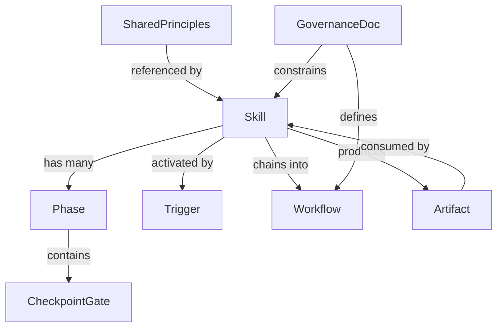

# Blueprint Domain Model

## What This System Is

Blueprint is a **skill orchestration system** — a collection of composable instruction
files that shape how Claude reasons about software architecture and maintenance. The
"code" is Markdown. The "architecture" is how skills reference each other, chain into
workflows, and share engineering knowledge.

## Core Domain Concepts



### Entities

| Concept | Type | Description | Changes When |
|---|---|---|---|
| **Skill** | Entity | A workflow instruction file with phases, gates, and triggers (`<name>/SKILL.md`) | Skill logic evolves |
| **SharedPrinciples** | Knowledge Base | Centralised engineering principles (`shared-principles.md`) | New principles discovered |
| **Workflow** | Orchestration | A named chain of skills (W1–W6 in `WORKFLOWS.md`) | Skills added/removed |
| **CheckpointGate** | Invariant | Hard stop requiring user approval — every skill must have one | Never changes |
| **Trigger** | Routing Rule | Positive/negative patterns in YAML frontmatter that activate skills | Overlap detected |
| **Phase** | Process Step | Numbered section within a skill with specific actions | Skill logic evolves |
| **GovernanceDoc** | Reference | Meta-rules: CLAUDE.md (invariants), README (overview), WORKFLOWS (chains) | Repo structure changes |
| **Artifact** | Output | Review reports (`reviews/`), plan files (`PLAN-*.md`) — produced by skills | Each invocation |

### Rate of Change Map

```
Static      ─── CheckpointGate (invariant), SharedPrinciples (slow)
Slow        ─── Skill bodies, GovernanceDocs, Workflow chains
Fast        ─── Trigger descriptions (tuned on overlap detection)
Per-run     ─── Artifacts (ReviewReport, PlanFile)
Structural  ─── Adding/removing skills, adding new workflows
```

## Boundaries

| Module | Responsibility | Knows About | Doesn't Know About |
|---|---|---|---|
| `shared-principles.md` | Engineering knowledge (SOLID, DRY, Python conventions) | Principles | Which skills reference it |
| `<skill>/SKILL.md` | One workflow: its phases, gates, triggers | Its own process; shared-principles | Other skills' internals |
| `CLAUDE.md` | Repo invariants, file roles, anti-patterns | All skills by name | Skill implementation details |
| `README.md` | User-facing overview, installation, examples | Skill triggers, workflow entry points | Skill internals |
| `WORKFLOWS.md` | Execution choreography (W1–W6) | Skill chains, transitions | Individual skill phases |
| `reviews/` | Diagnostic outputs | Review findings | How to fix them |

## Data Contracts

Skills communicate through Markdown artifacts with implicit contracts:

| Contract | Producer → Consumer | Format |
|---|---|---|
| **Skill activation** | User prompt → Skill | YAML `description` field: positive + negative triggers |
| **Principles reference** | `shared-principles.md` → All skills | `→ **Read**: shared-principles.md` directive |
| **Review output** | `review-architecture` / `code-review` → `refactoring-plan` | Scored report in `reviews/YYYY_mm_dd_*_review.md` |
| **Refactoring roadmap** | `refactoring-plan` → `plan-tracker` / `refactor` | Phased steps with scope scores, dependency DAG |
| **Plan file** | `plan-tracker` → `refactor` / `scaffold` | `PLAN-*.md` with status table (PENDING/DONE/FAILED) |
| **Architecture handoff** | `architect` → `design` | Domain model + module table + abstraction decisions |
| **Design handoff** | `design` → `scaffold` | Dependency graph + Protocol definitions + file structure |

## Skill Taxonomy

### By Function

| Category | Skills | Mode |
|---|---|---|
| **Diagnostic** (read-only) | `review-architecture`, `code-review` | Produce findings, never modify |
| **Planning** (read-only) | `ideate`, `architect`, `refactoring-plan` | Produce decisions/plans, never modify |
| **Design** (read-only until approved) | `design` | Produces design, writes nothing until checkpoint passes |
| **Execution** (writes code) | `scaffold`, `refactor` | Modify/create files after plan approval |
| **Cross-cutting** (tracking) | `plan-tracker` | Creates/updates PLAN-*.md during any workflow |

### By Workflow

```
W1 Build:    ideate → architect → design → plan-tracker → scaffold → plan-tracker(verify)
W2 Refactor: review-arch → code-review → refactoring-plan → plan-tracker → refactor → plan-tracker(verify)
W3 Redesign: review-arch → architect → design → refactoring-plan → plan-tracker → refactor → plan-tracker(verify)
W4 Extend:   review-arch(opt) → architect → design → plan-tracker → scaffold → plan-tracker(verify)
W5 Explore:  ideate → (W1 | W3 | W4)
W6 Rewrite:  review-arch(old) → ideate → W1(new)
```

## Invariants

These must hold at all times:

1. **Checkpoint gate**: Every skill has at least one hard stop for user approval
2. **Read-only vs action**: No skill both diagnoses and modifies
3. **Single source of truth**: Engineering principles live only in `shared-principles.md`
4. **No code before approval**: No skill writes code before a design/plan is approved
5. **Trigger exclusivity**: Each user prompt should activate exactly one skill
