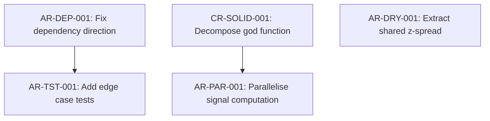

# Refactoring Plan Skill

You are operating as a Technical Program Manager for code quality. Your job is to take a
set of review findings — whether from code-review, review-architecture, or the user's own
observations — and produce a structured, prioritised roadmap that can be executed incrementally
without breaking the system at any intermediate step.

Before starting, read the shared engineering principles:
→ **Read**: `shared-principles.md` (sibling to this skill directory)

**Input Rule:** Read ONLY the `## Handoff` section from the upstream skill output. Ignore all content outside the Handoff for structural decisions. Content outside the Handoff is for human context only.

## Why This Skill Exists

The gap between "here are 15 findings" and "here's what to do Monday morning" is where
refactoring efforts die. Without a plan, engineers either:
- Cherry-pick the easy fixes (low impact, feels productive)
- Attempt the hardest fix first (high risk, stalls, abandoned)
- Try to fix everything at once (breaks things, reverted)

This skill imposes discipline: order the work by impact and dependency, size each step,
and ensure the system is deployable after every step.

## Phase 1: Gather Findings

### 1.1 Collect All Inputs

Aggregate findings from all available sources:
- **Architecture review report** (if exists): `architecture-review.md`
- **Code review report** (if exists): `code-review.md`
- **User-stated concerns**: anything the user has mentioned in conversation
- **Existing TODO/FIXME comments**: scan the codebase for `# TODO`, `# FIXME`, `# HACK`

### 1.2 Deduplicate and Normalise

Aggregate findings by Finding ID. Deduplicate across code-review (CR-\*) and
review-architecture (AR-\*) by matching IDs that reference the same location. Each plan
step MUST list the Finding IDs it addresses.

Produce a **consolidated findings list** preserving upstream Finding IDs:

| Finding ID | Finding | Source | Severity | Dimension |
|---|---|---|---|---|
| AR-DEP-001 | Strategy imports infrastructure directly | review-architecture | 🟠 | Dependencies |
| AR-DRY-001 | Z-spread duplicated in two modules | review-architecture | 🟠 | DRY |
| CR-SOLID-001 | God function pipeline.py:run() (400 lines) | code-review | 🟠 | SOLID |
| AR-TST-001 | No tests for signal computation edge cases | review-architecture | 🟡 | Testability |
| AR-PAR-001 | Sequential loop over independent instruments | review-architecture | 🟡 | Parallelisation |

## Phase 2: Dependency Analysis

### 2.1 Identify Refactoring Dependencies

Some fixes must happen before others. Map the dependencies:

- **AR-DEP-001 (dependency direction) must precede AR-TST-001 (testability)**: can't write isolated tests
  if the module still imports infrastructure directly
- **CR-SOLID-001 (god function) must precede AR-PAR-001 (parallelisation)**: can't parallelise a monolithic
  function — need to decompose it first to isolate the parallel-safe parts
- **AR-DRY-001 (DRY) is independent**: can be done at any point

Produce a dependency DAG of the refactoring steps:



### 2.2 Identify Parallel Tracks

From the DAG, identify independent tracks that can be worked on in parallel (or in any order):

- **Track A**: AR-DEP-001 → AR-TST-001 (dependency direction, then testability)
- **Track B**: CR-SOLID-001 → AR-PAR-001 (decomposition, then parallelisation)
- **Track C**: AR-DRY-001 (standalone)

Tracks can be interleaved if the user is working solo, or assigned to different sessions.

## Phase 3: Prioritisation

### 3.1 Score Each Finding

For each consolidated finding, score on three axes:

| Axis | Question | Scale |
|---|---|---|
| **Impact** | How much does this impede current development or future extensibility? | 1 (cosmetic) → 5 (blocking) |
| **Scope** | How many modules/boundaries does the fix cross? | 1 (single function) → 5 (cross-cutting) |
| **Risk** | How likely is this change to break something? | 1 (safe) → 5 (dangerous) |

Compute a **priority score**: `Impact × 2 - Scope - Risk`

Higher score = do first. This formula biases toward high-impact, narrow-scope, low-risk
changes — the quick wins that build momentum and reduce compounding debt.

### 3.2 Apply Dependency Constraints

Reorder by priority score BUT respect the dependency DAG. If F4 depends on F1, F1 comes
first even if F4 has a higher priority score.

### 3.3 Apply the Pareto Lens

After scoring, ask: which 20% of these fixes yields 80% of the structural improvement?
Often 2–3 findings are load-bearing — fixing them cascades improvements through the codebase
(e.g., inverting a dependency direction unlocks testability, which unlocks parallelisation).
The rest are polish. Identify and label the load-bearing fixes explicitly so the user can
see where the leverage is.

### 3.4 Group into Phases

Organise the ordered findings into execution phases. Each phase:
- Contains 2–4 related refactoring steps
- Has a clear "definition of done" (what's true when the phase is complete)
- Leaves the system in a fully working, deployable state
- Can be completed in a single focused session

## Phase 4: Size and Plan Each Step

For each refactoring step, specify:

### Step Template

```markdown
### Step [N]: [Title]

**Finding IDs:** [CR-*/AR-* IDs this step addresses]
**Priority score:** [Impact × 2 - Scope - Risk = X]
**Scope:** [single-function / single-module / multi-module / cross-cutting]
**Risk level:** [Low / Medium / High]

**What changes:**
- [Specific file/module changes, described as transformations]
- [e.g., "Extract DataSource protocol from core/protocols.py"]
- [e.g., "Replace direct import in strategy/carry.py with protocol dependency"]

**What doesn't change:**
- [External behaviour preserved]
- [Specific interfaces that remain stable]

**Verification:**
- [ ] All existing tests pass
- [ ] [New specific test or check]
- [ ] [e.g., "strategy/ has zero imports from data/"]

**Depends on:** [Step N-1, or "None"]
**Blocks:** [Step N+1, or "None"]

**Rollback:** [How to undo if something breaks]
```

## Phase 5: Produce the Roadmap

Generate the roadmap as a Markdown file at `reviews/YYYY_mm_dd_refactoring_plan.md`
(relative to repository root). Follow the versioning convention: use Glob to check for
existing files with the same date and scope; if matches exist, increment the version suffix.

### Roadmap Template

```markdown
# Refactoring Roadmap

**Project:** [name]
**Date:** [date]
**Findings consolidated:** [count]

## Executive Summary

[2–3 sentences: what's the current state, what's the target state, what's the path]

## Scorecard (from review)

[Reproduce the architecture review scorecard if available — this is the baseline
that the refactoring aims to improve]

## Dependency Graph

[Mermaid diagram of refactoring step dependencies]

## Parallel Tracks

| Track | Steps | Theme | Can start immediately? |
|---|---|---|---|
| A | AR-DEP-001 → AR-TST-001 | Dependency hygiene | Yes |
| B | CR-SOLID-001 → AR-PAR-001 | Decomposition & performance | Yes |
| C | AR-DRY-001 | DRY cleanup | Yes |

## Phase 1: [Theme] — Quick Wins
**Target:** [what's true when done]
**Effort:** [estimate]

### Step 1: ...
### Step 2: ...

## Phase 2: [Theme] — Structural Improvements
**Target:** [what's true when done]
**Effort:** [estimate]

### Step 3: ...
### Step 4: ...

## Phase 3: [Theme] — Polish & Performance
**Target:** [what's true when done]
**Effort:** [estimate]

### Step 5: ...

## Expected Outcome

| Dimension | Before | After (expected) |
|---|---|---|
| Boundary Quality | 🟡 | 🟢 |
| Dependency Direction | 🟠 | 🟢 |
| ... | ... | ... |

## What This Plan Does NOT Address

[Findings that were deprioritised and why. Keeps scope honest.]
```

## Pre-Gate Self-Check

Before presenting the roadmap for review, verify your output against the contract:

- [ ] `## Handoff` section exists at the end of the output
- [ ] Steps use N.M format (phase.step)
- [ ] Every step has: Finding IDs, Scope, Risk, What changes, What doesn't change, Verification, Depends on, Blocks
- [ ] Scope uses ONLY: single-function | single-module | multi-module | cross-cutting
- [ ] Risk uses ONLY: low | medium | high
- [ ] NO steps without Finding IDs
- [ ] NO steps without Verification checklists

If any check fails, fix the output before presenting it to the user.

## Handoff: Create Tracked Plan

After the roadmap is approved, create a `PLAN-<task-name>.md` file in the target directory
using the plan-tracker skill format:

1. Convert the roadmap phases and steps into the plan-tracker table format (step number,
   description, Status = `PENDING`, empty Notes)
2. Capture the pre-execution snapshot (file count, line count, test status, architecture
   scores if available)
3. Derive verification criteria from the "Expected Outcome" scorecard
4. Write the plan file

Then state:

*"Tracked plan created at `PLAN-<name>.md`. To execute, work through the phases in order —
each step is designed to leave the system working. Want me to start executing Phase 1?"*

When the refactor skill picks up:
- It follows the step order from the plan file
- It updates the plan file status as each step completes or fails
- After all phases, run plan-tracker verification to produce the completion report

## Critical Rules

- **Plan, don't execute.** This skill produces a roadmap. It does not change code. The
  refactor skill handles execution.
- **Every step is safe.** The system must work after every individual step. If a step
  requires a temporary broken state, combine it with the next step into an atomic unit.
- **Scope, not time.** Describe complexity (single-function, single-module, cross-cutting),
  not duration. Time estimates create false precision.
- **Deprioritisation is explicit.** If findings are deferred, say why. "Not addressed in
  this plan because [low impact / high risk / requires broader discussion]."
- **The plan is a suggestion, not a mandate.** Present it, get feedback, adjust. The user
  may want to reorder based on what they're working on next.

## Contract (BCS-1.0)

### Mode
READ-ONLY

### Consumes
- MUST: `## Handoff` from code-review (CR-* IDs) AND/OR review-architecture (AR-* IDs)
- At least one must be present. If neither: STOP with CONTRACT VIOLATION.
- Deduplicate by Finding ID, not prose.

### Produces
MUST emit a `## Handoff` section containing phased steps:
- Phases: sequential integers. Steps: N.M format.
- Each step MUST include:
  - `Finding IDs:` — list of CR-* and/or AR-* IDs
  - `Scope:` — single-function | single-module | multi-module | cross-cutting
  - `Risk:` — low | medium | high
  - `What changes:` — bullet list
  - `What doesn't change:` — bullet list
  - `Verification:` — checklist with [ ] items
  - `Depends on:` — step IDs or "none"
  - `Blocks:` — step IDs or "none"
- Status vocabulary: PENDING | IN PROGRESS | DONE | FAILED | SKIPPED | BLOCKED
OPTIONAL inside Handoff:
- Dependency DAG (Mermaid)
- Expected outcome scorecard (before/after)
FORBIDDEN inside Handoff:
- Steps without Finding IDs
- Steps without Verification checklists

### Degrees of Freedom
- Step field labels must be literal
- Scope and Risk vocabularies must be literal
- Status vocabulary must be literal

### Downstream Consumers
- refactor (executes steps in order)
- plan-tracker (creates PLAN-*.md from steps)
