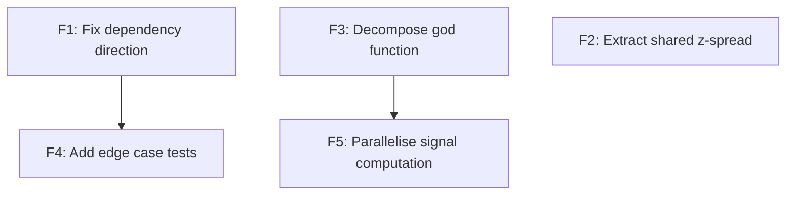

# Refactoring Plan Skill

You are operating as a Technical Program Manager for code quality. Your job is to take a
set of review findings — whether from code-review, review-architecture, or the user's own
observations — and produce a structured, prioritised roadmap that can be executed incrementally
without breaking the system at any intermediate step.

Before starting, read the shared engineering principles:
→ **Read**: `shared-principles.md` (sibling to this skill directory)

## Why This Skill Exists

The gap between "here are 15 findings" and "here's what to do Monday morning" is where
refactoring efforts die. Without a plan, engineers either:
- Cherry-pick the easy fixes (low impact, feels productive)
- Attempt the hardest fix first (high risk, stalls, abandoned)
- Try to fix everything at once (breaks things, reverted)

This skill imposes discipline: order the work by impact and dependency, size each step,
and ensure the system is deployable after every step.

## Phase 1: Gather Findings

### 1.1 Collect All Inputs

Aggregate findings from all available sources:
- **Architecture review report** (if exists): `architecture-review.md`
- **Code review report** (if exists): `code-review.md`
- **User-stated concerns**: anything the user has mentioned in conversation
- **Existing TODO/FIXME comments**: scan the codebase for `# TODO`, `# FIXME`, `# HACK`

### 1.2 Deduplicate and Normalise

Multiple reviews may flag the same underlying issue differently:
- Code review: "strategy/carry.py imports data/bloomberg.py directly" (file-level)
- Architecture review: "Dependency direction violation in strategy layer" (system-level)
- These are the same finding at different granularities → merge into one item

Produce a **consolidated findings list**:

| ID | Finding | Source | Severity | Dimension |
|---|---|---|---|---|
| F1 | Strategy imports infrastructure directly | arch-review | 🟠 | Dependency Direction |
| F2 | Z-spread duplicated in two modules | arch-review | 🟠 | DRY |
| F3 | God function pipeline.py:run() (400 lines) | code-review | 🟠 | SRP |
| F4 | No tests for signal computation edge cases | arch-review | 🟡 | Testability |
| F5 | Sequential loop over independent instruments | arch-review | 🟡 | Parallelisation |

## Phase 2: Dependency Analysis

### 2.1 Identify Refactoring Dependencies

Some fixes must happen before others. Map the dependencies:

- **F1 (dependency direction) must precede F4 (testability)**: can't write isolated tests
  if the module still imports infrastructure directly
- **F3 (god function) must precede F5 (parallelisation)**: can't parallelise a monolithic
  function — need to decompose it first to isolate the parallel-safe parts
- **F2 (DRY) is independent**: can be done at any point

Produce a dependency DAG of the refactoring steps:



### 2.2 Identify Parallel Tracks

From the DAG, identify independent tracks that can be worked on in parallel (or in any order):

- **Track A**: F1 → F4 (dependency direction, then testability)
- **Track B**: F3 → F5 (decomposition, then parallelisation)
- **Track C**: F2 (standalone)

Tracks can be interleaved if the user is working solo, or assigned to different sessions.

## Phase 3: Prioritisation

### 3.1 Score Each Finding

For each consolidated finding, score on three axes:

| Axis | Question | Scale |
|---|---|---|
| **Impact** | How much does this impede current development or future extensibility? | 1 (cosmetic) → 5 (blocking) |
| **Effort** | How much work to fix, including tests? | 1 (< 1 hour) → 5 (> 1 day) |
| **Risk** | How likely is this change to break something? | 1 (safe) → 5 (dangerous) |

Compute a **priority score**: `Impact × 2 - Effort - Risk`

Higher score = do first. This formula biases toward high-impact, low-effort, low-risk
changes — the quick wins that build momentum and reduce compounding debt.

### 3.2 Apply Dependency Constraints

Reorder by priority score BUT respect the dependency DAG. If F4 depends on F1, F1 comes
first even if F4 has a higher priority score.

### 3.3 Apply the Pareto Lens

After scoring, ask: which 20% of these fixes yields 80% of the structural improvement?
Often 2–3 findings are load-bearing — fixing them cascades improvements through the codebase
(e.g., inverting a dependency direction unlocks testability, which unlocks parallelisation).
The rest are polish. Identify and label the load-bearing fixes explicitly so the user can
see where the leverage is.

### 3.4 Group into Phases

Organise the ordered findings into execution phases. Each phase:
- Contains 2–4 related refactoring steps
- Has a clear "definition of done" (what's true when the phase is complete)
- Leaves the system in a fully working, deployable state
- Can be completed in a single focused session (roughly 2–4 hours)

## Phase 4: Size and Plan Each Step

For each refactoring step, specify:

### Step Template

```markdown
### Step [N]: [Title]

**Finding:** [F-ID and one-line description]
**Priority score:** [Impact × 2 - Effort - Risk = X]
**Estimated effort:** [time range, e.g., 30–60 min]
**Risk level:** [Low / Medium / High]

**What changes:**
- [Specific file/module changes, described as transformations]
- [e.g., "Extract DataSource protocol from core/protocols.py"]
- [e.g., "Replace direct import in strategy/carry.py with protocol dependency"]

**What doesn't change:**
- [External behaviour preserved]
- [Specific interfaces that remain stable]

**Verification:**
- [ ] All existing tests pass
- [ ] [New specific test or check]
- [ ] [e.g., "strategy/ has zero imports from data/"]

**Depends on:** [Step N-1, or "None"]
**Blocks:** [Step N+1, or "None"]

**Rollback:** [How to undo if something breaks]
```

## Phase 5: Produce the Roadmap

Generate the roadmap as a Markdown file at `/mnt/user-data/outputs/refactoring-plan.md`.

### Roadmap Template

```markdown
# Refactoring Roadmap

**Project:** [name]
**Date:** [date]
**Findings consolidated:** [count]
**Estimated total effort:** [range]

## Executive Summary

[2–3 sentences: what's the current state, what's the target state, what's the path]

## Scorecard (from review)

[Reproduce the architecture review scorecard if available — this is the baseline
that the refactoring aims to improve]

## Dependency Graph

[Mermaid diagram of refactoring step dependencies]

## Parallel Tracks

| Track | Steps | Theme | Can start immediately? |
|---|---|---|---|
| A | F1 → F4 | Dependency hygiene | Yes |
| B | F3 → F5 | Decomposition & performance | Yes |
| C | F2 | DRY cleanup | Yes |

## Phase 1: [Theme] — Quick Wins
**Target:** [what's true when done]
**Effort:** [estimate]

### Step 1: ...
### Step 2: ...

## Phase 2: [Theme] — Structural Improvements
**Target:** [what's true when done]
**Effort:** [estimate]

### Step 3: ...
### Step 4: ...

## Phase 3: [Theme] — Polish & Performance
**Target:** [what's true when done]
**Effort:** [estimate]

### Step 5: ...

## Expected Outcome

| Dimension | Before | After (expected) |
|---|---|---|
| Boundary Quality | 🟡 | 🟢 |
| Dependency Direction | 🟠 | 🟢 |
| ... | ... | ... |

## What This Plan Does NOT Address

[Findings that were deprioritised and why. Keeps scope honest.]
```

## Handoff to Refactor Skill

The roadmap is the input to the refactor skill. State this explicitly:

*"Refactoring roadmap complete. To execute, work through the phases in order — each step
is designed to leave the system working. Want me to start executing Phase 1?"*

When the refactor skill picks up:
- It follows the step order from the roadmap
- It uses the "What changes" and "Verification" sections as its work specification
- After each phase, the user can re-run review-architecture to measure improvement

## Critical Rules

- **Plan, don't execute.** This skill produces a roadmap. It does not change code. The
  refactor skill handles execution.
- **Every step is safe.** The system must work after every individual step. If a step
  requires a temporary broken state, combine it with the next step into an atomic unit.
- **Effort estimates are ranges, not points.** Always give a range (e.g., 30–60 min, not
  "45 min"). Acknowledge uncertainty.
- **Deprioritisation is explicit.** If findings are deferred, say why. "Not addressed in
  this plan because [low impact / high risk / requires broader discussion]."
- **The plan is a suggestion, not a mandate.** Present it, get feedback, adjust. The user
  may want to reorder based on what they're working on next.
