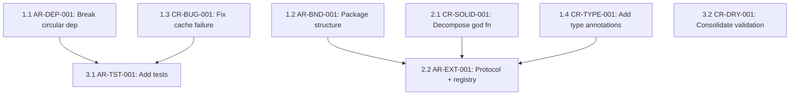
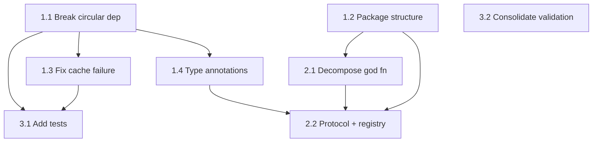

# Golden Example: refactoring-plan — pricefeed

Demonstrates a complete refactoring-plan output for the pricefeed project
(W2 Refactor). Exercises all MUST fields in the BCS-1.0 contract.

---

## Scenario

**Upstream:** code-review Handoff (CR-BUG-001, CR-SOLID-001, CR-TYPE-001,
CR-DRY-001) and review-architecture Handoff (AR-DEP-001, AR-BND-001,
AR-DRY-001, AR-EXT-001, AR-TST-001).

---

## Example Output

# Refactoring Roadmap

**Project:** pricefeed
**Date:** 2025-03-15
**Findings consolidated:** 8 (4 CR + 5 AR, with 1 merge: CR-DRY-001 ≈ AR-DRY-001)

## Executive Summary

The pricefeed codebase works but has critical structural issues: a circular
dependency between fetchers and cache, a 380-line god function, no protocols,
no tests, and poor extensibility (4 files to add a new source). The plan
addresses these in three phases: break the cycle and add types (Phase 1),
decompose the god function and add protocols (Phase 2), then add tests and
consolidate DRY violations (Phase 3).

## Scorecard (from review)

| Dimension | Score |
|---|---|
| Boundary Quality | 🟠 |
| Dependency Direction | 🟠 |
| Abstraction Fitness | 🟡 |
| DRY & Knowledge | 🟡 |
| Extensibility | 🔴 |
| Testability | 🟠 |
| Parallelisation | 🟡 |

## Consolidated Findings

| Finding ID | Finding | Source | Severity | Dimension |
|---|---|---|---|---|
| AR-DEP-001 | Circular dependency fetchers ↔ cache | review-architecture | 🟠 | Dependencies |
| AR-EXT-001 | Adding source requires 4 file changes | review-architecture | 🔴 | Extensibility |
| CR-SOLID-001 | God function run_all() 380 lines | code-review | 🟠 | SOLID |
| CR-BUG-001 | Cache returns stale data on silent failure | code-review | 🔴 | Correctness |
| AR-BND-001 | Flat package, no domain boundaries | review-architecture | 🟠 | Boundaries |
| CR-TYPE-001 | No type annotations on public functions | code-review | 🟠 | Types |
| CR-DRY-001 / AR-DRY-001 | Validation duplicated in two locations | both | 🟡 | DRY |
| AR-TST-001 | No tests; can't test in isolation | review-architecture | 🟠 | Testability |

## Dependency Graph

## Parallel Tracks

| Track | Steps | Theme | Can start immediately? |
|---|---|---|---|
| A | 1.1 → 1.3 → 3.1 | Dependency hygiene + testing | Yes |
| B | 1.2 → 1.4 → 2.1 → 2.2 | Structure + extensibility | Yes |
| C | 3.2 | DRY cleanup | After Phase 1 |

## Phase 1: Foundation — Break Cycles and Add Types

**Target:** No circular imports, package structure in place, type annotations
on all public functions, cache failure bug fixed.

### Step 1.1: Break circular dependency between fetchers and cache

**Finding IDs:** AR-DEP-001
**Priority score:** Impact 5 × 2 - Scope 2 - Risk 2 = 6
**Scope:** multi-module
**Risk level:** medium

**What changes:**
- Create `core/types.py` with PriceRecord dataclass
- Move shared type definitions out of `fetchers.py` and `cache.py`
- Replace direct imports between fetchers and cache with imports from core

**What doesn't change:**
- External behaviour of `pipeline.run_all()`
- CLI interface
- Config file format

**Verification:**
- [ ] All existing tests pass (currently none — pipeline runs without error)
- [ ] `python -c "import pricefeed.fetchers"` succeeds without importing cache
- [ ] `python -c "import pricefeed.cache"` succeeds without importing fetchers
- [ ] No circular import warnings

**Depends on:** none
**Blocks:** 3.1

### Step 1.2: Introduce package structure

**Finding IDs:** AR-BND-001
**Priority score:** Impact 4 × 2 - Scope 3 - Risk 2 = 3
**Scope:** cross-cutting
**Risk level:** medium

**What changes:**
- Create directories: `core/`, `fetchers/`, `validators/`, `cache/`, `cli/`
- Move `fetchers.py` → `fetchers/csv_fetcher.py` and `fetchers/api_fetcher.py`
- Move `validators.py` → `validators/range.py`
- Move `cache.py` → `cache/store.py`
- Move `pipeline.py` → `cli/main.py`
- Update all internal imports

**What doesn't change:**
- Module contents (only locations change)
- External CLI interface
- Config file format

**Verification:**
- [ ] Pipeline runs end-to-end without error
- [ ] All imports resolve
- [ ] Directory structure matches target layout

**Depends on:** none
**Blocks:** 2.1, 2.2

### Step 1.3: Fix cache silent failure bug

**Finding IDs:** CR-BUG-001
**Priority score:** Impact 5 × 2 - Scope 1 - Risk 1 = 8
**Scope:** single-function
**Risk level:** low

**What changes:**
- Remove fetch-on-miss behaviour from `cache.get_price()`
- Cache only returns cached data or None
- Fetching is orchestrator's responsibility, not cache's

**What doesn't change:**
- Cache storage mechanism
- Cache update interface

**Verification:**
- [ ] `cache.get_price("UNKNOWN")` returns None (not a fetch attempt)
- [ ] Pipeline still works (orchestrator handles fetching)

**Depends on:** 1.1
**Blocks:** 3.1

### Step 1.4: Add type annotations to all public functions

**Finding IDs:** CR-TYPE-001
**Priority score:** Impact 4 × 2 - Scope 3 - Risk 1 = 4
**Scope:** cross-cutting
**Risk level:** low

**What changes:**
- Add type annotations to all public functions in all modules
- Use PriceRecord from core/types.py as the shared type

**What doesn't change:**
- Function behaviour
- Function signatures (only adding type info)

**Verification:**
- [ ] `mypy --strict` passes (or pyright equivalent)
- [ ] Pipeline runs without error

**Depends on:** 1.1
**Blocks:** 2.2

## Phase 2: Structure — Decompose and Add Protocols

**Target:** God function decomposed, PriceFetcher protocol extracted, adding a
new source is one file + config entry.

### Step 2.1: Decompose god function pipeline.py:run_all()

**Finding IDs:** CR-SOLID-001
**Priority score:** Impact 5 × 2 - Scope 2 - Risk 3 = 5
**Scope:** single-module
**Risk level:** medium

**What changes:**
- Split `run_all()` into: `fetch_all_sources()`, `validate_records()`,
  `update_cache()`, `report_results()`
- Each function ≤30 lines, single responsibility
- Orchestrator function calls them in sequence

**What doesn't change:**
- End-to-end pipeline behaviour
- CLI interface
- Output format

**Verification:**
- [ ] Pipeline produces identical output before and after
- [ ] Each extracted function is callable independently
- [ ] No function exceeds 30 lines

**Depends on:** 1.2
**Blocks:** 2.2

### Step 2.2: Extract PriceFetcher protocol and registry

**Finding IDs:** AR-EXT-001
**Priority score:** Impact 5 × 2 - Scope 3 - Risk 2 = 5
**Scope:** multi-module
**Risk level:** medium

**What changes:**
- Define PriceFetcher protocol in `core/types.py`
- Refactor CsvFetcher and ApiFetcher to implement protocol
- Add fetcher registry (dict mapping source type → fetcher class)
- Orchestrator iterates registry, not hardcoded `if/elif` branches

**What doesn't change:**
- Fetcher behaviour (same data returned)
- Config file format
- CLI interface

**Verification:**
- [ ] Pipeline works with existing sources
- [ ] Adding a mock fetcher requires only: new file + config entry
- [ ] No `isinstance` or `if source_type ==` checks in orchestrator
- [ ] `fetchers/` has no imports from `cache/` or `cli/`

**Depends on:** 1.2, 1.4, 2.1
**Blocks:** none

## Phase 3: Quality — Tests and DRY

**Target:** Unit tests for all modules, validation centralised, test suite
passes.

### Step 3.1: Add unit and integration tests

**Finding IDs:** AR-TST-001
**Priority score:** Impact 4 × 2 - Scope 3 - Risk 1 = 4
**Scope:** cross-cutting
**Risk level:** low

**What changes:**
- Create `tests/unit/` with tests for: RangeValidator, PriceCache, CsvFetcher
  (with mock file)
- Create `tests/integration/` with orchestrator test using mock fetcher
- Add `conftest.py` with shared fixtures (sample PriceRecords)

**What doesn't change:**
- All source code (tests only)

**Verification:**
- [ ] `pytest tests/` passes
- [ ] Each module has at least one unit test
- [ ] Integration test covers fetch → validate → cache path

**Depends on:** 1.1, 1.3
**Blocks:** none

### Step 3.2: Consolidate duplicated validation logic

**Finding IDs:** CR-DRY-001, AR-DRY-001
**Priority score:** Impact 3 × 2 - Scope 1 - Risk 1 = 4
**Scope:** single-module
**Risk level:** low

**What changes:**
- Remove inline validation from pipeline/orchestrator
- All validation flows through Validator protocol implementation
- Thresholds configured via ValidationConfig, not hardcoded

**What doesn't change:**
- Validation rules (same thresholds)
- Pipeline behaviour

**Verification:**
- [ ] Only one location contains price range check logic
- [ ] Thresholds are configurable via config file
- [ ] Pipeline output unchanged

**Depends on:** none
**Blocks:** none

## Expected Outcome

| Dimension | Before | After (expected) |
|---|---|---|
| Boundary Quality | 🟠 | 🟢 |
| Dependency Direction | 🟠 | 🟢 |
| Abstraction Fitness | 🟡 | 🟢 |
| DRY & Knowledge | 🟡 | 🟢 |
| Extensibility | 🔴 | 🟢 |
| Testability | 🟠 | 🟢 |
| Parallelisation | 🟡 | 🟡 |

## What This Plan Does NOT Address

- **Parallelisation (AR-PAR implicit):** Sequential fetching is fine for 2-3
  sources. Address when source count exceeds 5 or latency becomes an issue.
- **API rate limiting:** Not a structural issue — add when ApiFetcher is
  production-hardened.

## Handoff

### Phase 1: Foundation

#### Step 1.1: Break circular dependency

**Finding IDs:** AR-DEP-001
**Scope:** multi-module
**Risk:** medium
**What changes:**
- Create `core/types.py` with PriceRecord dataclass
- Move shared types out of `fetchers.py` and `cache.py`
- Replace direct cross-imports with imports from core
**What doesn't change:**
- External behaviour of pipeline
- CLI interface, config format
**Verification:**
- [ ] Pipeline runs without error
- [ ] `import pricefeed.fetchers` succeeds without importing cache
- [ ] `import pricefeed.cache` succeeds without importing fetchers
- [ ] No circular import warnings
**Depends on:** none
**Blocks:** 1.3, 3.1

#### Step 1.2: Introduce package structure

**Finding IDs:** AR-BND-001
**Scope:** cross-cutting
**Risk:** medium
**What changes:**
- Create directories: `core/`, `fetchers/`, `validators/`, `cache/`, `cli/`
- Move and rename modules to match target layout
- Update all internal imports
**What doesn't change:**
- Module contents (only locations)
- CLI interface, config format
**Verification:**
- [ ] Pipeline runs end-to-end
- [ ] All imports resolve
- [ ] Directory structure matches target
**Depends on:** none
**Blocks:** 2.1, 2.2

#### Step 1.3: Fix cache silent failure

**Finding IDs:** CR-BUG-001
**Scope:** single-function
**Risk:** low
**What changes:**
- Remove fetch-on-miss from `cache.get_price()`
- Cache returns cached data or None only
**What doesn't change:**
- Cache storage mechanism
- Cache update interface
**Verification:**
- [ ] `cache.get_price("UNKNOWN")` returns None
- [ ] Pipeline works (orchestrator handles fetching)
**Depends on:** 1.1
**Blocks:** 3.1

#### Step 1.4: Add type annotations

**Finding IDs:** CR-TYPE-001
**Scope:** cross-cutting
**Risk:** low
**What changes:**
- Type annotations on all public functions
- Use PriceRecord from core/types.py
**What doesn't change:**
- Function behaviour and signatures
**Verification:**
- [ ] Type checker passes
- [ ] Pipeline runs without error
**Depends on:** 1.1
**Blocks:** 2.2

### Phase 2: Structure

#### Step 2.1: Decompose god function

**Finding IDs:** CR-SOLID-001
**Scope:** single-module
**Risk:** medium
**What changes:**
- Split `run_all()` into `fetch_all_sources()`, `validate_records()`,
  `update_cache()`, `report_results()`
- Each ≤30 lines
**What doesn't change:**
- End-to-end behaviour
- CLI interface, output format
**Verification:**
- [ ] Pipeline produces identical output
- [ ] Each function callable independently
- [ ] No function exceeds 30 lines
**Depends on:** 1.2
**Blocks:** 2.2

#### Step 2.2: Extract PriceFetcher protocol and registry

**Finding IDs:** AR-EXT-001
**Scope:** multi-module
**Risk:** medium
**What changes:**
- PriceFetcher protocol in `core/types.py`
- CsvFetcher and ApiFetcher implement protocol
- Fetcher registry replaces `if/elif` branches
**What doesn't change:**
- Fetcher behaviour
- Config format, CLI interface
**Verification:**
- [ ] Pipeline works with existing sources
- [ ] Adding mock fetcher requires only new file + config
- [ ] No isinstance checks in orchestrator
- [ ] `fetchers/` has no imports from `cache/` or `cli/`
**Depends on:** 1.2, 1.4, 2.1
**Blocks:** none

### Phase 3: Quality

#### Step 3.1: Add tests

**Finding IDs:** AR-TST-001
**Scope:** cross-cutting
**Risk:** low
**What changes:**
- Create `tests/unit/` and `tests/integration/`
- Unit tests for validator, cache, fetcher
- Integration test for orchestrator
**What doesn't change:**
- All source code
**Verification:**
- [ ] `pytest tests/` passes
- [ ] Each module has at least one test
- [ ] Integration test covers fetch → validate → cache
**Depends on:** 1.1, 1.3
**Blocks:** none

#### Step 3.2: Consolidate validation

**Finding IDs:** CR-DRY-001, AR-DRY-001
**Scope:** single-module
**Risk:** low
**What changes:**
- Remove inline validation from orchestrator
- All validation through Validator implementation
- Thresholds from ValidationConfig
**What doesn't change:**
- Validation rules and thresholds
- Pipeline behaviour
**Verification:**
- [ ] Single location for price range logic
- [ ] Thresholds configurable via config
- [ ] Pipeline output unchanged
**Depends on:** none
**Blocks:** none

### Dependency DAG

### Expected Outcome

| Dimension | Before | After |
|---|---|---|
| Boundary Quality | 🟠 | 🟢 |
| Dependency Direction | 🟠 | 🟢 |
| Abstraction Fitness | 🟡 | 🟢 |
| DRY & Knowledge | 🟡 | 🟢 |
| Extensibility | 🔴 | 🟢 |
| Testability | 🟠 | 🟢 |
| Parallelisation | 🟡 | 🟡 |
