# Golden Example: review-architecture — pricefeed

Demonstrates a complete review-architecture output for a messy existing
pricefeed codebase (W2 Refactor, review phase). Exercises all MUST fields
in the BCS-1.0 contract.

---

## Scenario

**User prompt:** "Review the architecture of this project"

The existing pricefeed codebase is a flat structure with circular imports,
no protocols, and tightly coupled modules.

---

## Example Output

# Architecture Review Report

**Project:** pricefeed
**Date:** 2025-03-15
**Files reviewed:** 5
**Overall health:** 🟠 Weak

## Codebase Summary

Pricefeed is a Python application that fetches bond prices from CSV files and
an external API, validates them, caches in memory, and serves via CLI. It is
currently structured as a flat package with 5 modules: `pipeline.py`
(orchestration), `fetchers.py` (data sources), `validators.py` (validation),
`cache.py` (caching), and `config.py` (configuration). The system works but
has grown without architectural discipline — circular imports exist between
`fetchers.py` and `cache.py`, there are no protocols, and the pipeline module
has become a god module that imports everything.

## Scorecard

| Dimension | Score | Key Finding |
|---|---|---|
| Boundary Quality | 🟠 | Flat structure mixes domain types, I/O, and orchestration |
| Dependency Direction | 🟠 | fetchers.py imports cache.py directly (circular) |
| Abstraction Fitness | 🟡 | No protocols; implicit interfaces only |
| DRY & Knowledge | 🟡 | Validation logic duplicated in validators.py and pipeline.py |
| Extensibility | 🔴 | Adding a new source requires modifying 4 existing files |
| Testability | 🟠 | Cannot test fetchers without real cache; no mocking surface |
| Parallelisation | 🟡 | Sequential fetching from sources; each is independent |

**Overall: 🟠 Weak — structural investment needed before adding more sources**

## Dependency Graph

```mermaid
graph TD
    pipeline[pipeline.py] --> fetchers[fetchers.py]
    pipeline --> validators[validators.py]
    pipeline --> cache[cache.py]
    pipeline --> config[config.py]
    fetchers -->|⚠️ circular| cache
    cache -->|⚠️ circular| fetchers
    validators --> config
```

## Detailed Findings

### AR-DEP-001: Circular dependency between fetchers.py and cache.py
- **Finding ID:** AR-DEP-001
- **Dimension:** Dependencies
- **Severity:** 🟠 Weak
- **Location:** `fetchers.py:L3`, `cache.py:L5`
- **Principle violated:** Dependency Inversion, DAG requirement
- **Evidence:** `fetchers.py` imports `cache.update_cache()` to write fetched
  data. `cache.py` imports `fetchers.fetch_prices()` as a fallback when cache
  misses. Both modules depend on each other's implementation.
- **Impact:** Cannot test either module in isolation. Cannot swap fetcher or
  cache implementation without modifying the other.
- **Recommendation:** Break cycle by extracting protocols to a `core/types.py`
  module. Fetchers produce records; cache consumes records. Wiring happens in
  the orchestrator, not in the modules themselves.

### AR-BND-001: Flat package structure with no domain boundaries
- **Finding ID:** AR-BND-001
- **Dimension:** Boundaries
- **Severity:** 🟠 Weak
- **Location:** `src/pricefeed/` (5 files, no subdirectories)
- **Principle violated:** Single Responsibility, Rate-of-change alignment
- **Evidence:** All modules live at the same level. `pipeline.py` (orchestration)
  is a sibling of `fetchers.py` (I/O) and `validators.py` (business rules).
  No separation between domain types, infrastructure, and orchestration.
- **Impact:** As the system grows, the flat structure forces all changes through
  the same namespace. No clear ownership boundaries.
- **Recommendation:** Introduce package structure: `core/` for types and
  protocols, `fetchers/` for data sources, `validators/` for business rules,
  `cache/` for storage, `cli/` for orchestration.

### AR-DRY-001: Validation threshold hardcoded in two locations
- **Finding ID:** AR-DRY-001
- **Dimension:** DRY
- **Severity:** 🟡 Adequate
- **Location:** `validators.py:L22`, `pipeline.py:L180`
- **Principle violated:** DRY (knowledge duplication)
- **Evidence:** Price range check (0 to 1,000,000) appears in both the
  validator module and inline in the pipeline. Different error handling at
  each location.
- **Impact:** Threshold changes must be made in two places; risk of divergence.
- **Recommendation:** Centralise validation in a single Validator protocol
  implementation. Pipeline delegates, not duplicates.

### AR-EXT-001: Adding a new data source requires 4 file changes
- **Finding ID:** AR-EXT-001
- **Dimension:** Extensibility
- **Severity:** 🔴 Critical
- **Location:** `fetchers.py`, `pipeline.py`, `config.py`, `cache.py`
- **Principle violated:** Open/Closed
- **Evidence:** Traced adding a new "REST API" source: (1) add function to
  `fetchers.py`, (2) add `if source_type == "rest"` branch to `pipeline.py:L45`,
  (3) add config schema to `config.py`, (4) add cache key mapping to `cache.py`.
  Four existing files modified for one new source.
- **Impact:** Shotgun surgery. Each new source increases coupling and regression
  risk.
- **Recommendation:** PriceFetcher protocol + registry pattern. New source =
  one new file implementing the protocol + config entry. Zero existing file
  modifications.

### AR-TST-001: No tests; cannot test modules in isolation
- **Finding ID:** AR-TST-001
- **Dimension:** Testability
- **Severity:** 🟠 Weak
- **Location:** Project-wide (no `tests/` directory)
- **Principle violated:** Testability
- **Evidence:** No `tests/` directory exists. Circular dependencies make it
  impossible to mock `fetchers` without also mocking `cache` (and vice versa).
  The god function `pipeline.run_all()` is untestable in isolation — requires
  all dependencies live.
- **Impact:** No regression safety net. Refactoring is risky without tests.
- **Recommendation:** Break circular dependency first (AR-DEP-001), then add
  unit tests for each module behind protocols. Add integration test for the
  orchestrator.

## Positive Highlights

1. **Clear naming**: Module names (`fetchers`, `validators`, `cache`) map to
   domain concepts — the boundaries are conceptually right even if structurally
   flat.
2. **Config externalised**: Settings loaded from YAML, not hardcoded in source.
3. **Logging infrastructure**: Every module uses `logging.getLogger(__name__)`.

## Recommended Review Cadence

Re-run this review after completing the refactoring plan. The circular
dependency (AR-DEP-001) and extensibility issue (AR-EXT-001) are the
load-bearing findings — once those are fixed, the scorecard should improve
significantly.

## Handoff

| Dimension | Score | Key Finding |
|---|---|---|
| Boundary Quality | 🟠 | Flat structure mixes domain, I/O, orchestration |
| Dependency Direction | 🟠 | Circular dependency between fetchers and cache |
| Abstraction Fitness | 🟡 | No protocols; implicit interfaces only |
| DRY & Knowledge | 🟡 | Validation threshold duplicated in two locations |
| Extensibility | 🔴 | Adding a new source requires modifying 4 files |
| Testability | 🟠 | No tests; circular deps prevent isolation |
| Parallelisation | 🟡 | Sequential fetching; sources are independent |

### AR-DEP-001
- **Severity:** 🟠
- **Dimension:** Dependencies
- **Location:** `fetchers.py:L3`, `cache.py:L5`
- **Summary:** Circular dependency between fetchers.py and cache.py. Each
  imports the other directly, preventing isolated testing and implementation
  swapping.

### AR-BND-001
- **Severity:** 🟠
- **Dimension:** Boundaries
- **Location:** `src/pricefeed/` (flat package)
- **Summary:** No package structure separating domain types, infrastructure,
  and orchestration. All 5 modules at the same level.

### AR-DRY-001
- **Severity:** 🟡
- **Dimension:** DRY
- **Location:** `validators.py:L22`, `pipeline.py:L180`
- **Summary:** Price range validation (0–1M) duplicated with different error
  handling at each location.

### AR-EXT-001
- **Severity:** 🔴
- **Dimension:** Extensibility
- **Location:** `fetchers.py`, `pipeline.py`, `config.py`, `cache.py`
- **Summary:** Adding a new data source requires modifying 4 existing files.
  No protocol or registry pattern. Violates Open/Closed.

### AR-TST-001
- **Severity:** 🟠
- **Dimension:** Testability
- **Location:** Project-wide
- **Summary:** No tests directory. Circular dependencies make isolated testing
  impossible. God function untestable without all live dependencies.
