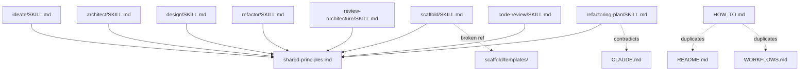

# Full Audit Review — Architecture + Code Review

**Project:** blueprint
**Date:** 2026-02-28
**Files reviewed:** 16 (all files in repository)
**Overall health:** 🟡 Needs attention

---

## Part 1: Architecture Review

### Codebase Summary

Blueprint is a collection of composable Markdown instruction files ("skills") that encode architecture-first engineering workflows for Claude. Skills chain into two pipelines: a build workflow (`ideate -> architect -> design -> scaffold`) and a review workflow (`code-review + review-architecture -> refactoring-plan -> refactor`). Shared engineering principles live in a single file referenced by all skills. The system has no executable code, no tests, and no automation — validation is entirely manual.

### Architecture Scorecard

| Dimension | Score | Key Finding |
|---|---|---|
| Boundary Quality | Strong | Each skill has clear single responsibility; domain naming |
| Dependency Direction | Strong | All skills reference shared-principles.md correctly |
| Abstraction Fitness | Adequate | HOW_TO.md is an abstraction without a clear role |
| DRY & Knowledge | Weak | Triple coverage of triggers/workflows across README, WORKFLOWS, HOW_TO |
| Extensibility | Strong | Adding a new skill is well-documented 5-step process |
| Testability | Weak | No automated validation; manual checklist only |
| Consistency | Weak | Output paths, time estimates, file conventions diverge across skills |

**Overall: Adequate — solid skill architecture with documentation hygiene issues that will compound**

### Dependency Graph



### Positive Architecture Highlights

1. **Excellent skill boundary design.** Each skill has clear single responsibility, positive AND negative triggers, explicit handoff points.
2. **shared-principles.md as single source of truth.** Zero duplication across 8 skills.
3. **Checkpoint gates universally enforced.** Core invariant holds in every skill.
4. **CLAUDE.md is comprehensive and actionable.** Anti-patterns table prevents real mistakes.

---

## Part 2: Code Review

### Executive Summary

The skill files are individually well-crafted with clear phase structures, strong checkpoint gates, and good shared-principles referencing. However, there are correctness issues: broken references, contradictions with governing CLAUDE.md, inconsistent output conventions, and orphaned files. The dominant pattern is **multi-agent drift** — different agents wrote different parts without cross-checking siblings. Top priority: fix the 3 internal contradictions.

### Findings

#### 1. refactoring-plan contradicts CLAUDE.md on time estimates
- **Severity:** Critical
- **Pillar:** Correctness / Governance compliance
- **Location:** `refactoring-plan/SKILL.md`, lines 104-105, 131, 148, 179, 254

BEFORE:
```
| **Effort** | How much work to fix, including tests? | 1 (< 1 hour) -> 5 (> 1 day) |
```
```
**Estimated effort:** [time range, e.g., 30-60 min]
```

AFTER:
```
| **Effort** | Scope and complexity of the fix | 1 (single function) -> 5 (cross-cutting) |
```
```
**Scope:** [complexity descriptor, e.g., "single-module", "cross-cutting"]
```

WHY: CLAUDE.md explicitly prohibits time estimates in plans. Direct violation of governing document.

---

#### 2. Scaffold references non-existent templates/ directory
- **Severity:** Critical
- **Pillar:** Correctness
- **Location:** `scaffold/SKILL.md`, line 24

BEFORE:
```
Read: templates/ directory in this skill folder for available templates
```

AFTER:
```
Templates are defined inline below. Extract to templates/ when patterns stabilise.
```

WHY: Instruction to read non-existent directory. Silent failure mode.

---

#### 3. Hardcoded /mnt/user-data/outputs/ paths
- **Severity:** Major
- **Pillar:** Correctness / Portability
- **Location:** `review-architecture/SKILL.md:230`, `refactoring-plan/SKILL.md:169`

BEFORE:
```
Generate the report as a Markdown file at /mnt/user-data/outputs/architecture-review.md
```

AFTER:
```
Generate the report as a Markdown file at reviews/YYYY_mm_dd_architecture_review.md
```

WHY: /mnt/user-data/outputs/ is claude.ai-specific. Fails in Claude Code. code-review already uses a better pattern.

---

#### 4. HOW_TO.md duplicates README.md and WORKFLOWS.md
- **Severity:** Major
- **Pillar:** DRY / Knowledge duplication
- **Location:** `HOW_TO.md` (entire file, 256 lines)

WHY: Three sources of truth for the same information. CLAUDE.md's "File Roles" table doesn't list HOW_TO.md. Already drifting.

Recommendation: Merge unique content into README. Delete HOW_TO.md.

---

#### 5. code-review "Handling Reviewer Notes" blurs read-only boundary
- **Severity:** Minor
- **Pillar:** Single Responsibility / Governance
- **Location:** `code-review/SKILL.md`, lines 92-96

WHY: CLAUDE.md invariant: "Skills are either read-only diagnostics OR action skills — never both." Task creation from reviewer notes is an action.

---

#### 6. code-review uses different structural format from siblings
- **Severity:** Minor
- **Pillar:** Consistency
- **Location:** `code-review/SKILL.md` (entire structure)

WHY: Every other skill uses `## Phase N:` structure. Consistency aids navigation.

---

#### 7. Orphaned files
- **Severity:** Minor
- **Pillar:** Economy
- **Location:** `examples/refactor plan`, `files.zip`

WHY: Not referenced anywhere. Every file should earn its place.

---

#### 8. .gitignore contradicts tracked state
- **Severity:** Minor
- **Pillar:** Correctness
- **Location:** `.gitignore:20`

WHY: CLAUDE.md is tracked in git but listed in .gitignore. Misleading.

---

#### 9. Inconsistent shared-principles reference phrasing
- **Severity:** Suggestion
- **Pillar:** Consistency
- **Location:** All SKILL.md files

WHY: "(sibling to this skill directory)" could be more precise as "(in the parent directory of this skill)".

### Summary Table

| # | Severity | Pillar | Location | Finding |
|---|----------|--------|----------|---------|
| 1 | Critical | Governance | refactoring-plan/SKILL.md | Time estimates contradict CLAUDE.md |
| 2 | Critical | Correctness | scaffold/SKILL.md:24 | References non-existent templates/ |
| 3 | Major | Portability | review-architecture, refactoring-plan | Hardcoded /mnt/user-data/outputs/ paths |
| 4 | Major | DRY | HOW_TO.md | Duplicates README + WORKFLOWS |
| 5 | Minor | SRP | code-review/SKILL.md:92-96 | Reviewer Notes blurs read-only boundary |
| 6 | Minor | Consistency | code-review/SKILL.md | Different format from siblings |
| 7 | Minor | Economy | examples/, files.zip | Orphaned files |
| 8 | Minor | Correctness | .gitignore:20 | Ignores tracked CLAUDE.md |
| 9 | Suggestion | Consistency | All skills | Sibling phrasing imprecise |

### Code Review Positive Highlights

1. **Frontmatter trigger design is excellent.** Positive AND negative triggers with sibling-exclusion.
2. **shared-principles.md single source of truth works.** Zero knowledge duplication across 8 skills.
3. **Checkpoint gates universally enforced.** Core invariant holds in every skill.
4. **CLAUDE.md anti-patterns table is actionable.** Specific, not vague.

---

## Inventory

| File | Purpose | Status |
|---|---|---|
| CLAUDE.md | Project meta-instructions | Complete |
| README.md | Skill map, installation, overview | Complete |
| WORKFLOWS.md | 6 workflows with decision tree | Complete |
| shared-principles.md | SOLID, DRY, Python conventions | Complete |
| HOW_TO.md | Usage guide with examples | Complete but redundant |
| .gitignore | Ignore rules | Complete but contradictory |
| ideate/SKILL.md | Solution-space exploration | Complete (117 lines) |
| architect/SKILL.md | Domain decomposition | Complete (310 lines) |
| design/SKILL.md | Dependency graph, interfaces | Complete (236 lines) |
| scaffold/SKILL.md | Boilerplate generation | Complete, broken ref (288 lines) |
| refactor/SKILL.md | Code restructuring | Complete (172 lines) |
| review-architecture/SKILL.md | System-level diagnostic | Complete (336 lines) |
| refactoring-plan/SKILL.md | Prioritised roadmap | Complete, contradicts CLAUDE.md (259 lines) |
| code-review/SKILL.md | File-level code review | Complete, different format (97 lines) |
| examples/refactor plan | Example workflow commands | Stub (16 lines, no extension) |
| files.zip | Unknown archive | Orphan |
